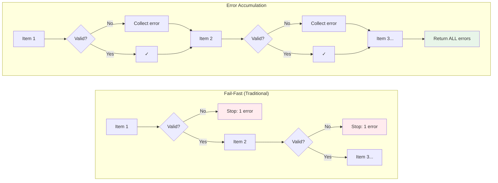

# Error Accumulation: Work Item Validation

Prodigy uses Stillwater's `Validation<T, E>` applicative functor to collect ALL validation errors in a single pass, eliminating the frustrating "fix one error, resubmit, find next error" cycle.

## Validation Flow Comparison



**Figure**: Fail-fast stops at first error; error accumulation continues through all items.

## The Problem: Fail-Fast Validation

**Location**: `src/cook/execution/data_pipeline/validation.rs`, `src/cook/execution/mapreduce/validation.rs`

Traditional validation stops at the first error, forcing users through multiple iterations:

```rust
// Source: Conceptual example - traditional fail-fast pattern
pub fn validate_and_load_items(path: &Path) -> Result<Vec<WorkItem>> {
    let items: Vec<WorkItem> = serde_json::from_reader(File::open(path)?)?;

    for item in &items {
        validate_item_structure(item)?;  // Stops here on first error
        validate_item_path(item)?;       // Never checked if above fails
        validate_item_filter(item)?;     // Never checked if above fails
    }

    Ok(items)
}
```

!!! warning "User Experience Impact"
    With 100 work items, users might need 100+ workflow restarts to find all errors.
    Each iteration takes time—loading the workflow, parsing items, running validation.

## The Solution: Error Accumulation

!!! note "Applicative Functor"
    Unlike `Result` which short-circuits on first error, `Validation<T, E>` is an
    applicative functor that can combine independent validations while accumulating
    all failures. This is the key insight from functional programming.

Stillwater's `Validation` type accumulates ALL errors before returning, so users see everything at once:

=== "Basic Usage"

    ```rust
    // Source: src/cook/execution/data_pipeline/validation.rs:39-41
    use serde_json::Value;
    use stillwater::Validation;

    // Validate a single work item
    pub fn validate_work_item(
        id: &str,
        data: &Value,
    ) -> Validation<ValidWorkItem, Vec<WorkItemValidationError>> {
        let id_validation = validate_item_id(id);
        let data_validation = validate_item_data(data);

        // Combine validations - accumulates all errors
        match (id_validation, data_validation) {
            (Validation::Success(id), Validation::Success(data)) => {
                Validation::success(ValidWorkItem { id, data })
            }
            (Validation::Failure(mut id_errors), Validation::Failure(mut data_errors)) => {
                id_errors.append(&mut data_errors);
                Validation::failure(id_errors)
            }
            (Validation::Failure(errors), _) | (_, Validation::Failure(errors)) => {
                Validation::failure(errors)
            }
        }
    }
    ```

=== "Validate All Items"

    ```rust
    // Source: src/cook/execution/data_pipeline/validation.rs:212-252
    pub fn validate_all_items(
        items: &[(String, Value)],
    ) -> Validation<Vec<ValidWorkItem>, Vec<WorkItemValidationError>> {
        let mut seen_ids = std::collections::HashMap::new();
        let mut valid_items = Vec::new();
        let mut all_errors = Vec::new();

        for (idx, (id, data)) in items.iter().enumerate() {
            // Check for duplicate IDs
            if let Some(&first_idx) = seen_ids.get(id) {
                all_errors.push(WorkItemValidationError::DuplicateId {
                    item_index: idx,
                    id: id.clone(),
                    first_seen_at: first_idx,
                });
                continue;
            }
            seen_ids.insert(id.clone(), idx);

            // Validate the item and accumulate errors
            match validate_work_item(id, data) {
                Validation::Success(item) => valid_items.push(item),
                Validation::Failure(errors) => all_errors.extend(errors),
            }
        }

        if all_errors.is_empty() {
            Validation::success(valid_items)
        } else {
            Validation::failure(all_errors)  // ALL errors at once
        }
    }
    ```

## Schema-Based Validation

For MapReduce workflows, Prodigy provides a fluent schema builder for comprehensive validation:

### WorkItemSchema Builder

```rust
// Source: src/cook/execution/mapreduce/validation.rs:226-258
use prodigy::cook::execution::mapreduce::validation::{
    WorkItemSchema, FieldType, Constraint,
};

let schema = WorkItemSchema::new()
    .require_field("id")
    .require_field("name")
    .field_type("count", FieldType::Number)
    .field_type("enabled", FieldType::Bool)
    .add_constraint("count", Constraint::Range { min: 0.0, max: 100.0 })
    .add_constraint("name", Constraint::MinLength(3))
    .id_field("id");
```

### Available Field Types

| Type | Description |
|------|-------------|
| `FieldType::String` | String value |
| `FieldType::Number` | Integer or float |
| `FieldType::Bool` | Boolean value |
| `FieldType::Array` | Array of values |
| `FieldType::Object` | Nested JSON object |
| `FieldType::Any` | Skip type checking |

### Available Constraints

```rust
// Source: src/cook/execution/mapreduce/validation.rs:182-194
pub enum Constraint {
    /// Numeric range (min, max)
    Range { min: f64, max: f64 },
    /// Minimum string length
    MinLength(usize),
    /// Maximum string length
    MaxLength(usize),
    /// Value must be one of these options
    OneOf(Vec<Value>),
    /// Custom regex pattern
    Pattern(String),
}
```

!!! example "Constraint Usage"
    ```rust
    let schema = WorkItemSchema::new()
        .add_constraint("score", Constraint::Range { min: 0.0, max: 100.0 })
        .add_constraint("status", Constraint::OneOf(vec![
            json!("pending"),
            json!("active"),
            json!("completed"),
        ]))
        .add_constraint("email", Constraint::Pattern(r"^[\w.-]+@[\w.-]+\.\w+$".to_string()));
    ```

## Complete Validation Example

```rust
// Source: src/cook/execution/mapreduce/validation.rs:285-334
use prodigy::cook::execution::mapreduce::validation::{
    validate_work_items, WorkItemSchema, FieldType, Constraint
};
use serde_json::json;
use stillwater::Validation;

let items = vec![
    json!({"id": "item-1", "count": 5, "name": "Valid"}),
    json!({"id": "item-2", "count": "not a number"}),  // Type error
    json!({"count": 10}),                               // Missing id
    json!({"id": "item-4", "count": 150}),             // Out of range
];

let schema = WorkItemSchema::new()
    .require_field("id")
    .field_type("count", FieldType::Number)
    .add_constraint("count", Constraint::Range { min: 0.0, max: 100.0 });

match validate_work_items(&items, Some(&schema)) {
    Validation::Success(valid_items) => {
        println!("All {} items valid", valid_items.len());
    }
    Validation::Failure(errors) => {
        // User sees ALL errors at once:
        // - Item 1: field 'count' expected number, got string
        // - Item 2: missing required field 'id'
        // - Item 3: field 'count' value '150' violates constraint: range [0, 100]
        for error in &errors {
            eprintln!("{}", error);
        }
    }
}
```

## DLQ Integration

Validation failures are automatically added to the Dead Letter Queue for review and retry:

```rust
// Source: src/cook/execution/mapreduce/dlq_integration.rs:314-333
use prodigy::cook::execution::mapreduce::dlq_integration::validation_errors_to_dlq_items;

// After validation failure
let dlq_items = validation_errors_to_dlq_items(&errors, &original_items);

// Each failed item is preserved with:
// - Original item data
// - All validation errors (grouped by item)
// - Timestamp and error signature
// - Marked as requiring manual review
```

!!! tip "Retry After Fixing"
    After fixing the input data, retry failed items:
    ```bash
    prodigy dlq retry <job_id>
    ```

## Error Types

The validation system provides specific error types for clear diagnostics:

```rust
// Source: src/cook/execution/mapreduce/validation.rs:54-89
pub enum WorkItemValidationError {
    MissingRequiredField { item_index: usize, field: String },
    InvalidFieldType { item_index: usize, field: String, expected: String, got: String },
    ConstraintViolation { item_index: usize, field: String, constraint: String, value: String },
    NotAnObject { item_index: usize },
    NullItem { item_index: usize },
    DuplicateId { item_index: usize, id: String, first_seen_at: usize },
    InvalidId { item_index: usize, reason: String },
}
```

## Impact

| Metric | Before | After |
|--------|--------|-------|
| **Validation iterations** | Up to N (one per error) | 1 (all errors at once) |
| **Time to fix all errors** | O(N × workflow_time) | O(workflow_time) |
| **User experience** | Frustrating | Delightful |
| **Debug context** | Minimal | Complete with DLQ |

## Related Patterns

- [Error Context](error-context.md) - Add context trails to errors for debugging
- [Semigroup Composition](semigroup-composition.md) - Composable aggregation for MapReduce results
