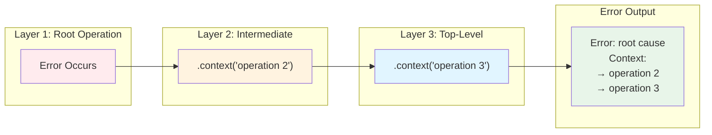

# Error Context: Debugging MapReduce Failures

## The Problem

When MapReduce agents fail, the error message often lacks context about what operation was being performed. This makes debugging difficult, especially when reviewing DLQ items.

```rust
// Source: Typical pattern before ContextError adoption
pub async fn execute_agent(&self, item: WorkItem) -> Result<AgentResult> {
    let worktree = self.create_agent_worktree().await?;  // Where did this fail?
    let interpolated = self.interpolate_commands(&item)?;  // Or here?
    let result = self.run_commands(&interpolated).await?;  // Or here?
    Ok(result)
}

// Error output (unhelpful):
// Error: Command execution failed
//   Caused by: File not found: process.sh
```

**Problems with context-free errors:**

- No indication which agent failed
- No context about which operation failed
- No information about what work item was being processed
- Difficult to debug DLQ items

## Stillwater Solution: ContextError

Stillwater's `ContextError<E>` wraps an error with a trail of context messages, preserving the full operation stack.



**Figure**: Context accumulates as errors propagate up the call stack, building a complete operation trail.

### Using the ResultExt Trait

Prodigy provides the `ResultExt` extension trait for ergonomic context addition:

```rust
// Source: src/cook/error/ext.rs:20-81
use prodigy::cook::error::{ResultExt, ContextResult};

pub async fn execute_agent(&self, item: &WorkItem) -> ContextResult<AgentResult, AgentError> {
    // Static context (known at compile time)
    create_agent_worktree(&item.id)
        .await
        .context("Creating agent worktree")?;

    // Dynamic context (evaluated only on error - zero cost on success)
    let interpolated = interpolate_commands(&item)
        .with_context(|| format!("Interpolating commands for item {}", item.id))?;

    let result = run_commands(&interpolated)
        .await
        .with_context(|| format!("Executing commands for item {}", item.id))?;

    Ok(result)
}
```

!!! tip "Lazy Context Evaluation"
    Use `.with_context(|| ...)` instead of `.context(format!(...))` when the context
    message requires computation. The closure is only evaluated if an error occurs,
    making it zero-cost on the success path.

### ContextResult Type Alias

For cleaner function signatures, use the `ContextResult` type alias:

```rust
// Source: src/cook/error/ext.rs:83-97
pub type ContextResult<T, E> = Result<T, ContextError<E>>;

// Instead of:
fn process_item(id: &str) -> Result<String, ContextError<ProcessError>>

// Write:
fn process_item(id: &str) -> ContextResult<String, ProcessError>
```

### Rich Error Output

With `ContextError`, error messages include the full context trail:

```text
Error: File not found: process.sh
Context:
  -> Executing commands for item item-42
  -> Interpolating agent commands
  -> Processing work item item-42
  -> Executing map phase for job job-123
```

## DLQ Integration

The Dead Letter Queue preserves error context for failed items, enabling effective post-mortem debugging.

### FailureDetail Structure

Each failure attempt captures complete context:

```rust
// Source: src/cook/execution/dlq.rs:46-62
pub struct FailureDetail {
    pub attempt_number: u32,
    pub timestamp: DateTime<Utc>,
    pub error_type: ErrorType,
    pub error_message: String,
    /// Full error context trail showing operation stack
    pub error_context: Option<Vec<String>>,
    pub stack_trace: Option<String>,
    pub agent_id: String,
    pub step_failed: String,
    pub duration_ms: u64,
    /// Path to Claude JSON log file for debugging
    pub json_log_location: Option<String>,
}
```

### Context Extraction from Display Format

When errors are captured as strings (e.g., from external processes), Prodigy parses the `ContextError` Display format to extract context:

```rust
// Source: src/cook/execution/mapreduce/dlq_integration.rs:136-184
fn extract_error_context(error_msg: &str) -> Option<Vec<String>> {
    // Parses error messages formatted as:
    // Error: base error message
    // Context:
    //   -> Context message 1
    //   -> Context message 2
    //   -> Context message 3

    if !error_msg.contains("Context:") {
        return None;
    }

    // Extract lines starting with "->" after "Context:" header
    // ...
}
```

This enables context preservation even when errors cross process boundaries.

### Viewing Context in DLQ

```bash
prodigy dlq show job-123

# Output:
# Item: item-42
# Error: File not found: process.sh
# Context:
#   -> Executing commands for item item-42
#   -> Interpolating agent commands
#   -> Processing work item item-42
#   -> Executing map phase for job job-123
# Log: ~/.local/state/claude/logs/session-xyz.json
# Time: 2025-11-23 04:00:00 UTC
```

!!! note "JSON Log Access"
    The `json_log_location` field points to the full Claude session log, which contains
    complete message history, tool invocations, and token usage. See
    [Claude Observability](../reference/observability.md) for log analysis techniques.

## Chaining Context Across Layers

!!! warning "Preserve Context When Re-throwing"
    When catching and re-throwing errors, always add context rather than replacing the error.
    Using `.context()` or `.with_context()` preserves the entire context chain. Creating a new
    error loses all accumulated context.

Context accumulates as errors propagate up the call stack:

```rust
// Source: src/cook/error/ext.rs:103-130 (test example)
fn layer1() -> Result<(), Error> {
    Err("root cause".into())
}

fn layer2() -> ContextResult<(), Error> {
    layer1().context("layer 2 context")
}

fn layer3() -> ContextResult<(), Error> {
    layer2().map_err(|e| e.context("layer 3 context"))?;
    Ok(())
}

// Result: Error with context trail:
//   ["layer 2 context", "layer 3 context"]
```

## Benefits

| Aspect | Before | After |
|--------|--------|-------|
| Error clarity | Generic messages | Full operation trail |
| Debug time | Manual log correlation | Context in error |
| DLQ utility | Limited info | Complete context |
| Performance | N/A | Zero-cost on success |

## Related Patterns

- [Error Accumulation](error-accumulation.md) - Collecting multiple validation errors
- [Testability](testability.md) - Testing context-aware error handling
