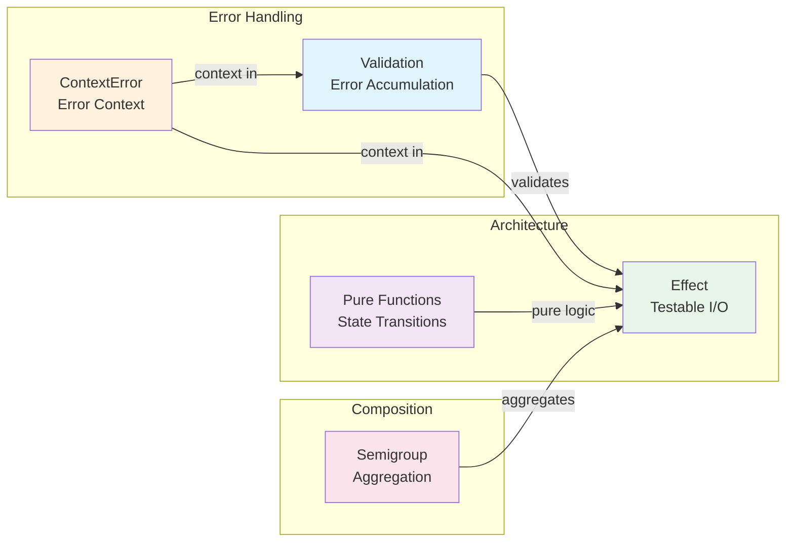

# Stillwater Pattern Mapping for Prodigy

## What is Stillwater?

[Stillwater](https://crates.io/crates/stillwater) is a functional programming library for Rust that provides patterns for clean error handling, testability, and composable operations. Prodigy uses Stillwater patterns throughout its codebase to achieve:

- **Error accumulation** instead of fail-fast validation
- **Effect-based I/O** for testable architecture
- **Context-rich errors** for better debugging
- **Composable aggregations** via algebraic patterns

---

## Pattern Relationships

The following diagram shows how Stillwater patterns relate to each other and their primary use cases in Prodigy:



---

## Pattern Documentation

This guide is organized into the following sections:

| # | Pattern | Description | Status |
|---|---------|-------------|--------|
| 1 | **[Error Accumulation: Work Item Validation](error-accumulation.md)** | Using `Validation<T, E>` to collect all errors instead of failing fast | :white_check_mark: Implemented |
| 2 | **[Testability: Orchestrator Without Mocks](testability.md)** | Using `Effect<T, E, Env>` and pure functions for testable architecture | :white_check_mark: Implemented |
| 3 | **[Error Context: Debugging MapReduce Failures](error-context.md)** | Using `ContextError<E>` for rich error trails | :white_check_mark: Implemented |
| 4 | **[State Management: Pure Transitions](state-management.md)** | Separating pure state logic from I/O operations | :white_check_mark: Implemented |
| 5 | **[Variable Aggregation: Semigroup Composition](semigroup-composition.md)** | Using the `Semigroup` trait for composable aggregations | :white_check_mark: Implemented |

---

## Summary: Impact Matrix

| Pattern | Prodigy Problem | Stillwater Solution | Impact | Effort |
|---------|----------------|---------------------|--------|--------|
| **Validation<T, E>** | Sequential work item validation | Error accumulation | High | Low-Medium |
| **Effect<T, E, Env>** | Orchestrator testability | Pure core + environment | High | High |
| **ContextError<E>** | Generic error messages | Context trail preservation | High | Low-Medium |
| **Pure Functions** | Mixed I/O and logic | Pure state transitions | High | Medium |
| **Semigroup** | Duplicated aggregation | Composable aggregates | Medium | Low-Medium |

!!! info "Effort Level Guide"
    - **Low**: Few files touched, localized changes (5-10 files)
    - **Low-Medium**: Moderate scope, well-contained changes (10-20 files)
    - **Medium**: Architectural changes within a single module (20-30 files)
    - **High**: Cross-cutting changes affecting multiple modules (30+ files)

---

## Implementation Status

All Stillwater patterns are now implemented in Prodigy. Key source locations:

```text
src/cook/execution/mapreduce/
├── validation.rs          # (1)!
├── effects/               # (2)!
│   ├── mod.rs
│   ├── worktree.rs        # (3)!
│   ├── commands.rs        # (4)!
│   └── merge.rs           # (5)!
└── mock_environment.rs    # (6)!

src/cook/error/
├── mod.rs                 # (7)!
└── ext.rs                 # (8)!

src/cook/execution/variables/
└── semigroup.rs           # (9)!
```

1. `Validation<T, E>` - Accumulates all work item errors instead of failing on first
2. `Effect<T, E, Env>` - Separates I/O from pure logic for testability
3. Worktree creation/cleanup effects with environment dependency injection
4. Command execution effects (Claude, shell) with retry and timeout handling
5. Git merge effects for combining agent results back to parent
6. Mock environments for testing effects without real I/O
7. Re-exports `ContextError<E>` from Stillwater for error wrapping
8. `ResultExt` trait adds `.context()` and `.with_context()` to Result types
9. `Semigroup` implementations for Count, Sum, Collect, Average, and more

---

## Adoption Recommendations

!!! tip "Quick Win: Error Context"
    **Why**: Immediate value, low effort, touches many modules

    - Add `.context()` calls throughout error-prone paths
    - Provides better error messages across entire codebase
    - See: `src/cook/error/ext.rs` for the `ResultExt` trait

!!! example "High Impact: Work Item Validation"
    **Why**: Solves major user pain point, clear demonstration of value

    - Users see all validation errors at once instead of one at a time
    - Reduces validation iteration cycles by ~90%
    - See: `src/cook/execution/mapreduce/validation.rs:285` for `validate_work_items()`

!!! note "Architectural Foundation: Effect Pattern"
    **Why**: Transforms architecture, enables comprehensive testability

    - Separates pure business logic from I/O operations
    - Enables mock environments for unit testing
    - ~60% increase in testability with clear separation of concerns
    - See: `src/cook/execution/mapreduce/effects/` for effect implementations
