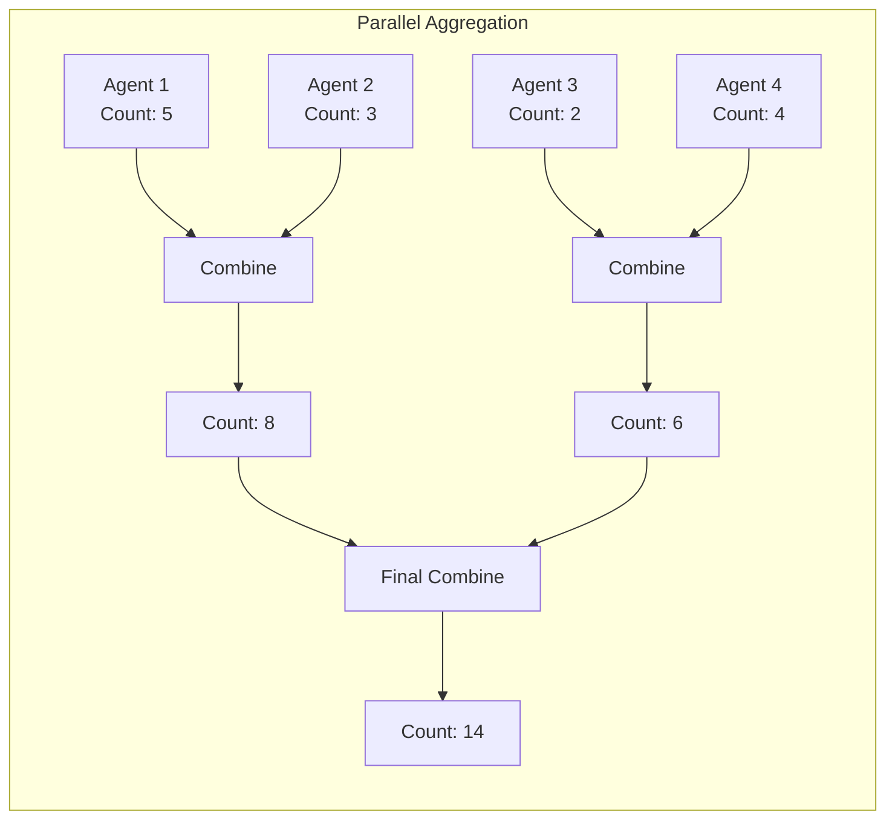
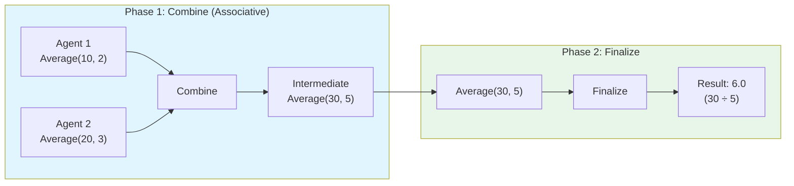

# Variable Aggregation: Semigroup Composition

Prodigy uses the Semigroup pattern from Stillwater for type-safe, composable aggregation of MapReduce results. This enables parallel execution with mathematical guarantees.

## Overview

The `AggregateResult` type implements Stillwater's `Semigroup` trait, providing a unified `combine` operation for merging aggregation states. The associativity property of semigroups guarantees that parallel aggregation produces the same results as sequential aggregation.



## Aggregate Types

All 15 aggregate types available in Prodigy:

| Type | Description | Combine Behavior | Finalize |
|------|-------------|------------------|----------|
| `Count` | Count items | Sum counts | Returns count |
| `Sum` | Sum numeric values | Sum values | Returns sum |
| `Min` | Track minimum | Keep smaller | Returns min value |
| `Max` | Track maximum | Keep larger | Returns max value |
| `Collect` | Collect all values | Extend arrays | Returns array |
| `Average` | Calculate average | Combine (sum, count) | Computes sum/count |
| `Median` | Calculate median | Collect values | Sorts and finds middle |
| `StdDev` | Standard deviation | Collect values | Computes std dev |
| `Variance` | Variance | Collect values | Computes variance |
| `Unique` | Unique values | Union sets | Returns array |
| `Concat` | Concatenate strings | Append strings | Returns string |
| `Merge` | Merge objects | First value wins | Returns object |
| `Flatten` | Flatten arrays | Extend arrays | Returns flat array |
| `Sort` | Sorted values | Collect values | Sorts on finalize |
| `GroupBy` | Group by key | Merge groups | Returns grouped object |

## The Two-Phase Pattern

Aggregations use a two-phase approach: `combine` for merging state (associative), then `finalize` for computing the final result.



This pattern ensures associativity during parallel execution while deferring complex computations to the finalization step.

```rust
// Source: src/cook/execution/variables/semigroup.rs:97-195
impl Semigroup for AggregateResult {
    fn combine(self, other: Self) -> Self {
        use AggregateResult::*;
        match (self, other) {
            (Count(a), Count(b)) => Count(a.saturating_add(b)),
            (Sum(a), Sum(b)) => Sum(a + b),
            (Average(sum_a, count_a), Average(sum_b, count_b)) => {
                Average(sum_a + sum_b, count_a + count_b)
            }
            // ... other variants
            _ => unreachable!(
                "Type mismatch in aggregation. Use `aggregate_map_results` or \
                 `combine_homogeneous` to validate types before combining."
            ),
        }
    }
}
```

### Stateful Aggregations

Some aggregations track intermediate state that requires finalization:

=== "Average"

    ```rust
    // Tracks sum and count during combine
    let a = AggregateResult::Average(10.0, 2); // sum: 10.0, count: 2
    let b = AggregateResult::Average(20.0, 3); // sum: 20.0, count: 3

    // Combine merges state associatively
    let combined = a.combine(b); // Average(30.0, 5)

    // Finalize computes the actual average
    let result = combined.finalize(); // 30.0 / 5 = 6.0
    ```

=== "Median"

    ```rust
    // Collects all values during combine
    let a = AggregateResult::Median(vec![1.0, 3.0, 5.0]);
    let b = AggregateResult::Median(vec![2.0, 4.0]);

    let combined = a.combine(b); // Median([1.0, 3.0, 5.0, 2.0, 4.0])

    // Finalize sorts and finds middle value
    let result = combined.finalize(); // 3.0
    ```

=== "StdDev/Variance"

    ```rust
    // Collects all values during combine
    let a = AggregateResult::Variance(vec![1.0, 2.0, 3.0]);
    let b = AggregateResult::Variance(vec![4.0, 5.0]);

    let combined = a.combine(b);

    // Finalize computes variance from all values
    let result = combined.finalize(); // variance of [1,2,3,4,5] = 2.0
    ```

## Validation Integration

!!! warning "Type Safety"
    The `combine` method requires matching types. Mismatched types will cause an `unreachable!` panic. Always use `aggregate_map_results` or `combine_homogeneous` for production code.

Prodigy integrates with Stillwater's homogeneous validation to prevent type mismatches and accumulate ALL errors:

```rust
// Source: src/cook/execution/variables/semigroup.rs:340-349
pub fn aggregate_map_results(
    results: Vec<AggregateResult>,
) -> Validation<AggregateResult, Vec<TypeMismatchError>> {
    if results.is_empty() {
        return Validation::success(AggregateResult::Count(0));
    }
    combine_homogeneous(results, std::mem::discriminant, TypeMismatchError::new)
}
```

### Error Accumulation Example

When type mismatches occur, ALL errors are reported at once:

```rust
use prodigy::cook::execution::variables::semigroup::{
    AggregateResult, aggregate_map_results
};
use stillwater::Validation;

let results = vec![
    AggregateResult::Count(5),
    AggregateResult::Sum(10.0),       // Type mismatch
    AggregateResult::Average(6.0, 2), // Type mismatch
    AggregateResult::Count(3),
];

match aggregate_map_results(results) {
    Validation::Success(combined) => {
        println!("Total: {:?}", combined);
    }
    Validation::Failure(errors) => {
        // ALL errors reported: Sum at index 1, Average at index 2
        for error in errors {
            eprintln!("Error at index {}: expected {}, got {}",
                error.index, error.expected, error.got);
        }
    }
}
```

!!! tip "Error Accumulation Benefits"
    Unlike fail-fast validation that stops at the first error, Stillwater's validation pattern collects ALL errors. This means users can fix multiple issues in a single iteration rather than discovering them one at a time.

## API Reference

### `aggregate_map_results`

Aggregates results with validation, accumulating all type mismatch errors:

```rust
// Source: src/cook/execution/variables/semigroup.rs:340-349
pub fn aggregate_map_results(
    results: Vec<AggregateResult>,
) -> Validation<AggregateResult, Vec<TypeMismatchError>>
```

### `aggregate_with_initial`

Combines with an existing checkpoint state (useful for resume):

```rust
// Source: src/cook/execution/variables/semigroup.rs:379-386
pub fn aggregate_with_initial(
    initial: AggregateResult,
    results: Vec<AggregateResult>,
) -> Validation<AggregateResult, Vec<TypeMismatchError>>
```

**Example - Checkpoint Recovery:**

```rust
// Resume from checkpointed state
let checkpointed = AggregateResult::Count(100);
let new_results = vec![
    AggregateResult::Count(25),
    AggregateResult::Count(15),
];

match aggregate_with_initial(checkpointed, new_results) {
    Validation::Success(total) => {
        assert_eq!(total, AggregateResult::Count(140));
    }
    Validation::Failure(errors) => { /* handle */ }
}
```

### `parallel_aggregate`

Parallel aggregation using rayon (for large datasets):

```rust
// Source: src/cook/execution/variables/semigroup.rs:417-419
pub fn parallel_aggregate(results: Vec<AggregateResult>) -> Option<AggregateResult>
```

!!! note "Performance Consideration"
    Parallel aggregation is beneficial for large datasets (>1000 items). For smaller datasets, the overhead of parallelization may outweigh the benefits.

**Example:**

```rust
use prodigy::cook::execution::variables::semigroup::{
    AggregateResult, parallel_aggregate
};

let results: Vec<_> = (0..10000)
    .map(|_| AggregateResult::Count(1))
    .collect();

let combined = parallel_aggregate(results).unwrap();
assert_eq!(combined, AggregateResult::Count(10000));
```

## Property-Based Testing

The semigroup implementation is verified using property-based tests with proptest to ensure associativity holds for all aggregate types:

```rust
// Source: src/cook/execution/variables/semigroup_property_tests.rs:76-121
macro_rules! test_associativity {
    ($name:ident, $generator:expr) => {
        proptest! {
            #[test]
            fn $name(
                a in $generator,
                b in $generator,
                c in $generator,
            ) {
                // Semigroup law: (a · b) · c = a · (b · c)
                let left = a.clone().combine(b.clone()).combine(c.clone());
                let right = a.combine(b.combine(c));
                prop_assert_eq!(left, right);
            }
        }
    };
}

// Tests generated for all aggregate types
test_associativity!(test_count_associativity, arb_count());
test_associativity!(test_sum_associativity, arb_sum());
test_associativity!(test_min_associativity, arb_min());
test_associativity!(test_max_associativity, arb_max());
// ... all 15 types tested
```

This ensures that parallel aggregation (splitting work across threads) produces identical results to sequential aggregation.

## Workflow Usage

Use aggregations in MapReduce workflows:

```yaml title="workflow.yml"
name: analyze-items
mode: mapreduce

map:
  input: "items.json"
  json_path: "$.items[*]"

  variables:
    total_count:
      type: count
      initial: 0

    total_size:
      type: sum
      initial: 0

    all_tags:
      type: unique
      initial: []

reduce:
  - shell: "echo 'Processed ${total_count} items'"
  - shell: "echo 'Total size: ${total_size}'"
  - shell: "echo 'Unique tags: ${all_tags}'"
```

## Benefits

| Benefit | Description |
|---------|-------------|
| **Type Safety** | Validation catches type mismatches with full error accumulation |
| **Parallel Safe** | Associativity guarantees correct parallel execution |
| **Checkpoint Compatible** | `aggregate_with_initial` enables resume from checkpoints |
| **Composable** | Single `combine` interface for all aggregation types |
| **Mathematically Verified** | Property tests prove semigroup laws hold |
| **Clear Semantics** | Two-phase pattern separates state merging from final computation |

## Related Topics

- [Error Accumulation](error-accumulation.md) - Validation pattern for collecting all errors
- [Testability](testability.md) - Property-based testing patterns
