# Stillwater Validation Migration Guide

This document provides before/after examples demonstrating the migration of Prodigy's validation code to use the stillwater library's error accumulation patterns.

!!! abstract "Related Documentation"
    This migration guide complements the detailed pattern documentation:

    - [Error Accumulation Pattern](stillwater-patterns/error-accumulation.md) - Deep dive into Validation applicative functor
    - [Semigroup Composition](stillwater-patterns/semigroup-composition.md) - Composable aggregation patterns
    - [Error Context](stillwater-patterns/error-context.md) - Context trails for debugging
    - [Stillwater Pattern Mapping](stillwater-pattern-mapping.md) - Complete pattern reference

## Overview

The migration to stillwater validation brings several key improvements:

!!! tip "Key Benefits"
    - **Error Accumulation**: Collect all validation errors before failing, instead of stopping at the first error
    - **Composable Validators**: Build complex validators from simple, reusable functions
    - **Pure Functions**: Separate validation logic from I/O operations for better testability
    - **Consistent Error Handling**: Uniform error types and severity classification across the codebase

## Validation Flow Comparison

```mermaid
flowchart LR
    subgraph FailFast["Fail-Fast (Traditional)"]
        direction LR
        I1[Item 1] --> V1{Valid?}
        V1 -->|No| Stop1[Stop: 1 error]
        V1 -->|Yes| I2[Item 2]
        I2 --> V2{Valid?}
        V2 -->|No| Stop2[Stop: 1 error]
    end

    subgraph Accumulate["Error Accumulation"]
        direction LR
        A1[Item 1] --> C1{Valid?}
        C1 -->|No| E1[Collect]
        C1 -->|Yes| OK1[✓]
        E1 --> A2
        OK1 --> A2[Item 2]
        A2 --> C2{Valid?}
        C2 --> Final[Return ALL errors]
    end

    style Stop1 fill:#ffebee
    style Stop2 fill:#ffebee
    style Final fill:#e8f5e9
```



**Figure**: Fail-fast stops at first error; error accumulation continues through all items.

## Migration Patterns

### Pattern 1: Single Field Validation with Early Return

=== "Before (Imperative)"

    ```rust
    // Traditional fail-fast validation
    fn validate_path(path: &Path) -> Result<PathBuf, ValidationError> {
        if !path.exists() {
            return Err(ValidationError::PathNotFound(path.to_path_buf()));
        }

        if path.starts_with("..") {
            return Err(ValidationError::PathInParentDir(path.to_path_buf()));
        }

        Ok(path.to_path_buf())
    }

    // Only reports FIRST error
    fn validate_all_paths(paths: &[&Path]) -> Result<Vec<PathBuf>, ValidationError> {
        let mut results = Vec::new();
        for path in paths {
            results.push(validate_path(path)?); // Stops at first error
        }
        Ok(results)
    }
    ```

=== "After (Stillwater)"

    ```rust
    // Source: src/core/validation/mod.rs:11
    use stillwater::Validation;

    /// File existence check function type (passed as parameter to avoid I/O)
    pub type FileExistsCheck = fn(&Path) -> bool;

    // Source: src/core/validation/mod.rs:182-206
    fn validate_path(
        path: &Path,
        exists_check: FileExistsCheck,
    ) -> Validation<PathBuf, Vec<ValidationError>> {
        let mut errors = Vec::new();

        if !exists_check(path) {
            errors.push(ValidationError::PathNotFound(path.to_path_buf()));
        }

        if path.starts_with("..") {
            errors.push(ValidationError::PathInParentDir(path.to_path_buf()));
        }

        if errors.is_empty() {
            Validation::success(path.to_path_buf())
        } else {
            Validation::failure(errors)
        }
    }

    // Source: src/core/validation/mod.rs:209-227
    // Accumulates ALL errors from ALL paths
    pub fn validate_paths(paths: &[&Path], exists_check: FileExistsCheck) -> ValidationResult {
        let mut all_errors = Vec::new();
        let mut all_paths = Vec::new();

        for &path in paths {
            match validate_path(path, exists_check).into_result() {
                Ok(p) => all_paths.push(p),
                Err(errors) => all_errors.extend(errors), // Collect ALL errors
            }
        }

        let validation = if all_errors.is_empty() {
            Validation::success(all_paths)
        } else {
            Validation::failure(all_errors)
        };

        ValidationResult::from_validation(validation)
    }
    ```

!!! success "Benefits"
    - Reports ALL path errors at once instead of just the first one
    - Separates I/O (file existence check) from pure validation logic
    - Allows testing without touching the filesystem

### Pattern 2: Multiple Independent Validations

=== "Before (Sequential)"

    ```rust
    fn validate_environment(required_vars: &[&str]) -> Result<(), Vec<String>> {
        let mut errors = Vec::new();

        for var in required_vars {
            if std::env::var(var).is_err() {
                errors.push(format!("Missing: {}", var));
            }
        }

        if !errors.is_empty() {
            return Err(errors);
        }

        Ok(())
    }
    ```

=== "After (Stillwater)"

    ```rust
    // Source: src/core/validation/mod.rs:230-246
    use stillwater::Validation;

    fn validate_env_var(
        var_name: &str,
        env_vars: &HashMap<String, String>,
    ) -> Validation<(String, String), Vec<ValidationError>> {
        if let Some(value) = env_vars.get(var_name) {
            if (var_name.contains("KEY") || var_name.contains("SECRET") || var_name.contains("TOKEN"))
                && value.trim().is_empty()
            {
                Validation::failure(vec![ValidationError::EnvVarEmpty(var_name.to_string())])
            } else {
                Validation::success((var_name.to_string(), value.clone()))
            }
        } else {
            Validation::failure(vec![ValidationError::EnvVarMissing(var_name.to_string())])
        }
    }

    // Source: src/core/validation/mod.rs:249-280
    pub fn validate_environment(
        required_vars: &[&str],
        env_vars: &HashMap<String, String>,
    ) -> ValidationResult {
        let mut all_errors = Vec::new();
        let mut all_vars = Vec::new();

        for &var in required_vars {
            match validate_env_var(var, env_vars).into_result() {
                Ok(pair) => all_vars.push(pair),
                Err(errors) => all_errors.extend(errors),
            }
        }

        let validation = if all_errors.is_empty() {
            Validation::success(all_vars)
        } else {
            Validation::failure(all_errors)
        };

        ValidationResult::from_validation(validation)
    }
    ```

!!! success "Benefits"
    - Validates ALL environment variables, not just until first failure
    - Separates env var access from validation logic (accepts HashMap parameter)
    - Distinguishes between missing vars (errors) and empty sensitive vars (warnings)

### Pattern 3: Nested Validation with Multiple Error Types

=== "Before (Mixed Errors)"

    ```rust
    fn validate_command(command: &str) -> Result<(), String> {
        if command.trim().is_empty() {
            return Err("Command is empty".to_string());
        }

        if command.contains("rm -rf /") {
            return Err("Dangerous command pattern".to_string());
        }

        if command.contains("sudo") {
            eprintln!("Warning: Command uses sudo");
        }

        Ok(())
    }
    ```

=== "After (Stillwater)"

    ```rust
    // Source: src/core/validation/mod.rs:283-306
    use stillwater::Validation;

    fn check_dangerous_patterns(command: &str) -> Validation<(), Vec<ValidationError>> {
        let dangerous_patterns = [
            "rm -rf /",
            "dd if=/dev/zero",
            ":(){ :|:& };:", // Fork bomb
            "> /dev/sda",
            "chmod -R 777 /",
        ];

        let errors: Vec<ValidationError> = dangerous_patterns
            .iter()
            .filter(|&&pattern| command.contains(pattern))
            .map(|&pattern| ValidationError::CommandDangerous {
                cmd: command.to_string(),
                pattern: pattern.to_string(),
            })
            .collect();

        if errors.is_empty() {
            Validation::success(())
        } else {
            Validation::failure(errors)
        }
    }

    // Source: src/core/validation/mod.rs:309-331
    fn check_suspicious_patterns(command: &str) -> Validation<(), Vec<ValidationError>> {
        let mut warnings = Vec::new();

        if command.contains("sudo") && !command.contains("sudo -n") {
            warnings.push(ValidationError::CommandSuspicious {
                cmd: command.to_string(),
                reason: "Command uses sudo which may require password".to_string(),
            });
        }

        if command.contains("curl") && command.contains("| sh") {
            warnings.push(ValidationError::CommandSuspicious {
                cmd: command.to_string(),
                reason: "Command pipes curl output to shell, potential security risk".to_string(),
            });
        }

        if warnings.is_empty() {
            Validation::success(())
        } else {
            Validation::failure(warnings)
        }
    }

    // Source: src/core/validation/mod.rs:334-360
    pub fn validate_command(command: &str) -> ValidationResult {
        if command.trim().is_empty() {
            return ValidationResult::from_validation(
                Validation::<(), Vec<ValidationError>>::failure(vec![
                    ValidationError::CommandEmpty,
                ])
            );
        }

        let mut all_errors = Vec::new();

        // Accumulate errors from multiple checks
        if let Err(errors) = check_dangerous_patterns(command).into_result() {
            all_errors.extend(errors);
        }

        if let Err(errors) = check_suspicious_patterns(command).into_result() {
            all_errors.extend(errors);
        }

        let validation = if all_errors.is_empty() {
            Validation::success(())
        } else {
            Validation::failure(all_errors)
        };

        ValidationResult::from_validation(validation)
    }
    ```

!!! success "Benefits"
    - Finds ALL dangerous and suspicious patterns in a single pass
    - Separates error severity (errors vs warnings) through error classification
    - Composable validators can be tested independently
    - Consistent error types instead of ad-hoc strings

### Pattern 4: Resource Limit Validation

=== "Before (Separate Functions)"

    ```rust
    fn validate_memory(memory_mb: usize) -> Result<(), String> {
        if memory_mb == 0 {
            return Err("Memory cannot be zero".to_string());
        }
        if memory_mb < 128 {
            eprintln!("Warning: Low memory limit");
        }
        Ok(())
    }

    fn validate_cpu(cpu_cores: usize) -> Result<(), String> {
        if cpu_cores == 0 {
            return Err("CPU cores cannot be zero".to_string());
        }
        Ok(())
    }

    fn validate_limits(limits: &ResourceLimits) -> Result<(), Vec<String>> {
        let mut errors = Vec::new();

        if let Err(e) = validate_memory(limits.memory_mb) {
            errors.push(e);
        }

        if let Err(e) = validate_cpu(limits.cpu_cores) {
            errors.push(e);
        }

        if !errors.is_empty() {
            Err(errors)
        } else {
            Ok(())
        }
    }
    ```

=== "After (Stillwater)"

    ```rust
    // Source: src/core/validation/mod.rs:458-474
    use stillwater::Validation;

    fn validate_memory_limit(memory_mb: usize) -> Validation<usize, Vec<ValidationError>> {
        let mut errors = Vec::new();

        if memory_mb == 0 {
            errors.push(ValidationError::MemoryLimitZero);
        } else if memory_mb < 128 {
            errors.push(ValidationError::MemoryLimitLow(memory_mb));
        } else if memory_mb > 32768 {
            errors.push(ValidationError::MemoryLimitHigh(memory_mb));
        }

        if errors.is_empty() {
            Validation::success(memory_mb)
        } else {
            Validation::failure(errors)
        }
    }

    // Source: src/core/validation/mod.rs:513-538
    pub fn validate_resource_limits(limits: &ResourceLimits) -> ValidationResult {
        let mut all_errors = Vec::new();

        // Accumulate errors from all validators
        if let Err(errors) = validate_memory_limit(limits.memory_mb).into_result() {
            all_errors.extend(errors);
        }

        if let Err(errors) = validate_cpu_cores(limits.cpu_cores).into_result() {
            all_errors.extend(errors);
        }

        if let Err(errors) = validate_timeout(limits.timeout_seconds).into_result() {
            all_errors.extend(errors);
        }

        let validation = if all_errors.is_empty() {
            Validation::success(())
        } else {
            Validation::failure(all_errors)
        };

        ValidationResult::from_validation(validation)
    }
    ```

!!! success "Benefits"
    - Reports ALL resource limit issues at once
    - Structured error types (not strings) enable programmatic handling
    - Warnings and errors handled through error severity classification
    - Each validator is independently testable

### Pattern 5: JSON Schema Validation

The validation module also provides schema-based JSON validation that accumulates all field errors:

```rust
// Source: src/core/validation/mod.rs:393-425
pub fn validate_json_schema(
    json: &serde_json::Value,
    required_fields: &[&str],
) -> ValidationResult {
    if let Some(obj) = json.as_object() {
        let mut all_errors = Vec::new();

        // Check required fields
        for &field in required_fields {
            if let Err(errors) = validate_json_field(field, obj).into_result() {
                all_errors.extend(errors);
            }
        }

        // Check for null values in non-optional fields
        if let Err(errors) = check_null_fields(obj).into_result() {
            all_errors.extend(errors);
        }

        let validation = if all_errors.is_empty() {
            Validation::success(())
        } else {
            Validation::failure(all_errors)
        };

        ValidationResult::from_validation(validation)
    } else {
        ValidationResult::from_validation(Validation::<(), Vec<ValidationError>>::failure(vec![
            ValidationError::JsonNotObject,
        ]))
    }
}
```

!!! example "Usage"
    ```rust
    let json = serde_json::json!({
        "name": "test",
        "status": null,  // Will produce warning
    });

    let required = vec!["name", "id", "type"];
    let result = validate_json_schema(&json, &required);

    // Reports ALL missing fields: id, type
    // Plus warning for null status field
    ```

## Error Severity Classification

Stillwater validation introduces error severity classification:

```rust
// Source: src/core/validation/mod.rs:107-132
#[derive(Debug, Clone, PartialEq)]
pub enum ErrorSeverity {
    Error,   // Must be fixed
    Warning, // Should review but not blocking
}

impl ValidationError {
    pub fn severity(&self) -> ErrorSeverity {
        match self {
            // Warnings
            Self::PathInParentDir(_)
            | Self::PathInTempDir(_)
            | Self::EnvVarEmpty(_)
            | Self::JsonFieldNull(_)  // Note: includes JsonFieldNull
            | Self::CommandSuspicious { .. }
            | Self::IterationCountHigh(_)
            | Self::MemoryLimitLow(_)
            | Self::MemoryLimitHigh(_)
            | Self::CpuCoresHigh(_)
            | Self::TimeoutLow(_)
            | Self::TimeoutHigh(_) => ErrorSeverity::Warning,

            // Errors
            _ => ErrorSeverity::Error,
        }
    }
}
```

**Usage Example**:
```rust
let result = validate_paths(&paths, exists_check);

// Separate errors and warnings
for error in result.errors {
    eprintln!("Error: {}", error);
}

for warning in result.warnings {
    eprintln!("Warning: {}", warning);
}

// Can proceed with warnings, but not errors
if !result.errors.is_empty() {
    return Err("Validation failed");
}
```

## Testing Benefits

=== "Before (Requires I/O)"

    ```rust
    #[test]
    fn test_validate_path() {
        let temp_file = create_temp_file(); // Requires file system
        let result = validate_path(&temp_file);
        assert!(result.is_ok());
    }
    ```

=== "After (Pure Function)"

    ```rust
    // Source: src/core/validation/mod.rs:545-548
    #[test]
    fn test_validate_path() {
        // Mock exists check - no I/O required
        fn mock_exists_check(path: &Path) -> bool {
            path.to_str().map(|s| s.contains("exists")).unwrap_or(false)
        }

        let path = Path::new("/tmp/exists.txt");
        let result = validate_path(path, mock_exists_check);
        assert!(result.is_success());
    }
    ```

### Verifying Error Accumulation

```rust
// Source: src/core/validation/mod.rs:564-579
#[test]
fn test_validate_paths_accumulates_all_errors() {
    let paths: Vec<&Path> = vec![
        Path::new("/nonexistent1"),
        Path::new("/nonexistent2"),
        Path::new("/nonexistent3"),
    ];

    let result = validate_paths(&paths, mock_exists_check);

    // Should accumulate ALL errors, not just first
    assert!(!result.is_valid);
    assert_eq!(result.errors.len(), 3);
    assert!(result.errors.iter().any(|e| e.contains("nonexistent1")));
    assert!(result.errors.iter().any(|e| e.contains("nonexistent2")));
    assert!(result.errors.iter().any(|e| e.contains("nonexistent3")));
}
```

!!! tip "Test Pattern"
    Always test that your validators accumulate ALL errors, not just the first one. This verifies the core benefit of the migration.

## Performance Considerations

The stillwater validation migration maintains zero performance regression:

- **No allocation overhead**: Error accumulation uses `Vec` which is already allocated
- **No additional traversals**: Validation happens in a single pass over the data
- **Inline-friendly**: Small validators are optimized by the compiler
- **Benchmark verification**: See `benches/execution_benchmarks.rs::bench_validation_performance`

Run benchmarks to verify:
```bash
cargo bench --bench execution_benchmarks -- validation_performance
```

## Migration Checklist

When migrating validation code to stillwater:

- [ ] **Identify validation functions** that return early on first error
- [ ] **Extract I/O operations** as function parameters (e.g., `FileExistsCheck`)
- [ ] **Replace early returns** with error accumulation in `Vec<ValidationError>`
- [ ] **Use `Validation<T, Vec<ValidationError>>`** as return type
- [ ] **Compose validators** by collecting errors from multiple validators
- [ ] **Classify errors** using `ErrorSeverity` for warnings vs errors
- [ ] **Convert to `ValidationResult`** for backward compatibility
- [ ] **Add tests** that verify error accumulation (not just first error)

## Key Takeaways

The stillwater validation migration provides:

| Aspect | Improvement |
|--------|-------------|
| **User Experience** | See ALL errors at once, not just the first one |
| **Testability** | Pure functions with injected dependencies |
| **Composability** | Build complex validators from simple ones |
| **Consistency** | Uniform error types across the codebase |
| **Performance** | Zero regression while improving functionality |

This migration is part of Prodigy's broader adoption of functional programming patterns to improve code quality, testability, and maintainability.

!!! info "Learn More"
    For deeper exploration of these patterns, see the [Stillwater Patterns](stillwater-patterns/index.md) documentation section.
