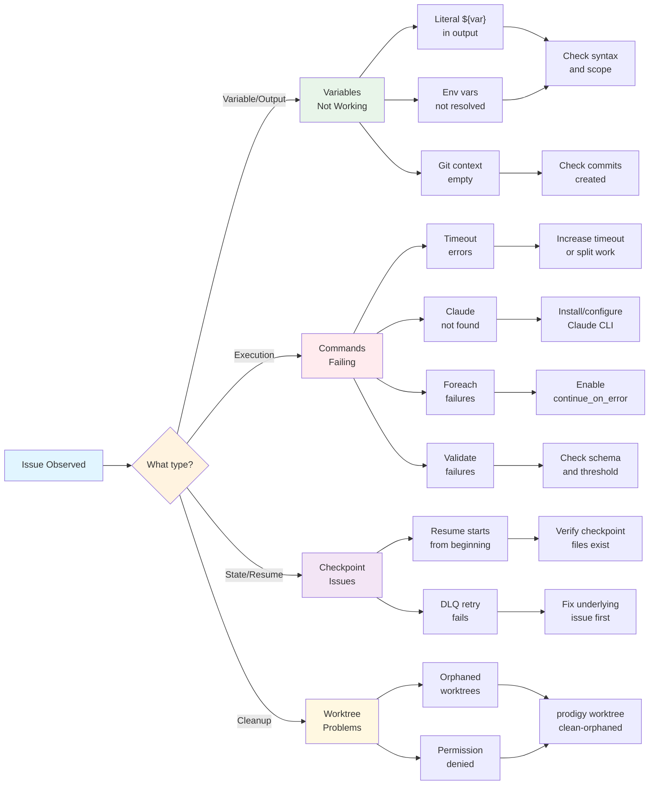

# Troubleshooting

This chapter provides comprehensive guidance for diagnosing and resolving common issues with Prodigy workflows. Whether you're experiencing MapReduce failures, checkpoint issues, or variable interpolation problems, you'll find practical solutions here.

## Troubleshooting Decision Flow

Use this diagram to quickly identify your issue category:



## Quick Reference

Find your issue by symptom:

| Symptom | Section |
|---------|---------|
| Literal `${var}` appears in output | [Variables not interpolating](#variables-not-interpolating) |
| No items to process, empty JSONPath result | [MapReduce items not found](#mapreduce-items-not-found) |
| Commands timing out | [Timeout errors](#timeout-errors) |
| Resume starts from beginning | [Checkpoint resume not working](#checkpoint-resume-not-working) |
| Retry fails or items re-fail immediately | [DLQ items not retrying](#dlq-items-not-retrying-or-re-failing) |
| Orphaned worktrees, permission denied | [Worktree cleanup failures](#worktree-cleanup-failures) |
| Environment variables not resolved | [Environment variables not resolved](#environment-variables-not-resolved) |
| Git context variables empty | [Git context variables empty](#git-context-variables-empty) |
| Foreach iteration failures | [Foreach iteration failures](#foreach-iteration-failures) |
| Template not found errors | [Workflow composition errors](#workflow-composition-errors) |
| Schema validation failed | [Validate command failures](#validate-command-failures) |
| File write permission denied | [Write file failures](#write-file-failures) |
| Claude command not found | [Claude command fails](#claude-command-fails-with-command-not-found) |

## Common Issues

### Variables not interpolating

**Symptoms:** Literal `${var}` appears in output instead of value

**Causes:**
- Variable name typo or case mismatch
- Variable not in scope
- Incorrect syntax
- Variable not captured

**Solutions:**

- Check variable name spelling and case sensitivity
- Verify variable is available in current scope (step vs workflow)
- Ensure proper syntax: `${var}` not `$var` for complex expressions
- Verify capture_output command succeeded
- Check variable was set before use (e.g., in previous step)

**Source**: src/cook/execution/variables.rs

### MapReduce items not found

**Symptoms:** No items to process, empty JSONPath result, or "items.json not found"

**Causes:**
- Input file doesn't exist
- Incorrect JSONPath
- Setup phase failed
- Wrong file format

**Solutions:**

- Verify input file exists with correct path
- Test JSONPath expression with jsonpath-cli or jq
- Check json_path field syntax (default: `$[*]`)
- Ensure setup phase generated the input file successfully
- Validate JSON format with jq or json validator

**Source**: src/cook/execution/mapreduce/input.rs

### Timeout errors

!!! warning "High Impact"
    Timeout errors can cause complete workflow failures and may leave resources in inconsistent states.

**Symptoms:** Commands or phases timing out before completion

**Causes:**
- Operation too slow
- Insufficient timeout
- Hung processes
- Deadlock

**Solutions:**

- Increase timeout value for long operations
- Optimize command execution for better performance
- Split work into smaller chunks (use max_items, offset)
- Check for hung processes with ps or top
- Look for deadlocks in concurrent operations
- Use agent_timeout_secs for MapReduce agents

!!! tip "Timeout Configuration"
    Use `agent_timeout_secs` in MapReduce workflows for per-agent timeouts, and `timeout` at the command level for individual operations.

### Checkpoint resume not working

!!! info "Recovery Feature"
    Checkpoints enable resuming long-running workflows after interruption without losing progress.

**Symptoms:** Resume starts from beginning, fails to load state, or "checkpoint not found"

**Causes:**

- Checkpoint files missing
- Wrong session/job ID
- Workflow changed
- Concurrent resume

**Solutions:**

- Verify checkpoint files exist in `~/.prodigy/state/{repo}/mapreduce/jobs/{job_id}/`
- Check session/job ID is correct with `prodigy sessions list`
- Ensure workflow file hasn't changed significantly
- Check for concurrent resume lock in `~/.prodigy/resume_locks/`
- Review checkpoint file contents for corruption

!!! tip "Finding Session IDs"
    Use `prodigy sessions list` to view all sessions and their job IDs. The session ID and job ID are bidirectionally mapped for easy lookup.

See [MapReduce Checkpoint and Resume](../mapreduce/checkpoint-and-resume.md) for detailed information.

### DLQ items not retrying or re-failing

**Symptoms:** Retry command fails, items immediately fail again, or no progress

**Causes:**

- Systematic error not transient
- DLQ file corrupted
- Underlying issue not fixed

**Solutions:**

- Check DLQ file format and contents with `prodigy dlq show <job_id>`
- Verify error was transient not systematic (e.g., rate limit vs bug)
- Fix underlying issue before retry (e.g., API credentials, file permissions)
- Increase max-parallel for retry if parallelism helps
- Check json_log_location in DLQ for detailed error info

!!! warning "Systematic vs Transient Errors"
    Before retrying, determine if the error is transient (rate limits, network issues) or systematic (bugs, missing files). Retrying systematic errors will fail again.

See [Dead Letter Queue (DLQ)](../mapreduce/dead-letter-queue-dlq.md) for complete DLQ management details.

### Worktree cleanup failures

!!! info "Resource Management"
    Worktrees are temporary git checkouts used for isolation. Orphaned worktrees consume disk space but don't affect workflow correctness.

**Symptoms:** Orphaned worktrees after failures, "permission denied" on cleanup

**Causes:**
- Locked files
- Running processes
- Permission issues
- Disk full

**Solutions:**
- Use `prodigy worktree clean-orphaned <job_id>` for automatic cleanup
- Check for locked files with lsof or similar tools
- Verify no running processes using worktree with ps
- Check disk space with `df -h`
- Verify file permissions on worktree directory
- Manual cleanup if necessary: `rm -rf ~/.prodigy/worktrees/<path>`

**Source**: src/cli/commands/worktree/orphaned_cleanup.rs

### Environment variables not resolved

**Symptoms:** Literal `${VAR}` or `$VAR` appears in commands instead of value

**Causes:**
- Variable not defined
- Wrong profile
- Scope issue
- Syntax error

**Solutions:**
- Check variable defined in env, secrets, or profiles section
- Verify correct profile activated with --profile flag
- Use proper syntax: `${VAR}` for workflow vars, `$VAR` may work for shell
- Check variable scope (global vs step-level)
- Ensure env_files loaded correctly

See [Environment Variables](../environment/index.md) for variable configuration details.

### Git context variables empty

**Symptoms:** `${step.files_added}` returns empty string or undefined

**Causes:**
- No commits created
- Git repo not initialized
- Step not completed
- Wrong format

**Solutions:**
- Ensure commands created commits (use `commit_required: true`)
- Check git repository is initialized in working directory
- Verify step completed before accessing variables
- Use appropriate format modifier (e.g., :json, :newline)
- Check git status to verify changes exist

See [Advanced Git Context](../git-context-advanced.md) for available git variables.

### Foreach iteration failures

**Symptoms:** Foreach command fails partway through, items skipped, or parallel execution errors

**Causes:**
- Command failure with continue_on_error disabled
- Parallel execution resource exhaustion
- Variable interpolation errors in item context
- Max items limit reached unexpectedly

**Solutions:**
- Enable continue_on_error to process remaining items on failure
- Reduce parallelism: `parallel: 5` instead of `parallel: true`
- Verify ${item}, ${index}, ${total} variable interpolation
- Check max_items setting matches expectations
- Review progress bar output for failure patterns
- Use shell command for debugging: `shell: "echo Processing ${item}"`

Example foreach with error handling:

```yaml
# Source: src/cook/execution/foreach.rs:44-515
foreach:
  input:
    list: ["file1.py", "file2.py", "file3.py"]
  parallel: 5  # (1)!
  max_items: 10  # (2)!
  continue_on_error: true  # (3)!
  commands:
    - shell: "echo Processing ${item} (${index}/${total})"  # (4)!
    - claude: "/refactor ${item}"
```

1. Limits concurrent execution to 5 workers (use `true` for unlimited)
2. Process at most 10 items total
3. Continue processing remaining items even if one fails
4. Built-in variables: `${item}` (current value), `${index}` (0-based), `${total}` (count)

### Workflow composition errors

**Symptoms:** "Template not found", "Circular dependency detected", "Required parameter not provided"

**Causes:**
- Missing or unregistered templates
- Circular extends/imports chains
- Required parameters not provided
- Path resolution issues

**Solutions:**
- Verify template exists and is registered: `prodigy template list`
- Register template if needed: `prodigy template register <path>`
- Check for circular dependencies in extends/imports chains
- Provide required parameters via `--param NAME=value` or `--param-file`
- Review template parameter definitions for requirements
- Check template paths are correct (relative to registry or filesystem)

See [Common Error Messages](common-error-messages.md#template-not-found) for specific composition error details.

### Validate command failures

**Symptoms:** "Schema validation failed", "Threshold not met", "Gap-filling failed", validate command error

**Causes:**
- Validation output doesn't match expected_schema
- Completeness percentage below threshold
- Invalid JSON output from validation command
- Timeout during validation
- Gap-filling commands fail

**Solutions:**
- Test validation command independently and check JSON output
- Verify expected_schema matches actual validation output structure
- Check completeness threshold is realistic: `threshold: 80.0`
- Increase validation timeout if needed: `timeout: 300`
- Ensure validation command writes proper JSON to stdout or result_file
- Review gap-filling commands in on_incomplete section
- Use verbose mode to see validation output: `prodigy run workflow.yml -v`

Example validate configuration:

```yaml
# Source: src/cook/workflow/validation.rs:10-49
validate:
  shell: "cargo test --no-fail-fast -- --format json"  # (1)!
  expected_schema:  # (2)!
    type: "object"
    required: ["passed", "total"]
  threshold: 90.0  # (3)!
  on_incomplete:  # (4)!
    commands:
      - claude: "/fix-failing-tests"
```

1. Command that produces JSON output for validation
2. JSON Schema that the output must conform to
3. Minimum percentage of tests that must pass (0-100)
4. Commands to run if threshold not met

### Write file failures

**Symptoms:** "Permission denied", "Directory not found", "Invalid format", file not created or corrupted

**Causes:**
- Parent directory doesn't exist and create_dirs not enabled
- Insufficient permissions to write to path
- Invalid JSON/YAML content when using format validation
- Variable interpolation error in path or content
- Invalid file mode permissions

**Solutions:**
- Enable create_dirs to auto-create parent directories: `create_dirs: true`
- Check directory permissions: `ls -ld $(dirname path/to/file)`
- Verify format validation for JSON/YAML: test content with `jq` or `yq`
- Test variable interpolation independently: `echo "${var}"`
- Ensure file mode is valid octal: `mode: "0644"` not `mode: "644"`
- Use absolute paths or verify working directory context
- Check disk space: `df -h`

Example write_file configuration:

```yaml
# Source: src/config/command.rs:278-313
- write_file:
    path: "output/results-${item.id}.json"  # (1)!
    content: |  # (2)!
      {
        "item_id": "${item.id}",
        "status": "completed"
      }
    format: json  # (3)!
    create_dirs: true  # (4)!
    mode: "0644"  # (5)!
```

1. Supports variable interpolation in file path
2. File content with embedded variable interpolation
3. Validates content as JSON before writing (also supports `yaml`)
4. Auto-create parent directories if they don't exist
5. Unix file permissions in octal format

### Claude command fails with "command not found"

**Symptoms:** Shell error about claude command not existing

!!! note "Prerequisites"
    Claude Code CLI must be installed and accessible in your PATH for Prodigy to execute `claude:` commands in workflows.

**Causes:**
- Claude Code not installed
- Not in PATH
- Wrong executable name

**Solutions:**
- Install Claude Code CLI if not present
- Verify claude is in PATH with `which claude`
- Check command name matches Claude Code CLI (not "claude-code")
- Use full path if necessary: `/path/to/claude`

## Debug Tips

=== "CLI Commands"

    ### Dry-run mode

    Preview commands without execution:

    ```bash
    prodigy run workflow.yml --dry-run
    ```

    Example output:

    ```text
    [DRY-RUN] Workflow: my-workflow.yml
    [DRY-RUN] Mode: sequential
    [DRY-RUN] Step 1: shell: echo "Starting workflow"
    [DRY-RUN] Step 2: claude: /review src/main.rs
    [DRY-RUN] Step 3: shell: cargo test
    [DRY-RUN] Variables resolved:
    [DRY-RUN]   PROJECT_NAME = my-project
    [DRY-RUN]   BUILD_TYPE = release
    ```

    **Source**: src/cli/args.rs:59-61

    ### Verbose mode

    Get execution details with streaming output:

    ```bash
    prodigy run workflow.yml -v     # Claude streaming output
    prodigy run workflow.yml -vv    # + debug logs
    prodigy run workflow.yml -vvv   # + trace-level logs
    ```

    ### Event inspection

    View execution timeline and statistics:

    ```bash
    prodigy events ls --job-id <job_id>      # List events
    prodigy events follow --job-id <job_id>  # Real-time stream
    prodigy events stats                      # Statistics
    ```

    **Source**: src/cli/commands/events.rs:22-98

=== "Log Analysis"

    ### Claude JSON logs

    View complete Claude interactions:

    ```bash
    prodigy logs --latest --summary  # Summary view
    prodigy logs --latest --tail     # Real-time streaming
    ```

    **Shows:** Messages, tool invocations, token usage, errors

    !!! tip "Debugging Failed Commands"
        When a Claude command fails, the JSON log contains the full conversation history and error details.

    ### DLQ inspection

    Review failed MapReduce items:

    ```bash
    prodigy dlq show <job_id>
    ```

    **Shows:** Failed items, error details, retry history, json_log_location

=== "State Inspection"

    ### Checkpoint files

    **Location:** `~/.prodigy/state/{repo}/mapreduce/jobs/{job_id}/`

    **Contents:**

    - Saved execution state
    - Completed items list
    - Variable values
    - Phase progress

    ### Worktree git history

    View commits created during workflow:

    ```bash
    cd ~/.prodigy/worktrees/{repo}/{session}/ && git log --oneline
    ```

    ### Orphaned worktrees

    List and clean orphaned worktrees:

    ```bash
    prodigy worktree ls                       # List all
    prodigy worktree clean-orphaned <job_id>  # Clean specific job
    ```

## Additional Topics

For more specific troubleshooting guidance, see:
- [FAQ](faq.md) - Frequently asked questions
- [Common Error Messages](common-error-messages.md) - Specific error messages explained
