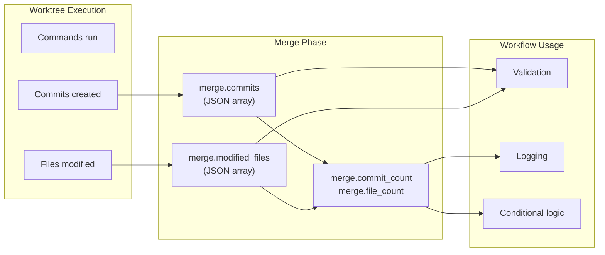

# Git and Merge Variables

This section covers variables for git context tracking throughout workflow execution and merge phase variables for worktree integration.

## Git Context Variables

Variables tracking git changes throughout workflow execution:

| Variable | Description | Example |
|----------|-------------|---------|
| `${step.files_added}` | Files added in current step | `echo ${step.files_added}` |
| `${step.files_modified}` | Files modified in current step | `echo ${step.files_modified}` |
| `${step.files_deleted}` | Files deleted in current step | `echo ${step.files_deleted}` |
| `${step.files_changed}` | All changed files (added + modified + deleted) | `echo ${step.files_changed}` |
| `${step.commits}` | Commits in current step | `echo ${step.commits}` |
| `${step.commit_count}` | Number of commits in step | `echo "${step.commit_count} commits"` |
| `${step.insertions}` | Lines inserted in step | `echo "+${step.insertions}"` |
| `${step.deletions}` | Lines deleted in step | `echo "-${step.deletions}"` |
| `${workflow.commits}` | All commits in workflow | `git show ${workflow.commits}` |
| `${workflow.commit_count}` | Total number of commits | `echo "${workflow.commit_count} commits"` |

**Available in:** All phases (requires git repository)

### Format Modifiers

!!! info "Applies to all git list variables"
    These format modifiers work with **all git context variables that return file or commit lists**, including merge phase variables like `merge.commits` and `merge.modified_files`. Note that merge variables return JSON by default.

Git context variables support multiple output formats:

| Modifier | Description | Example |
|----------|-------------|---------|
| (default) | Space-separated list | `${step.files_added}` → `file1.rs file2.rs` |
| `:json` | JSON array format | `${step.files_added:json}` → `["file1.rs", "file2.rs"]` |
| `:lines` | Newline-separated list | `${step.files_added:lines}` → `file1.rs\nfile2.rs` |
| `:csv` | Comma-separated list | `${step.files_added:csv}` → `file1.rs,file2.rs` |
| `:*.ext` | Glob pattern filter | `${step.files_added:*.rs}` → only Rust files |
| `:path/**/*.ext` | Path with glob | `${step.files_added:src/**/*.rs}` → Rust files in src/ |

**Format Examples:**
```yaml
# JSON format for jq processing
- shell: "echo '${step.files_added:json}' | jq -r '.[]'"

# Newline format for iteration
- shell: |
    echo '${step.files_modified:lines}' | while read file; do
      cargo fmt "$file"
    done

# Glob filtering for language-specific operations
- shell: "cargo clippy ${step.files_modified:*.rs}"

# Multiple glob patterns
- shell: "git diff ${step.files_modified:*.rs,*.toml}"
```

## Merge Variables (Merge Phase Only)

Variables available during the merge phase when integrating worktree changes. Merge variables include both basic context and comprehensive git tracking information.



### Basic Merge Context

| Variable | Description | Example |
|----------|-------------|---------|
| `${merge.worktree}` | Worktree name being merged | `echo ${merge.worktree}` |
| `${merge.source_branch}` | Source branch from worktree | `git log ${merge.source_branch}` |
| `${merge.target_branch}` | Target branch (where you started) | `git merge ${merge.source_branch}` |
| `${merge.session_id}` | Session ID for correlation | `echo ${merge.session_id}` |

### Merge Git Context Variables

Additional variables tracking git changes during the merge operation:

| Variable | Description | Format | Example |
|----------|-------------|--------|---------|
| `${merge.commits}` | All commits from worktree | JSON array | `echo '${merge.commits}' \| jq` |
| `${merge.commit_count}` | Number of commits | Integer | `echo "${merge.commit_count} commits"` |
| `${merge.commit_ids}` | Short commit IDs | Comma-separated | `git show ${merge.commit_ids}` |
| `${merge.modified_files}` | Modified files with metadata | JSON array | `echo '${merge.modified_files}' \| jq` |
| `${merge.file_count}` | Number of modified files | Integer | `echo "${merge.file_count} files"` |
| `${merge.file_list}` | File paths | Comma-separated | `echo ${merge.file_list}` |

!!! note "Availability"
    These variables are only available in the merge phase of workflows.

!!! warning "Limits"
    Capped at 100 commits and 500 files to prevent overwhelming workflows. These limits are configurable in `GitOperationsConfig`.

### Fallback Behavior

When git information cannot be retrieved (e.g., worktree doesn't exist yet or git operations fail), variables are set to safe defaults:

| Variable | Fallback Value |
|----------|----------------|
| `merge.commits` | `[]` (empty JSON array) |
| `merge.modified_files` | `[]` (empty JSON array) |
| `merge.commit_count` | `0` |
| `merge.file_count` | `0` |
| `merge.file_list` | (empty string) |
| `merge.commit_ids` | (empty string) |

!!! tip "Handling empty results"
    Always check counts before processing arrays to handle edge cases gracefully:
    ```yaml
    - shell: |
        if [ ${merge.file_count} -gt 0 ]; then
          echo '${merge.modified_files}' | jq -r '.[].path'
        else
          echo "No files modified"
        fi
    ```

### Merge Context Examples

**Basic merge workflow:**
```yaml
merge:
  commands:
    - shell: "git fetch origin"
    - shell: "git merge origin/${merge.target_branch}"
    - claude: "/prodigy-merge-worktree ${merge.source_branch} ${merge.target_branch}"
```

**Using git context variables:**
```yaml
merge:
  commands:
    # Show merge summary
    - shell: |
        echo "Merging worktree: ${merge.worktree}"
        echo "Commits: ${merge.commit_count}"
        echo "Files modified: ${merge.file_count}"

    # List all commits being merged
    - shell: "echo 'Commit IDs: ${merge.commit_ids}'"

    # Process commits as JSON
    - shell: |
        echo '${merge.commits}' | jq -r '.[] | "\(.short_id): \(.message)"'

    # Check specific files
    - shell: |
        echo '${merge.modified_files}' | jq -r '.[].path'

    # Conditional merge based on file count
    - shell: |
        if [ ${merge.file_count} -gt 50 ]; then
          echo "Large merge detected, requesting review"
        fi

    # Perform merge
    - claude: "/prodigy-merge-worktree ${merge.source_branch} ${merge.target_branch}"
```

### Commit Object Structure

The `${merge.commits}` variable contains an array of commit objects with this structure:

```json
// Source: src/cook/execution/mapreduce/resources/git_operations.rs:282-293
[
  {
    "id": "full-sha-hash",
    "short_id": "abc1234",
    "author": {
      "name": "Author Name",
      "email": "author@example.com",
      "timestamp": "2025-01-10T12:00:00Z"
    },
    "committer": {
      "name": "Committer Name",
      "email": "committer@example.com",
      "timestamp": "2025-01-10T12:05:00Z"
    },
    "message": "Commit message",
    "timestamp": "2025-01-10T12:00:00Z",
    "parent_ids": ["parent-sha-1", "parent-sha-2"],
    "tree_id": "tree-sha-hash",
    "stats": {
      "files_changed": 3,
      "insertions": 45,
      "deletions": 12
    },
    "files_changed": ["file1.rs", "file2.rs"]
  }
]
```

!!! note "Optional fields"
    The `stats` field is optional and may be `null` if commit statistics are not available.

| Field | Type | Description |
|-------|------|-------------|
| `id` | string | Full SHA hash of the commit |
| `short_id` | string | Short (7-character) commit ID |
| `author` | object | Author information with name, email, and timestamp |
| `committer` | object | Committer information (may differ from author) |
| `message` | string | Full commit message |
| `timestamp` | string | ISO 8601 timestamp |
| `parent_ids` | array | SHA hashes of parent commits |
| `tree_id` | string | SHA hash of the tree object |
| `stats` | object/null | Optional commit statistics |
| `files_changed` | array | List of file paths changed in this commit |

### File Object Structure

The `${merge.modified_files}` variable contains an array of file modification objects:

```json
// Source: src/cook/execution/mapreduce/resources/git_operations.rs:313-322
[
  {
    "path": "src/main.rs",
    "modification_type": "Modified",
    "size_before": 1024,
    "size_after": 1156,
    "last_modified": "2025-01-10T12:00:00Z",
    "commit_id": "abc1234",
    "diff_stats": {
      "lines_added": 15,
      "lines_removed": 3,
      "lines_context": 42
    },
    "content_diff": null
  }
]
```

| Field | Type | Description |
|-------|------|-------------|
| `path` | string | File path relative to repository root |
| `modification_type` | string/object | Type of modification (see below) |
| `size_before` | number/null | File size before modification (bytes) |
| `size_after` | number/null | File size after modification (bytes) |
| `last_modified` | string | ISO 8601 timestamp of last modification |
| `commit_id` | string/null | Short commit ID where change occurred |
| `diff_stats` | object/null | Optional line-level diff statistics |
| `content_diff` | string/null | Optional unified diff content |

#### Modification Types

The `modification_type` field can be one of:

| Type | Value | Description |
|------|-------|-------------|
| Added | `"Added"` | New file created |
| Modified | `"Modified"` | Existing file changed |
| Deleted | `"Deleted"` | File removed |
| Renamed | `{"Renamed": {"from": "old/path.rs"}}` | File moved/renamed |
| Copied | `{"Copied": {"from": "source/path.rs"}}` | File copied from another location |

!!! example "Handling renamed files"
    ```yaml
    - shell: |
        echo '${merge.modified_files}' | jq -r '
          .[] | select(.modification_type | type == "object") |
          select(.modification_type.Renamed) |
          "\(.modification_type.Renamed.from) -> \(.path)"
        '
    ```
