# Available Variables

Prodigy provides a comprehensive set of built-in variables that are automatically available based on your workflow context. All variables use the `${variable.name}` interpolation syntax.

## Variable Availability by Phase

Different variables become available at different phases of workflow execution:

```mermaid
flowchart LR
    subgraph Always["Always Available"]
        direction TB
        Env["env.* variables"]
        Context["session.id
        project.root
        project.name"]
        Computed["file: cmd:
        date: uuid"]
    end

    subgraph Setup["Setup Phase"]
        direction TB
        SetupOut["shell.output
        claude.output
        last.output"]
    end

    subgraph Map["Map Phase"]
        direction TB
        Item["item.*
        item.id
        item.index"]
        MapOut["shell.output
        claude.output"]
    end

    subgraph Reduce["Reduce Phase"]
        direction TB
        MapResults["map.total
        map.successful
        map.failed
        map.results"]
        ReduceOut["reduce.output"]
    end

    subgraph Merge["Merge Phase"]
        direction TB
        MergeVars["merge.source_branch
        merge.target_branch
        merge.worktree"]
    end

    Always --> Setup --> Map --> Reduce --> Merge

    style Always fill:#e8f5e9
    style Setup fill:#e1f5ff
    style Map fill:#fff3e0
    style Reduce fill:#f3e5f5
    style Merge fill:#fce4ec
```

!!! tip "Most Commonly Used"
    The variables you'll use most often are:

    - **`${item.*}`** - Access work item fields in the map phase
    - **`${last.output}`** - Capture output from the previous command
    - **`${map.results}`** - Access all results in the reduce phase

## Variable Categories

-   :material-format-text:{ .lg .middle } **Standard and Computed Variables**

    ---

    Core output variables, environment access, file content, command output, JSON extraction, date formatting, and UUID generation

    [:octicons-arrow-right-24: Standard Variables](standard-variables.md)

-   :material-map:{ .lg .middle } **MapReduce Variables**

    ---

    Item variables for the map phase and aggregated result variables for the reduce phase

    [:octicons-arrow-right-24: MapReduce Variables](mapreduce-variables.md)

-   :material-source-branch:{ .lg .middle } **Git and Merge Variables**

    ---

    Git context tracking, file change monitoring, commit tracking, and merge phase variables

    [:octicons-arrow-right-24: Git and Merge Variables](git-merge-variables.md)

-   :material-code-braces:{ .lg .middle } **Interpolation Reference**

    ---

    Syntax reference, legacy aliases, scoping rules, precedence, and performance optimization

    [:octicons-arrow-right-24: Interpolation Reference](interpolation-reference.md)

## Quick Reference

### Standard Variables

| Variable | Description |
|----------|-------------|
| `${last.output}` | Output from the last command of any type |
| `${shell.output}` | Output from the last shell command |
| `${shell.last_output}` | Alias for shell.output |
| `${shell.exit_code}` | Exit code from the last shell command |
| `${claude.output}` | Output from the last Claude command |
| `${env.VAR_NAME}` | Read environment variable |
| `${file:path}` | Read file contents |
| `${cmd:command}` | Execute command and capture output |
| `${date:format}` | Current date/time with format |
| `${uuid}` | Generate random UUID v4 |

### Context Variables

| Variable | Description |
|----------|-------------|
| `${session.id}` | Current session identifier |
| `${project.root}` | Root directory of the project |
| `${project.name}` | Name of the current project |
| `${worktree.name}` | Name of the current worktree |
| `${worktree.path}` | Path to the current worktree |

### MapReduce Variables

| Variable | Phase | Description |
|----------|-------|-------------|
| `${item.*}` | Map | Access work item fields |
| `${item.id}` | Map | Work item identifier |
| `${item.index}` | Map | Work item index (0-based) |
| `${map.total}` | Reduce | Total items processed |
| `${map.successful}` | Reduce | Number of successfully processed items |
| `${map.failed}` | Reduce | Number of failed items |
| `${map.results}` | Reduce | All map results as JSON |
| `${reduce.output}` | Reduce | Output from the reduce phase |

### Git Variables

| Variable | Description |
|----------|-------------|
| `${step.files_modified}` | Files modified in current step |
| `${step.commits}` | Commits in current step |
| `${workflow.commit_count}` | Total commits in workflow |
| `${merge.source_branch}` | Source branch from worktree |
