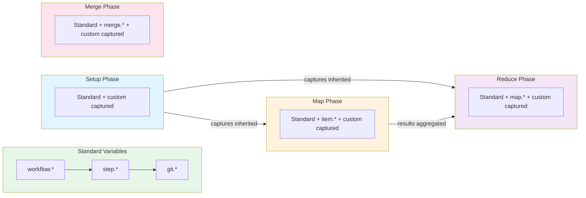
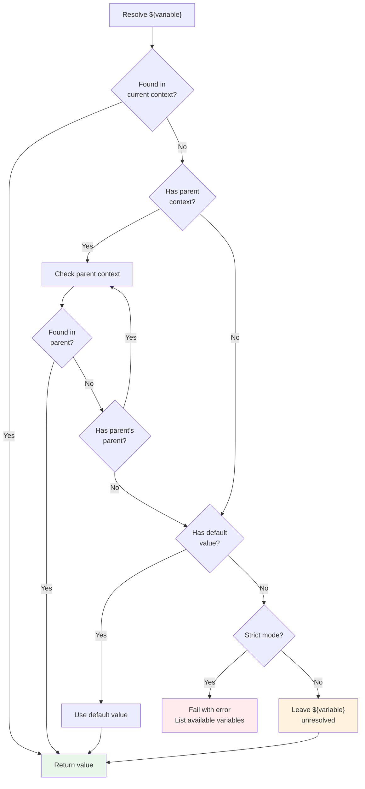
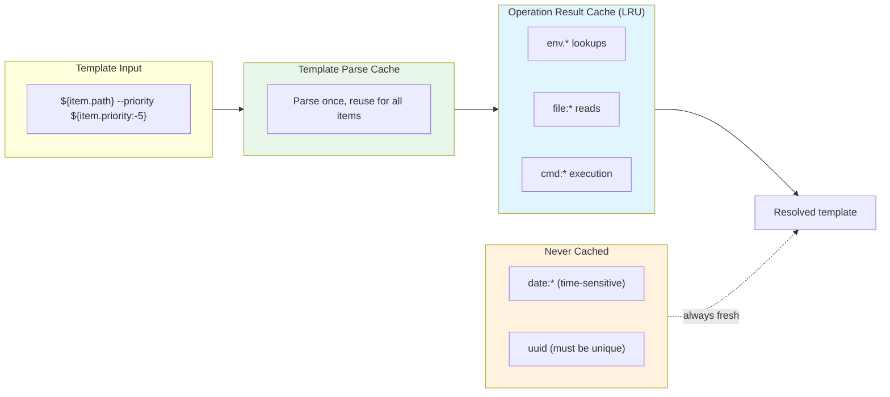

# Interpolation Reference

This section covers variable interpolation syntax, legacy aliases, scoping rules, precedence, and performance optimization.

## Variable Interpolation Syntax

Prodigy supports two interpolation syntaxes:

- **`${VAR}`** - Preferred syntax, works in all contexts (recommended)
- **`$VAR`** - Shell-style syntax, simpler but may have limitations

**When to use `${VAR}`:**
- In YAML values with special characters
- For nested field access: `${item.nested.field}`
- When combining with text: `prefix_${var}_suffix`
- For format modifiers: `${step.files:json}`

**When `$VAR` works:**
- Simple variable names in shell commands
- Environment variables in shell context
- Quick substitutions without special characters

!!! tip "Best Practice"
    Always use `${VAR}` syntax for consistency and reliability.

## Legacy Variable Aliases

For backward compatibility, Prodigy supports legacy variable aliases from earlier versions. These are still functional but **deprecated** - prefer the current variable names in new workflows.

```text
# Source: src/cook/workflow/variables.rs
```

| Legacy Alias | Current Variable | Context | Status |
|--------------|------------------|---------|--------|
| `${ARG}` | `${item.value}` | Map phase | Deprecated |
| `${ARGUMENT}` | `${item.value}` | Map phase | Deprecated |
| `${FILE}` | `${item.path}` | Map phase | Deprecated |
| `${FILE_PATH}` | `${item.path}` | Map phase | Deprecated |

**Example:**

=== "Legacy Style (Deprecated)"
    ```yaml
    map:
      agent_template:
        - shell: "process ${ARG}"
        - shell: "cat ${FILE}"
    ```

=== "Current Style (Recommended)"
    ```yaml
    map:
      agent_template:
        - shell: "process ${item.value}"
        - shell: "cat ${item.path}"
    ```

!!! warning "Migration Recommendation"
    Update legacy aliases to current variable names when maintaining older workflows. The current names are more explicit and work better with arbitrary JSON field access.

## Default Values

Provide fallback values for undefined or missing variables using the `:-` syntax (bash/shell convention):

**Syntax:** `${variable:-default_value}`

```text
# Source: src/cook/execution/interpolation.rs:276-290 (parse_variable_expression function)
```

**Examples:**
```yaml
# Use default if variable is undefined
- shell: "echo 'Timeout: ${timeout:-600}'"
  # Output: "Timeout: 600" if timeout is not defined

# Fallback for optional configuration
- shell: "cargo build --profile ${build_profile:-dev}"
  # Uses "dev" profile if build_profile not set

# Default for MapReduce variables
- shell: "echo 'Processed ${map.successful:-0} items'"
  # Shows "0" if map.successful is not available
```

**Behavior with Interpolation Modes:**

- **Non-strict mode (default):** Uses default value if variable is undefined
- **Strict mode:** Default value syntax prevents errors for optional variables

## Interpolation Modes

Prodigy supports two modes for handling undefined variables:

=== "Non-strict Mode (Default)"
    - Leaves placeholders unresolved when variable is undefined
    - Example: `${undefined}` remains as `${undefined}` in output
    - With default: `${undefined:-fallback}` becomes `fallback`
    - Use case: Workflows that can handle partial variable resolution

=== "Strict Mode"
    - Fails immediately on undefined variables
    - Example: `${undefined}` causes workflow to fail with comprehensive error
    - Error message lists all available variables for debugging
    - Use case: Production workflows requiring all variables to be properly defined

```text
# Source: src/cook/execution/interpolation.rs:15-22 (InterpolationEngine struct),
#         src/cook/execution/interpolation.rs:80-139 (resolve_template_segments with strict mode)
```

**Configuration:**
Strict mode is configured per InterpolationEngine instance and controlled at the workflow execution level.

!!! tip "Best Practice"
    Use strict mode during development to catch variable name typos and scope issues early. Use default values (`${var:-default}`) for truly optional configuration.

**Examples:**
```yaml
# Non-strict mode (graceful degradation)
- shell: "echo 'Config: ${optional_config:-none}'"
  # Works even if optional_config is undefined

# Strict mode (fail fast)
# If required_var is undefined, workflow stops with error:
# "Variable interpolation failed: required_var not found.
#  Available variables: workflow.name, workflow.id, step.index, ..."
- shell: "echo 'Required: ${required_var}'"
```

## Variable Scoping and Precedence

### Scope by Phase



**Figure**: Variable availability across workflow phases showing inheritance flow.

| Phase | Variables Available |
|-------|---------------------|
| Setup | Standard, workflow context, step context, git context, custom captured |
| Map | Standard, workflow context, step context, git context, item variables, custom captured |
| Reduce | Standard, workflow context, step context, git context, MapReduce variables, custom captured |
| Merge | Standard, workflow context, step context, merge variables, custom captured |

!!! note "Variable Inheritance"
    Setup phase captures are available in map and reduce phases. Map phase captures are only available within that specific agent. Reduce phase captures are available to subsequent reduce steps.

### Variable Precedence (highest to lowest)

1. **Custom captured variables** (`capture_output`)
2. **Phase-specific built-in variables** (`item.*`, `map.*`, `merge.*`)
3. **Step context variables** (`step.*`)
4. **Workflow context variables** (`workflow.*`)
5. **Standard output variables** (`last.output`, `shell.output`)
6. **Environment variables** (static workflow-level `env` block)
7. **Computed variables** (`env.*`, `file:*`, `cmd:*`, `json:*`, `date:*`, `uuid`)

### Dual Interpolation Systems

Prodigy uses two complementary interpolation systems:

| System | Location | Purpose |
|--------|----------|---------|
| **InterpolationEngine** | `src/cook/execution/interpolation.rs` | Basic variable resolution, template parsing, strict mode handling |
| **VariableContext** | `src/cook/execution/variables.rs` | Computed variables, scoped lookups, LRU caching |

The `InterpolationEngine` handles basic `${variable}` substitution with context inheritance. The `VariableContext` provides advanced features like computed variables (`env.*`, `file:*`, `cmd:*`, `json:*`, `date:*`, `uuid`) with three scope levels:

```text
# Source: src/cook/execution/variables.rs:394-399 (ScopeLevel enum)
```

| Scope Level | Priority | Description |
|-------------|----------|-------------|
| **Local** | Highest | Variables set within current command/step |
| **Phase** | Medium | Variables available throughout the phase |
| **Global** | Lowest | Workflow-wide variables |

!!! note "Computed Variable Precedence"
    Computed variables have lowest precedence because they're evaluated on-demand. If a custom variable has the same name as a computed variable, the custom variable wins.

!!! warning "Shadowing Warning"
    Custom captures can shadow built-in variable names. Avoid using names like `item`, `map`, `workflow`, etc. as custom variable names.

**Example:**
```yaml
# Bad: shadows built-in ${item}
- shell: "custom command"
  capture_output: "item"  # Don't do this!

# Good: descriptive custom name
- shell: "custom command"
  capture_output: "custom_result"
```

### Parent Context Resolution

Variable resolution walks up a parent context chain when variables are not found in the current context. This enables variable inheritance across workflow phases and nested contexts.

```text
# Source: src/cook/execution/interpolation.rs:376-383 (InterpolationContext struct),
#         src/cook/execution/interpolation.rs:421-438 (resolve_path with parent resolution)
```



**Figure**: Variable resolution flow showing parent context chain traversal.

**Resolution Order:**

1. Check current context
2. If not found, check parent context
3. If not found in parent, check parent's parent
4. Continue until variable is found or no parent exists
5. If not found and has default value, use default
6. If not found in strict mode, fail with error listing available variables

**Benefits:**

- Nested workflow contexts inherit variables from parent workflows
- Foreach loops access both loop-level and workflow-level variables
- Map agents access setup phase variables
- Reduce phase accesses both map results and setup variables

**Example:**
```yaml
setup:
  - shell: "pwd"
    capture_output: "workspace_root"  # Available to all agents via parent context
  - shell: "git rev-parse HEAD"
    capture_output: "base_commit"     # Also inherited by map agents

map:
  input: "items.json"
  json_path: "$.items[*]"
  agent_template:
    - shell: "echo 'processing ${item.name}'"
      capture_output: "item_status"  # Only in this agent's context
    - shell: "cd ${workspace_root}"  # Resolved from parent (setup) context
    - shell: "git diff ${base_commit}" # Also from parent context
    - shell: "echo 'Status: ${item_status}'" # From current agent context

reduce:
  # Can access setup variables but NOT individual agent's item_status
  - shell: "cd ${workspace_root}"  # From setup phase parent context
  - shell: "echo 'Base: ${base_commit}'"  # Also from setup phase
```

**Context Hierarchy:**
```
Setup Context (workspace_root, base_commit)
    ↓ parent
Map Agent Context (item, item_status, workspace_root*, base_commit*)
    ↓ parent
Reduce Context (map.results, workspace_root*, base_commit*)
```

*Inherited from parent context

## Performance: Template Caching

Prodigy implements **dual caching** for optimal performance: template parsing cache and operation result cache.

```text
# Source: src/cook/execution/interpolation.rs:68-77 (template cache in get_or_parse_template),
#         src/cook/execution/variables.rs:421-455 (VariableContext with LRU cache)
```



**Figure**: Dual caching architecture showing template parse cache and operation result cache.

### Template Parse Caching

When the same variable template is used multiple times, the template is parsed once and reused:

**How It Works:**

- First use: Template is parsed and cached
- Subsequent uses: Cached template is reused (no re-parsing)
- Cache key: Exact template string
- Automatic: No configuration needed

**Example:**
```yaml
# Template "${item.path} --priority ${item.metadata.priority:-5}"
# is parsed once, then reused for all 1000 items
map:
  input: "items.json"  # 1000 items
  json_path: "$.items[*]"
  agent_template:
    - shell: "process ${item.path} --priority ${item.metadata.priority:-5}"
```

### Computed Variable Caching

Expensive computed operations (file reads, command execution) have separate result caching:

**Cached Operations:**

- `${env.VAR}` - Environment variable lookups
- `${file:path}` - File system reads
- `${cmd:command}` - Shell command execution

**Not Cached:**

- `${json:path:from:variable}` - JSON path extraction is fast
- `${date:format}` - Values change over time
- `${uuid}` - Must be unique each time

!!! note "JSON Variable Syntax"
    Use `${json:path:from:variable}` to extract values from JSON. For example, `${json:database.host:from:config}` extracts the `database.host` field from the `config` variable.

**Cache Details:**

- **Type:** LRU (Least Recently Used) cache
- **Size:** 100 entries maximum
- **Scope:** Per workflow execution
- **Thread Safety:** Async RwLock protection

**Performance Impact:**
```yaml
# First shell command: Reads .commit-message.txt from disk
- shell: "git commit -m '${file:.commit-message.txt}'"

# Second shell command: Uses cached file content (no disk read)
- shell: "echo 'Message: ${file:.commit-message.txt}'"

# Third shell command: Still uses cache
- shell: "test -n '${file:.commit-message.txt}'"
```

**Benefits:**

- **Faster interpolation** for repeated templates (template cache)
- **Reduced I/O** for repeated file reads (operation cache)
- **Lower CPU** for repeated command execution (operation cache)
- **Reduced latency** in MapReduce workflows

**When It Matters Most:**

- MapReduce workflows with many work items (>100)
- Workflows using the same computed variables repeatedly
- High-frequency variable interpolation in loops
- Templates with multiple variables and nested field access

!!! note "Transparent Caching"
    All caching is transparent and automatic. You don't need any configuration to benefit from it. Both caches persist for the lifetime of the workflow execution.
