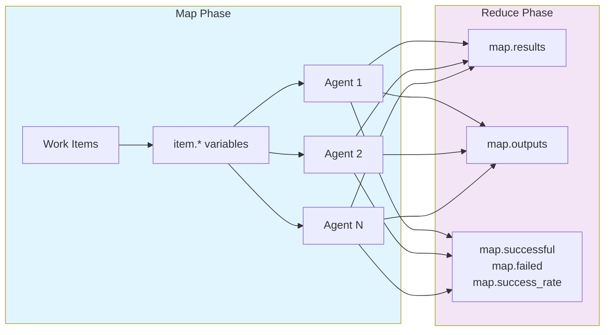

# MapReduce Variables

This section covers variables available during MapReduce workflow execution, including item variables for the map phase and aggregated result variables for the reduce phase.



## Item Variables (Map Phase Only)

Variables for accessing work item data during parallel processing. The `${item.*}` syntax supports **arbitrary field access** - you can access any field present in your JSON work items, not just the predefined ones shown below.

**Source:** src/cook/workflow/variables.rs:16-23 (item variable resolution)

| Variable | Description | Example |
|----------|-------------|---------|
| `${item}` | Full item object (as string) | `echo ${item}` |
| `${item.value}` | Item value for simple types | `process ${item.value}` |
| `${item.path}` | File path (for file inputs) | `cat ${item.path}` |
| `${item.name}` | Item display name | `echo "Processing ${item.name}"` |
| `${item_index}` | Zero-based item index | `Item ${item_index}` |
| `${item_total}` | Total number of items | `of ${item_total}` |
| `${item.*}` | **Any JSON field** - Access arbitrary fields from your work items | `${item.priority}`, `${item.custom_field}` |

**Available in:** Map phase only

### Arbitrary Field Access

!!! tip "Design Your JSON for Variable Access"
    Structure your work items with descriptive field names—they become your variable names directly. Fields like `priority`, `owner`, and `metadata.reviewer` are immediately accessible as `${item.priority}`, `${item.owner}`, and `${item.metadata.reviewer}`.

The `${item.*}` syntax provides full access to any field in your JSON work items. This includes:

- **Top-level fields:** `${item.priority}`, `${item.status}`, `${item.category}`
- **Nested fields:** `${item.metadata.author}`, `${item.config.database.host}`
- **Array indices:** `${item.tags[0]}`, `${item.dependencies[2].version}`
- **Mixed access:** `${item.data.results[0].score}`

**Example with custom JSON structure:**
```yaml
# Input: items.json
# [
#   {
#     "file": "src/main.rs",
#     "priority": 10,
#     "owner": "backend-team",
#     "metadata": {
#       "last_modified": "2025-01-10",
#       "reviewer": "alice"
#     },
#     "tags": ["critical", "security"]
#   }
# ]

map:
  input: "items.json"
  json_path: "$[*]"
  agent_template:
    # Access any field from your JSON structure
    - shell: "echo 'Processing ${item.file}'"
    - shell: "echo 'Priority: ${item.priority}'"
    - shell: "echo 'Owner: ${item.owner}'"
    - shell: "echo 'Reviewer: ${item.metadata.reviewer}'"
    - shell: "echo 'First tag: ${item.tags[0]}'"
    - claude: "/analyze '${item.file}' --priority ${item.priority} --owner ${item.owner}"
```

**Best Practice:** Use descriptive field names in your JSON work items - they become your variable names.

## MapReduce Variables (Reduce Phase Only)

Variables for accessing aggregated results from map phase. Map results support **indexed access** for retrieving individual agent results and **nested field access** for extracting specific properties.

**Source:** src/cook/execution/mapreduce/utils.rs:119-121, src/cook/execution/mapreduce/reduce_phase.rs:143-171

| Variable | Description | Example |
|----------|-------------|---------|
| `${map.total}` | Total items in map phase | `echo "Processed ${map.total} items"` |
| `${map.successful}` | Successfully processed items | `echo "${map.successful} succeeded"` |
| `${map.failed}` | Failed items count | `echo "${map.failed} failed"` |
| `${map.success_rate}` | Success rate as percentage (0-100) | `echo "Success rate: ${map.success_rate}%"` |
| `${map.results}` | All map results as JSON array | `echo '${map.results}' \| jq` |
| `${map.results_json}` | Alias for `map.results` (same value) | `echo '${map.results_json}' \| jq` |
| `${map.outputs}` | JSON array of successful agent outputs | `echo '${map.outputs}' \| jq` |
| `${map.results[index]}` | Individual result by index (0-based) | `${map.results[0]}`, `${map.results[5]}` |
| `${map.results[index].field}` | Nested field access | `${map.results[0].output}`, `${map.results[2].item_id}` |
| `${map.key}` | Key for map output (optional) | `${map.key}` |
| `${worker.id}` | Worker ID for tracking | `Worker ${worker.id}` |

**Available in:** Reduce phase only

!!! tip "Choosing Between `${map.results}` and `${map.outputs}`"
    Use `${map.results}` when you need the full result objects including metadata (success status, item_id, errors). Use `${map.outputs}` when you only need the output strings from successful agents—it's pre-filtered and simpler to work with.

### Indexed Access to Map Results

!!! warning "Index Bounds"
    Ensure your index is within range—accessing `${map.results[10]}` when only 5 items were processed will result in an empty value. Use `${map.total}` to verify the result count before indexed access.

You can access individual agent results using bracket notation `[index]` and drill into nested fields with dot notation.

**Syntax patterns:**
- `${map.results[0]}` - First agent result (full object)
- `${map.results[0].output}` - Output from first agent
- `${map.results[0].item_id}` - Item ID processed by first agent
- `${map.results[0].success}` - Success status ("true" or "false")

**Example:**
```yaml
reduce:
  # Access specific agent results
  - shell: "echo 'First result: ${map.results[0]}'"
  - shell: "echo 'First output: ${map.results[0].output}'"
  - shell: "echo 'Second agent processed: ${map.results[1].item_id}'"

  # Combine with shell commands
  - shell: |
      if [ "${map.results[0].success}" = "true" ]; then
        echo "First agent succeeded"
      fi

  # Process multiple results
  - shell: |
      echo "Results 0-2:"
      echo "${map.results[0].item_id}"
      echo "${map.results[1].item_id}"
      echo "${map.results[2].item_id}"
```

### Full Array Processing

!!! example "When to Use Full Array Processing"
    Use `jq` with `${map.results}` for aggregations across all results: counting errors, calculating averages, filtering by status, or extracting specific fields from every result.

For processing all results, use `${map.results}` with JSON tools like `jq`:

```yaml
reduce:
  # Count errors using jq
  - shell: |
      echo '${map.results}' | jq '[.[] | select(.status == "error")] | length'
    capture_output: "error_count"

  # Extract all item IDs
  - shell: |
      echo '${map.results}' | jq -r '.[].item_id'
    capture_output: "processed_items"

  # Calculate average score
  - shell: |
      echo '${map.results}' | jq '[.[].score] | add / length'
    capture_output: "avg_score"

  # Filter successful results
  - shell: |
      echo '${map.results}' | jq '[.[] | select(.success == true)]'
    capture_output: "successful_results"

  # Generate summary
  - claude: "/summarize ${map.results} --total ${map.total} --failed ${map.failed}"
```

**Note:** `${map.results}` and `${map.results_json}` are equivalent - use whichever is clearer in your context.

## Reduce Phase Access to Item Data

In the reduce phase, individual item variables (`${item.*}`) are not directly available, but you can access all item data through `${map.results}`, which contains the aggregated results from all map agents.

**Examples:**
```yaml
reduce:
  # Count items with specific property
  - shell: |
      echo '${map.results}' | jq '[.[] | select(.type == "error")] | length'
    capture_output: "error_count"

  # Extract all file paths processed
  - shell: |
      echo '${map.results}' | jq -r '.[].item.path'
    capture_output: "all_paths"

  # Aggregate numeric field
  - shell: |
      echo '${map.results}' | jq '[.[].coverage] | add / length'
    capture_output: "avg_coverage"

  # Filter and transform results
  - shell: |
      echo '${map.results}' | jq '[.[] | select(.item.priority > 5) | .item.name]'
    capture_output: "high_priority_items"
```

!!! note "Semigroup-Based Aggregations"
    For advanced aggregation patterns (count, sum, average, median, unique values, etc.) across parallel agents, Prodigy uses semigroup composition. This enables safe parallel aggregation with type validation. See [Semigroup Composition](../../stillwater-patterns/semigroup-composition.md) for details on workflow-level aggregation variables.
