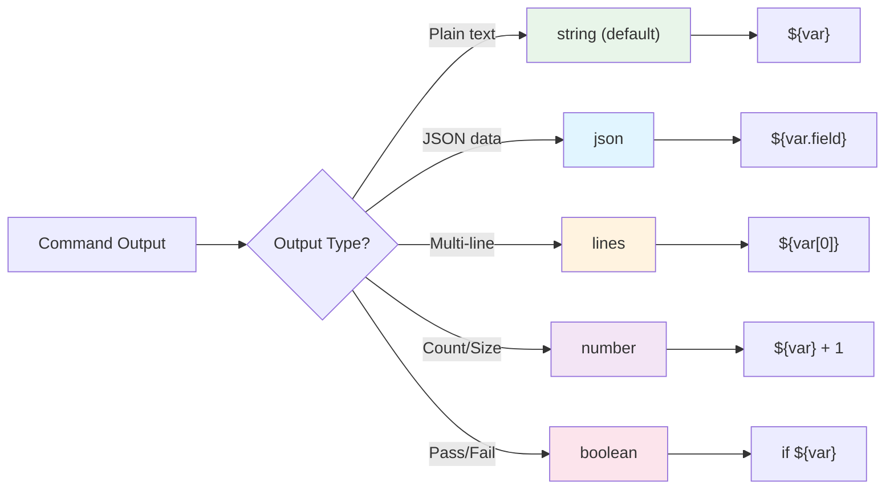
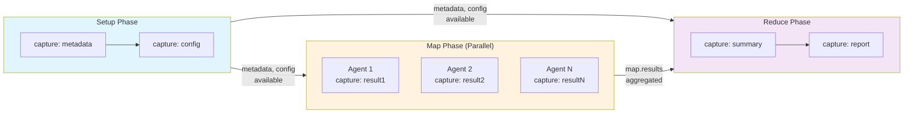

## Custom Variable Capture

Custom capture variables allow you to save command output with explicit names for later use. This provides fine-grained control over what data is captured, how it's formatted, and when it's available to subsequent steps.

!!! tip "Recommendation"
    Use custom variable names (e.g., `capture_output: "file_count"`) instead of `capture_output: true` for clarity and to avoid accidentally overwriting previous captures.

### Basic Syntax

The `capture_output` field can be used with any command type (shell, claude, handler):

```yaml
# Option 1: No capture (default)
- shell: "cargo test"
  capture_output: false

# Option 2: Boolean - use default variable name
- shell: "cargo test"
  capture_output: true  # Creates ${shell.output}

# Option 3: Custom variable name (recommended)
- shell: "ls -la | wc -l"
  capture_output: "file_count"  # Creates ${file_count}
```

### Default Variable Names

When using `capture_output: true`, the variable name depends on the command type:

| Command Type | Default Variable | Example |
|--------------|------------------|---------|
| `shell:` | `${shell.output}` | `echo ${shell.output}` |
| `claude:` | `${claude.output}` | `echo ${claude.output}` |
| `handler:` | `${handler.output}` | `echo ${handler.output}` |

### Capture Formats

Control how output is parsed and structured using `capture_format`:



**Figure**: Choose capture format based on output type and how you'll access the data.

```yaml
# String format (default) - raw output
- shell: "cat readme.txt"
  capture_output: "readme"
  capture_format: "string"  # default, can be omitted

# JSON format - parse as JSON, access nested fields
- shell: "cargo metadata --format-version 1"
  capture_output: "metadata"
  capture_format: "json"
- shell: "echo 'Package: ${metadata.packages[0].name}'"

# Lines format - split into array
- shell: "git log --oneline -5"
  capture_output: "recent_commits"
  capture_format: "lines"

# Number format - parse as numeric
- shell: "cargo test 2>&1 | grep -c 'test result: ok'"
  capture_output: "passed_tests"
  capture_format: "number"

# Boolean format - parse as boolean or use exit status
- shell: "cargo clippy -- -D warnings"
  capture_output: "clippy_clean"
  capture_format: "boolean"
```

### Metadata Fields

Captured variables automatically include metadata fields:

| Field | Description | Example |
|-------|-------------|---------|
| `${var}` | Primary output value | `echo ${file_count}` |
| `${var.stderr}` | Standard error output | `echo ${build.stderr}` |
| `${var.exit_code}` | Command exit code | `if [ ${build.exit_code} -eq 0 ]` |
| `${var.success}` | Boolean success status | `if ${build.success}` |
| `${var.duration}` | Execution time in seconds | `echo "Took ${build.duration}s"` |

**Example:**
```yaml
- shell: "cargo build --release"
  capture_output: "build"
- shell: |
    if ${build.success}; then
      echo "Build succeeded in ${build.duration}s"
    else
      echo "Build failed: ${build.stderr}"
      exit ${build.exit_code}
    fi
```

### Capture Streams

Customize which streams and metadata are captured using `capture_streams`:

```yaml
- shell: "cargo test 2>&1"
  capture_output: "test_output"
  capture_streams:
    stdout: true      # default: true
    stderr: true      # default: false (include stderr in output)
    exit_code: true   # default: true
    success: true     # default: true
    duration: true    # default: true
```

!!! note "Default Behavior"
    **Source:** `src/cook/workflow/variables.rs:269-291`

- `stdout: true` - Command output is captured (default)
- `stderr: false` - Error output is NOT captured by default (prevents noise from warnings)
- `exit_code: true` - Exit code is always captured
- `success: true` - Boolean success status (exit_code == 0) is always captured
- `duration: true` - Execution duration is always captured

=== "stderr: false (default)"
    - Error output is discarded
    - Only stdout is captured in the variable
    - Use this when stderr contains progress bars, warnings, or noise

=== "stderr: true"
    - Both stdout and stderr are combined in the captured output
    - Useful for debugging failures or when errors contain useful information

**Common Patterns:**
```yaml
# Capture both stdout and stderr for debugging
- shell: "cargo build 2>&1"
  capture_output: "build_output"
  capture_streams:
    stdout: true
    stderr: true  # Override default to capture errors

# Only capture exit code for validation (no output)
- shell: "test -f config.toml"
  capture_output: "config_exists"
  capture_streams:
    stdout: false  # Don't capture output
    stderr: false
    exit_code: true  # Just check if it succeeded
    success: true    # Get boolean result

# Capture output but measure performance
- shell: "cargo test --lib"
  capture_output: "test_results"
  capture_streams:
    stdout: true
    stderr: false
    duration: true  # Track how long tests took
```

### Variable Scoping

Captured variables have different scopes depending on the workflow phase:



**Figure**: Variable scoping - setup variables flow to all phases; map variables stay agent-local.

| Phase | Scope | Available To |
|-------|-------|--------------|
| Setup | Workflow-wide | All map agents and reduce steps |
| Map | Agent-local | Only that specific agent's steps |
| Reduce | Step-forward | Current and subsequent reduce steps |
| Merge | Merge-local | Only merge phase commands |

!!! warning "Important"
    Setup phase captures are the only way to share data across all map agents.

**Example:**
```yaml
setup:
  - shell: "cargo metadata --format-version 1"
    capture_output: "cargo_metadata"
    capture_format: "json"
  - shell: "echo '${cargo_metadata.workspace_root}'"
    capture_output: "workspace_root"

map:
  input: "packages.json"
  agent_template:
    # ${workspace_root} and ${cargo_metadata} available here
    - shell: "cd ${workspace_root} && cargo test -p ${item.name}"
      capture_output: "test_result"  # only available in this agent
```

### JSON Field Access

When using `capture_format: "json"`, access nested fields with dot notation:

```yaml
- shell: "cargo metadata --format-version 1"
  capture_output: "metadata"
  capture_format: "json"

# Access nested fields
- shell: "echo 'Workspace: ${metadata.workspace_root}'"
- shell: "echo 'Target: ${metadata.target_directory}'"
- shell: "echo 'First package: ${metadata.packages[0].name}'"
- shell: "echo 'Version: ${metadata.packages[0].version}'"
```

!!! tip "Exploring JSON Structure"
    Use `jq` to explore JSON structure before writing field access:
    ```yaml
    - shell: "cargo metadata --format-version 1 | jq -r '.packages[0] | keys'"
    ```

### Complete Examples

!!! example "Practical Patterns"
    The following examples demonstrate common variable capture patterns across different workflow phases.

#### Example 1: Setup Phase Variables

```yaml
name: analyze-codebase
mode: mapreduce

setup:
  # Capture workspace info for all agents
  - shell: "cargo metadata --format-version 1"
    capture_output: "metadata"
    capture_format: "json"

  - shell: "find . -name '*.rs' | wc -l"
    capture_output: "total_rust_files"
    capture_format: "number"

  - shell: "git rev-parse --abbrev-ref HEAD"
    capture_output: "current_branch"

map:
  input: "packages.json"
  agent_template:
    # All setup variables available here
    - shell: "echo 'Processing ${item.name} on ${current_branch}'"
    - shell: "echo 'Workspace has ${total_rust_files} Rust files'"
```

#### Example 2: Map Phase Local Variables

```yaml
map:
  input: "tests.json"
  agent_template:
    - shell: "cargo test ${item.test_name}"
      capture_output: "test_result"
      capture_streams:
        stdout: true
        stderr: true

    - shell: |
        if ${test_result.success}; then
          echo "PASS: ${item.test_name}"
        else
          echo "FAIL: ${item.test_name}"
          echo "${test_result.stderr}"
        fi
```

#### Example 3: Reduce Phase Aggregation

```yaml
reduce:
  # Extract error count
  - shell: "echo '${map.results}' | jq '[.[] | select(.status == \"failed\")] | length'"
    capture_output: "failure_count"
    capture_format: "number"

  # Extract failed test names
  - shell: "echo '${map.results}' | jq -r '[.[] | select(.status == \"failed\") | .item.test_name] | join(\", \")'"
    capture_output: "failed_tests"

  # Generate summary
  - shell: |
      echo "Total: ${map.total}"
      echo "Passed: ${map.successful}"
      echo "Failed: ${failure_count}"
      if [ ${failure_count} -gt 0 ]; then
        echo "Failed tests: ${failed_tests}"
      fi
```

#### Example 4: Conditional Execution Based on Captures

```yaml
- shell: "cargo clippy -- -D warnings 2>&1"
  capture_output: "clippy"
  capture_format: "boolean"

- shell: "cargo fmt --check"
  capture_output: "fmt"
  capture_format: "boolean"

- shell: |
    if ${clippy.success} && ${fmt.success}; then
      echo "All checks passed!"
      exit 0
    else
      echo "Checks failed:"
      [ ! ${clippy.success} ] && echo "  - clippy: ${clippy.stderr}"
      [ ! ${fmt.success} ] && echo "  - fmt: ${fmt.stderr}"
      exit 1
    fi
```

### JSON Parsing: capture_format vs jq

When to use each approach for JSON data:

=== "Use capture_format: json"
    - Direct field access is sufficient
    - You need the full JSON structure
    - Simple navigation with dot notation
    - Performance is important (parsed once)

=== "Use manual jq parsing"
    - Complex filtering or transformations needed
    - Extract only specific fields (reduce memory)
    - JSON structure varies or is deeply nested
    - Combine or reshape data
    - Error handling for invalid JSON

**Complex jq transformations:**

```yaml
# Complex transformation with jq
- shell: |
    cargo test --format json 2>&1 | \
      jq -s '[.[] | select(.type == "test")] |
             group_by(.event) |
             map({event: .[0].event, count: length})'
  capture_output: "test_summary"
  capture_format: "json"

# Filter to specific data only
- shell: |
    cargo metadata --format-version 1 | \
      jq '.packages[] | select(.name == "prodigy") | {name, version, edition}'
  capture_output: "prodigy_info"
  capture_format: "json"
```

**Combined approach (recommended for complex workflows):**

```yaml
# Capture full JSON for direct field access
- shell: "cargo metadata --format-version 1"
  capture_output: "metadata"
  capture_format: "json"

# Access simple fields directly (fast, no jq needed)
- shell: "echo 'Workspace: ${metadata.workspace_root}'"

# Use jq for complex operations on the same data
- shell: |
    echo '${metadata}' | jq '.packages[] | select(.name == "prodigy")'
  capture_output: "prodigy_package"
  capture_format: "json"
```

!!! info "Performance Considerations"
    - **capture_format: json** - Parses once, enables direct field access
    - **Manual jq** - Can filter early to reduce memory for large JSON
    - **Combined approach** - Gives both direct access and complex queries

### Common Patterns

**Pattern 1: Conditional Claude Command**
```yaml
- shell: "cargo test 2>&1"
  capture_output: "tests"

- claude: "/fix-failing-tests '${tests}'"
  condition: "! ${tests.success}"
```

**Pattern 2: Counting and Statistics**
```yaml
- shell: "find . -name '*.rs' | wc -l"
  capture_output: "rust_files"
  capture_format: "number"

- shell: "echo 'Found ${rust_files} Rust files'"
```

**Pattern 3: Passing Structured Data**
```yaml
- shell: "cargo metadata --format-version 1"
  capture_output: "metadata"
  capture_format: "json"

- claude: "/analyze-dependencies '${metadata.packages:json}'"
```

