# Variable Interpolation

## Overview

Prodigy provides two complementary variable systems:

1. **Built-in Variables**: Automatically available based on workflow context (workflow state, step info, work items, etc.)
2. **Custom Captured Variables**: User-defined variables created via the `capture:` field in commands

Both systems support two syntax options:

- **`${variable.name}`** - Recommended for all variable references, especially dotted paths
- **`$VAR`** - Simple unbraced syntax for basic variable names (no dots)

!!! tip "Syntax Recommendation"
    Use `${variable.name}` syntax for consistency and clarity. Unbraced `$VAR` syntax works only for simple names without dots—it cannot be used for paths like `map.results`.

## Variable Availability by Phase

Understanding which variables are available in each workflow phase prevents interpolation errors:

```mermaid
graph LR
    subgraph Setup["Setup Phase"]
        direction TB
        S1["Standard Variables"]
        S2["Computed Variables"]
        S3["Git Context"]
    end

    subgraph Map["Map Phase"]
        direction TB
        M1["Standard Variables"]
        M2["Computed Variables"]
        M3["Git Context"]
        M4["Item Variables ★"]
        M5["Worker Variables ★"]
    end

    subgraph Reduce["Reduce Phase"]
        direction TB
        R1["Standard Variables"]
        R2["Computed Variables"]
        R3["Git Context"]
        R4["Map Aggregation ★"]
    end

    subgraph Merge["Merge Phase"]
        direction TB
        MG1["Standard Variables"]
        MG2["Computed Variables"]
        MG3["Git Context"]
        MG4["Merge Variables ★"]
    end

    Setup --> Map --> Reduce --> Merge

    style M4 fill:#fff3e0
    style M5 fill:#fff3e0
    style R4 fill:#e1f5ff
    style MG4 fill:#f3e5f5
```



**Figure**: Variable availability across workflow phases. Items marked with ★ are phase-specific variables.

| Variable Category | Setup | Map | Reduce | Merge |
|------------------|:-----:|:---:|:------:|:-----:|
| **Standard Variables** (`last.output`, `shell.output`, etc.) | ✓ | ✓ | ✓ | ✓ |
| **Output Variables** (captured via `capture:`) | ✓ | ✓ | ✓ | ✓ |
| **Computed Variables** (`env.*`, `file:`, `cmd:`, `date:`, `uuid`) | ✓ | ✓ | ✓ | ✓ |
| **Git Context Variables** (`step.files_*`, `step.commits`, etc.) | ✓ | ✓ | ✓ | ✓ |
| **Item Variables** (`${item}`, `${item.field}`) | ✗ | ✓ | ✗ | ✗ |
| **Worker Variables** (`${worker.id}`) | ✗ | ✓ | ✗ | ✗ |
| **Map Aggregation** (`map.total`, `map.successful`, `map.failed`, `map.success_rate`, `map.results`, `map.results_json`) | ✗ | ✗ | ✓ | ✗ |
| **Merge Variables** (`merge.worktree`, `merge.source_branch`, etc.) | ✗ | ✗ | ✗ | ✓ |

!!! warning "Phase-Specific Variables"
    Using variables outside their designated phase will result in interpolation errors or empty values. For example:

    - `${item}` in reduce phase → Error
    - `${map.results}` in map phase → Error
    - `${merge.worktree}` in setup phase → Error

!!! note "Accessing Item Data in Reduce Phase"
    Individual `${item.*}` variables are not available in reduce phase, but you can access all item data through `${map.results}`, which contains the aggregated results from all map agents. This enables processing item-level information during aggregation.

## Quick Example

```yaml title="Variable usage across phases"
name: example-workflow
mode: mapreduce

setup:
  - shell: "echo 'Build: ${cmd:git rev-parse --short HEAD}'" # (1)!

map:
  input: "items.json"
  agent_template:
    - shell: "echo 'Processing ${item.name} by worker ${worker.id}'" # (2)!

reduce:
  - shell: "echo 'Processed ${map.successful}/${map.total} items'" # (3)!
  - shell: "echo 'Success rate: ${map.success_rate}%'"
```

1. **Computed variable** — `${cmd:...}` executes a shell command and interpolates the output
2. **Item & worker variables** — Only available in map phase; `${item.*}` accesses work item fields
3. **Map aggregation** — Only available in reduce phase; provides statistics from completed map agents

## Additional Topics

Explore specific variable types and patterns:

- **[Available Variables](available-variables.md)** — Complete reference of all built-in, computed, and phase-specific variables with examples
- **[Custom Variable Capture](custom-variable-capture.md)** — Define and use custom variables via the `capture:` field
- **[Troubleshooting Variable Interpolation](troubleshooting-variable-interpolation.md)** — Common errors, debugging techniques, and solutions
