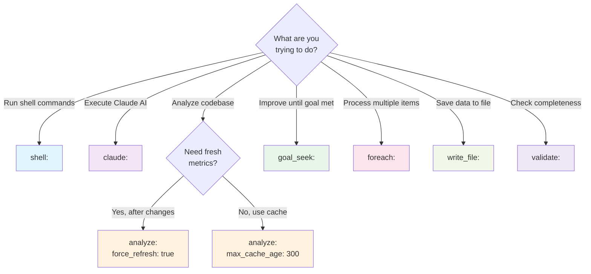
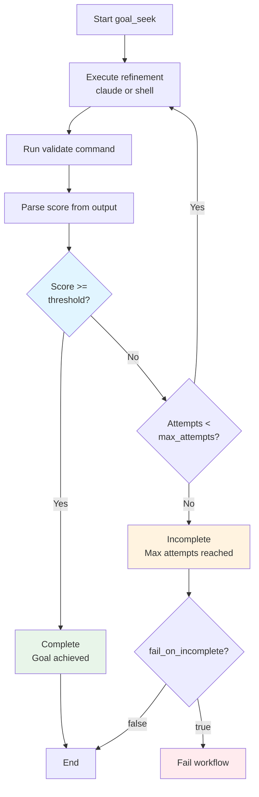
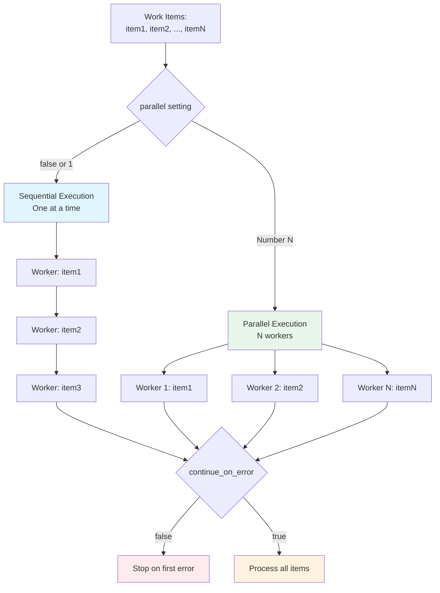

## Command Types

Prodigy supports several types of commands in workflows. **Each command step must specify exactly one command type** - they are mutually exclusive.

### Quick Reference

| Command Type | Primary Use Case | Key Features |
|-------------|------------------|--------------|
| [`shell:`](#shell-commands) | Execute shell commands | Output capture, conditional execution, timeouts |
| [`claude:`](#claude-commands) | Run Claude AI commands | Variable interpolation, commit tracking, output declarations |
| [`analyze:`](#analyze-commands) | Codebase analysis with caching | Cache control, force refresh, format options |
| [`goal_seek:`](#goal-seek-commands) | Iterative refinement | Score-based validation, automatic retry, convergence detection |
| [`foreach:`](#foreach-commands) | Parallel iteration | Process lists in parallel, item limits, error handling |
| [`write_file:`](#write-file-commands) | Create files | Format validation (JSON/YAML), directory creation, permissions |
| [`validate:`](#validation-commands) | Implementation validation | Threshold checking, gap detection, multi-step validation |

!!! tip "Command Exclusivity"
    Each workflow step must use exactly one command type. You cannot combine `shell:` and `claude:` in the same step. Use `on_success:` or `on_failure:` to chain commands together.

### Choosing the Right Command Type



**Figure**: Decision tree for selecting the appropriate command type based on your workflow needs.

### Shell Commands

Execute shell commands during workflow execution.

**Source**: src/config/command.rs:328

**Syntax**:
```yaml
- shell: "command to execute"
  timeout: 300                    # (1)!
  capture_output: true            # (2)!
  capture_format: "json"          # (3)!
  capture_streams: "both"         # (4)!
  output_file: "results.txt"      # (5)!
  on_failure:                     # (6)!
    claude: "/debug-failure"
  on_success:                     # (7)!
    shell: "echo 'Success!'"
  when: "variable == 'value'"     # (8)!
```

1. Maximum execution time in seconds before the command is terminated
2. Capture command output to a variable (boolean or variable name)
3. Format for captured output: `json`, `text`, or `lines`
4. Which streams to capture: `stdout`, `stderr`, or `both`
5. File path to redirect command output to
6. Nested command to execute if the shell command fails (non-zero exit)
7. Nested command to execute if the shell command succeeds (zero exit)
8. Conditional expression - command only runs if the condition evaluates to true

**Fields**:
- `shell` (required): The shell command to execute
- `timeout` (optional): Maximum execution time in seconds
- `capture_output` (optional): Boolean or variable name to capture output to
- `capture_format` (optional): Format for captured output (json, text, lines)
- `capture_streams` (optional): Which streams to capture (stdout, stderr, both)
- `output_file` (optional): File path to redirect output to
- `on_failure` (optional): Nested command to execute if shell command fails
- `on_success` (optional): Nested command to execute if shell command succeeds
- `when` (optional): Conditional expression - command only runs if true

**Example** (from workflows/fix-files-mapreduce.yml:36):
```yaml
- shell: "cargo check --lib 2>&1 | grep -E '(error|warning)' | head -10 || echo 'No errors'"
  capture_output: true
```

**Example with on_failure** (from workflows/coverage.yml:13):
```yaml
- shell: "just test"
  on_failure:
    claude: "/prodigy-debug-test-failure --spec ${coverage.spec} --output ${shell.output}"
```

!!! example "Common Use Cases"
    - Running build commands (`cargo build`, `npm install`)
    - Executing tests (`cargo test`, `pytest`)
    - File operations (`mkdir`, `cp`, `rm`)
    - Running analysis tools (`cargo clippy`, `eslint`)
    - Generating data files

!!! tip "Error Handling Flow"
    Shell commands support error handling via `on_failure` and `on_success` hooks. The flow looks like:

    ```mermaid
    flowchart LR
        Exec[Execute shell command] --> Check{Exit code<br/>zero?}
        Check -->|Yes| Success[Run on_success<br/>if defined]
        Check -->|No| Failure[Run on_failure<br/>if defined]
        Success --> Next[Continue workflow]
        Failure --> Next

        style Check fill:#fff3e0
        style Success fill:#e8f5e9
        style Failure fill:#ffebee
    ```

### Claude Commands

Execute Claude CLI commands via Claude Code.

**Source**: src/config/command.rs:324

**Syntax**:
```yaml
- claude: "/command-name args"
  id: "command_id"                # (1)!
  commit_required: true           # (2)!
  timeout: 600                    # (3)!
  outputs:                        # (4)!
    spec:
      file_pattern: "*.md"
  when: "condition"               # (5)!
  on_failure:                     # (6)!
    claude: "/fix-issue"
  on_success:                     # (7)!
    shell: "echo 'Done'"
```

1. Unique identifier for this command - used to reference outputs with `${id.output_name}`
2. Whether the command is expected to create git commits (validates commit after execution)
3. Maximum execution time in seconds before the command is terminated
4. Declare outputs that downstream commands can reference (e.g., files created)
5. Conditional expression - command only runs if the condition evaluates to true
6. Nested command to execute if Claude command fails or returns error
7. Nested command to execute if Claude command succeeds

**Fields**:
- `claude` (required): The Claude command string with arguments
- `id` (optional): Unique identifier for this command in the workflow
- `commit_required` (optional): Whether command is expected to create git commits (default: false)
- `timeout` (optional): Maximum execution time in seconds
- `outputs` (optional): Declare outputs that can be referenced by other commands
- `when` (optional): Conditional expression for execution
- `on_failure` (optional): Nested command to execute on failure
- `on_success` (optional): Nested command to execute on success

**Example with outputs** (from workflows/coverage.yml:3):
```yaml
- claude: "/prodigy-coverage"
  id: coverage
  commit_required: true
  outputs:
    spec:
      file_pattern: "*-coverage-improvements.md"

- claude: "/prodigy-implement-spec ${coverage.spec}"
  commit_required: true
```

**Example in MapReduce** (from workflows/fix-files-mapreduce.yml:31):
```yaml
- claude: "/analyze-and-fix-file ${item.path} --complexity ${item.complexity}"
  capture_output: true
  timeout: 300
```

!!! example "Common Use Cases"
    - Running custom Claude commands (slash commands)
    - Code analysis and generation
    - Implementing specifications from markdown
    - Debugging test failures with AI assistance
    - Automated code review and linting

### Analyze Commands

Perform codebase analysis with intelligent caching to avoid redundant computation. Analysis results include both metrics and context data that can be used by subsequent Claude commands.

**Source**: src/config/command.rs:332

**Syntax**:
```yaml
# Source: workflows/analysis-workflow.yml:19-23
- analyze:
    max_cache_age: 300        # Optional: cache validity in seconds
    force_refresh: false      # Optional: bypass cache (default: false)
    save: true                # Optional: save analysis results (default: true)
    format: "summary"         # Optional: output format (summary, detailed)
```

**Fields**:
- `max_cache_age` (optional): Maximum age of cached analysis in seconds before refresh
- `force_refresh` (optional): Force fresh analysis even if cache is valid (default: false)
- `save` (optional): Save analysis results to context directory (default: true)
- `format` (optional): Output format for analysis results (summary, detailed)

**Caching Behavior**:
- If cache exists and is younger than `max_cache_age`, use cached results
- If `force_refresh: true`, always perform fresh analysis regardless of cache
- Analysis runs automatically at workflow start unless `--skip-analysis` flag is used
- Cached results are stored per-repository for reuse across workflows

**Example with cached analysis** (from workflows/analysis-workflow.yml:19-26):
```yaml
# Source: workflows/analysis-workflow.yml:19-26
- analyze:
    max_cache_age: 300        # Use cache if less than 5 minutes old
    force_refresh: false      # Don't force if cache is fresh
    save: true
    format: "summary"

- claude: "/prodigy-code-review"
```

**Example with forced refresh** (from workflows/analysis-workflow.yml:29-34):
```yaml
# Source: workflows/analysis-workflow.yml:29-34
- analyze:
    force_refresh: true       # Always get fresh analysis for accuracy
    save: true
    format: "summary"

- claude: "/prodigy-cleanup-tech-debt"
```

**Example with short cache** (from workflows/tech-debt.yml:3-5):
```yaml
# Source: workflows/tech-debt.yml:3-5
- analyze:
    max_cache_age: 300
    save: true

- claude: "/prodigy-cleanup-tech-debt"
  id: cleanup
```

!!! example "Common Use Cases"
    - Refreshing analysis after significant code changes
    - Providing fresh metrics for tech debt cleanup
    - Updating context before documentation generation
    - Caching analysis for multiple commands to save time
    - Force refresh for critical operations requiring accuracy

!!! info "When to Use Analyze"
    Use `analyze:` when you need fresh codebase metrics or context for Claude commands. The first analyze in a workflow can use cache, but subsequent analyses after modifications should use `force_refresh: true` for accuracy.

!!! tip "Cache Strategy"
    - **Development workflows**: Use `max_cache_age: 300` (5 minutes) for fast iteration
    - **After code changes**: Use `force_refresh: true` for accurate metrics
    - **Multiple commands**: Share one analysis with appropriate `max_cache_age`
    - **CI/CD pipelines**: Use `force_refresh: true` for consistency

### Goal Seek Commands

Iteratively refine implementation until validation threshold is met.

**Source**: src/cook/goal_seek/mod.rs:15-41

**Syntax**:
```yaml
- goal_seek:
    goal: "Human-readable goal description"
    claude: "/command-for-refinement"  # Either claude or shell required
    shell: "refinement-command"        # Either claude or shell required
    validate: "validation-command"     # Required: returns score 0-100
    threshold: 90                      # Required: success threshold (0-100)
    max_attempts: 5                    # Required: maximum refinement attempts
    timeout_seconds: 600               # Optional: timeout for entire operation
    fail_on_incomplete: true           # Optional: fail workflow if goal not met
  commit_required: true
```

**Fields**:
- `goal` (required): Human-readable description of what to achieve
- `claude` (optional): Claude command for refinement attempts
- `shell` (optional): Shell command for refinement attempts (use claude OR shell)
- `validate` (required): Command that returns validation score (0-100)
- `threshold` (required): Minimum score required for success (0-100)
- `max_attempts` (required): Maximum number of refinement attempts
- `timeout_seconds` (optional): Timeout for the entire goal-seeking operation
- `fail_on_incomplete` (optional): Whether to fail workflow if goal is not met

**Validation Output Format**:
The validate command must output a line containing `score: <number>` where number is 0-100:
```
score: 85
```

**Result Types**:
- `Complete`: Goal achieved (score >= threshold)
- `Incomplete`: Maximum attempts reached without achieving threshold
- `Failed`: Error during execution

**Execution Flow**:



**Figure**: Goal-seeking iteration flow showing refinement loop and termination conditions.

**Example** (from workflows/implement-goal.yml:8):
```yaml
- goal_seek:
    goal: "Implement specification: $ARG"
    claude: "/prodigy-implement-spec $ARG"
    validate: "git diff --stat | grep -q '.*\\.rs' && echo 'score: 100' || echo 'score: 0'"
    threshold: 90
    max_attempts: 3
    timeout_seconds: 600
  commit_required: true
```

**Example with shell refinement** (from workflows/goal-seeking-examples.yml:7):
```yaml
- goal_seek:
    goal: "Achieve 90% test coverage"
    shell: "cargo tarpaulin --out Lcov"
    validate: "cargo tarpaulin --print-summary 2>/dev/null | grep 'Coverage' | sed 's/.*Coverage=\\([0-9]*\\).*/score: \\1/'"
    threshold: 90
    max_attempts: 5
    timeout_seconds: 300
    fail_on_incomplete: true
  commit_required: true
```

!!! example "Common Use Cases"
    - Iteratively improving code quality until metrics are met
    - Achieving test coverage thresholds (e.g., 90% coverage)
    - Performance optimization to target benchmarks
    - Fixing linting issues until clean
    - Implementing specifications completely with validation

!!! warning "Validation Score Format"
    The validate command **must** output `score: <number>` (0-100) for goal-seeking to work. Example: `echo "score: 85"`

### Foreach Commands

Iterate over a list of items, executing commands for each item in parallel or sequentially.

**Source**: src/config/command.rs:344, src/config/command.rs:188-211

**Syntax**:
```yaml
- foreach:
    items: ["item1", "item2"]       # Static list
    # OR
    items: "shell-command"          # Command that produces items
    do:                             # Commands to execute per item
      - claude: "/process ${item}"
      - shell: "test ${item}"
    parallel: 5                     # Optional: number of parallel workers
    continue_on_error: true         # Optional: continue if item fails
    max_items: 100                  # Optional: limit number of items
```

**Input Types**:
1. **Static List**: Array of strings directly in YAML
2. **Command Output**: Shell command whose output produces item list

**Fields**:
- `items` (required): Either a static list or a command to generate items
- `do` (required): List of commands to execute for each item
- `parallel` (optional): Number of parallel workers (boolean or count)
  - `true`: Default parallel count
  - `false`: Sequential execution
  - Number: Specific parallel count
- `continue_on_error` (optional): Continue processing other items if one fails (default: false)
- `max_items` (optional): Maximum number of items to process

**Variable Access**:
Inside `do` commands, use `${item}` to reference the current item.

**Parallel Execution Strategy**:



**Figure**: Foreach execution showing sequential vs parallel processing and error handling.

**Example** (from workflows/fix-files-mapreduce.yml - conceptual):
```yaml
- foreach:
    items: "find src -name '*.rs' -type f"
    do:
      - claude: "/analyze-file ${item}"
      - shell: "rustfmt ${item}"
    parallel: 4
    continue_on_error: true
```

!!! example "Common Use Cases"
    - Processing multiple files (e.g., formatting all `.rs` files)
    - Running operations on a list of identifiers
    - Batch operations with controlled parallelism
    - Conditional processing based on item properties

!!! tip "Parallel Execution"
    Set `parallel: 5` to process 5 items concurrently. Use `parallel: false` for sequential processing.

### Write File Commands

Write content to files with format validation and directory creation.

**Source**: src/config/command.rs:348, src/config/command.rs:279-317

**Syntax**:
```yaml
- write_file:
    path: "output/file.json"        # Required: file path (supports variables)
    content: "${map.results}"       # Required: content to write (supports variables)
    format: json                    # Optional: text, json, yaml (default: text)
    mode: "0644"                    # Optional: file permissions (default: 0644)
    create_dirs: true               # Optional: create parent directories (default: false)
```

**Fields**:
- `path` (required): File path to write to (supports variable interpolation)
- `content` (required): Content to write (supports variable interpolation)
- `format` (optional): Output format - text, json, or yaml (default: text)
  - `text`: Write content as-is
  - `json`: Validate JSON and pretty-print
  - `yaml`: Validate YAML and format
- `mode` (optional): File permissions in octal format (default: "0644")
- `create_dirs` (optional): Create parent directories if they don't exist (default: false)

**Format Types** (src/config/command.rs:301-313):
- `Text`: No processing, write content directly
- `Json`: Validate JSON syntax and pretty-print
- `Yaml`: Validate YAML syntax and format

**Example** (from workflows/debtmap-reduce.yml:105):
```yaml
- write_file:
    path: ".prodigy/map-results.json"
    content: "${map.results}"
    format: json
    create_dirs: true
```

!!! example "Common Use Cases"
    - Saving workflow results to files
    - Generating configuration files from templates
    - Writing JSON/YAML data with automatic validation
    - Creating reports and logs
    - Persisting intermediate data between workflow steps

!!! tip "Format Validation"
    Use `format: json` or `format: yaml` to automatically validate and pretty-print output. Invalid content will fail the step.

### Validation Commands

Validate implementation completeness using shell or Claude commands with threshold-based checking.

**Source**: src/cook/workflow/validation.rs:12-50

**Syntax**:
```yaml
- validate:
    shell: "validation-command"         # Either shell or claude or commands
    claude: "/validate-command"         # Either shell or claude or commands
    commands:                           # Or array of commands for multi-step validation
      - shell: "step1"
      - claude: "/step2"
    expected_schema: {...}              # Optional: JSON schema for validation output
    threshold: 100                      # Optional: completion threshold % (default: 100)
    timeout: 300                        # Optional: timeout in seconds
    result_file: "validation.json"      # Optional: where validation results are written
    on_incomplete:                      # Optional: commands to run if validation fails
      claude: "/fix-gaps ${validation.gaps}"
      max_attempts: 3
```

**Fields**:
- `shell` (optional): Shell command for validation (deprecated, use `commands`)
- `claude` (optional): Claude command for validation
- `commands` (optional): Array of commands for multi-step validation
- `expected_schema` (optional): JSON schema that validation output must match
- `threshold` (optional): Minimum completion percentage required (default: 100)
- `timeout` (optional): Timeout for validation command in seconds
- `result_file` (optional): File where validation results are written
- `on_incomplete` (optional): Configuration for handling incomplete implementations
  - Nested command to execute if validation fails
  - `max_attempts`: Maximum retry attempts

**Validation Output Format**:
Validation commands should output JSON matching this structure:
```json
{
  "complete": true,
  "score": 100,
  "gaps": [],
  "incomplete_specs": []
}
```

**Example with result_file** (from workflows/implement.yml:8):
```yaml
validate:
  claude: "/prodigy-validate-spec $ARG --output .prodigy/validation-result.json"
  result_file: ".prodigy/validation-result.json"
  threshold: 100
  on_incomplete:
    claude: "/prodigy-complete-spec $ARG --gaps ${validation.gaps}"
```

**Example with commands array** (from workflows/debtmap.yml:13):
```yaml
validate:
  commands:
    - claude: "/prodigy-validate-debtmap-plan --before .prodigy/debtmap-before.json --plan .prodigy/IMPLEMENTATION_PLAN.md --output .prodigy/plan-validation.json"
  result_file: ".prodigy/plan-validation.json"
  threshold: 75
  on_incomplete:
    claude: "/fix-plan-gaps --gaps ${validation.gaps}"
    max_attempts: 3
```

!!! example "Common Use Cases"
    - Verifying specification completeness
    - Checking implementation against requirements
    - Validating test coverage meets thresholds
    - Ensuring documentation quality standards
    - Multi-step validation pipelines

!!! info "Validate vs Goal Seek"
    **`validate:`** is for one-time validation with gap detection and retry logic.
    **`goal_seek:`** is for iterative refinement until a score threshold is met.
    Use `validate:` for spec checking, `goal_seek:` for quality improvement.

### Common Fields

Several fields are available across all command types:

**Source**: src/config/command.rs:320-401

- `id` (string): Unique identifier for referencing command outputs
- `timeout` (number): Maximum execution time in seconds
- `when` (string): Conditional execution expression
- `on_success` (command): Command to run on successful execution
- `on_failure` (command): Command to run on failed execution
- `capture_output` (boolean or string): Capture command output (true/false or variable name)
- `capture_format` (string): Format for captured output (json, text, lines)
- `capture_streams` (string): Which streams to capture (stdout, stderr, both)
- `output_file` (string): File to redirect output to

### Command Exclusivity

Each workflow step must specify **exactly one** command type. You cannot combine multiple command types in a single step:

=== "Valid ✓"
    ```yaml
    - shell: "cargo test"        # ✓ Only shell command
    - claude: "/lint"            # ✓ Only Claude command
    - analyze:                   # ✓ Only analyze command
        max_cache_age: 300
    - goal_seek:                 # ✓ Only goal_seek command
        goal: "Fix tests"
        validate: "..."
    ```

=== "Invalid ✗"
    ```yaml
    - shell: "cargo test"        # ✗ Cannot combine shell and claude
      claude: "/lint"

    - analyze: {...}             # ✗ Cannot combine analyze and claude
      claude: "/review"

    - goal_seek: {...}           # ✗ Cannot combine goal_seek and foreach
      foreach: {...}
    ```

**Enforcement**: src/config/command.rs:465-476

### Deprecated: Test Command

!!! warning "Deprecated Syntax"
    The `test:` command syntax is deprecated and will be removed in a future version.
    Use `shell:` with `on_failure:` instead for the same functionality.

**Source**: src/config/command.rs:446-463

**Old (deprecated)**:
```yaml
- test:
    command: "cargo test"
    on_failure:
      claude: "/debug-test"
```

**New (recommended)**:
```yaml
- shell: "cargo test"
  on_failure:
    claude: "/debug-test"
```

The migration is straightforward: replace `test:` → `command:` with `shell:` and keep all other fields unchanged.

## See Also

- [Available Fields](available-fields.md) - Complete reference of all command fields
- [Goal Seeking Operations](../advanced/goal-seeking-operations.md) - Advanced goal-seeking patterns
- [Parallel Iteration with Foreach](../advanced/parallel-iteration-with-foreach.md) - Foreach best practices
- [Implementation Validation](../advanced/implementation-validation.md) - Validation strategies
- [Variables](../variables/index.md) - Variable interpolation in commands
- [Error Handling](error-handling.md) - Error handling strategies
