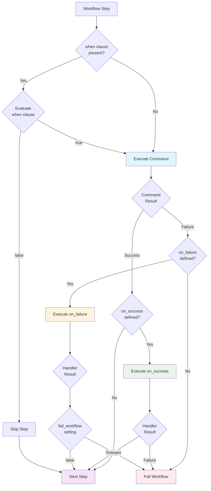

# Conditional Execution

Prodigy provides powerful conditional execution features that allow workflows to make intelligent decisions about which steps to run and how to handle errors. These features enable workflows to adapt to different scenarios, handle failures gracefully, and execute complex logic.

## When Clauses

When clauses allow you to conditionally execute workflow steps based on boolean expressions. Steps with a `when` clause are only executed if the expression evaluates to `true`.

### Syntax

```yaml
# Source: src/config/command.rs:388
- shell: "cargo build --release"
  when: "${env} == 'production'"
```

### Expression Features

When clauses support:

- **Variable interpolation**: `${variable_name}`
- **Comparison operators**: `==`, `!=`, `<`, `>`, `<=`, `>=`
- **Logical operators**: `&&` (and), `||` (or), `!` (not)
- **Parentheses**: For grouping expressions
- **Step results**: Access previous step outcomes

!!! warning "Expression Evaluation Gotcha"
    Undefined variables in when clauses evaluate to `false` (not an error). This allows safe checking for optional variables but can cause unexpected skips if you mistype a variable name.

### Available Variables

**Workflow Variables:**
```yaml
# Source: src/cook/workflow/conditional_tests.rs:72-86
when: "${flag} == true"              # Boolean variable
when: "${score} >= 80"               # Numeric variable
when: "${env} == 'production'"       # String variable
```

**Step Results:**
```yaml
# Source: src/cook/workflow/conditional_tests.rs:94-98
when: "${build.success}"             # Did step succeed?
when: "${build.exit_code} == 0"      # Check exit code
when: "${build.output} contains 'OK'" # Check output
```

**Environment Variables:**
```yaml
when: "${CI} == 'true'"              # Environment variables are accessible
```

!!! note
    Undefined variables evaluate to `false`. Use this behavior to safely check for optional variables.

### Examples

**Skip deployment on non-main branches:**
```yaml
# Source: src/cook/workflow/conditional_tests.rs:108-109
- shell: "git rev-parse --abbrev-ref HEAD"
  capture_output: "branch"

- shell: "./deploy.sh"
  when: "${branch} == 'main'"
```

**Run tests only if code changed:**
```yaml
- shell: "git diff --name-only HEAD~1 | grep '\.rs$'"
  capture_output: "rust_changed"

- shell: "cargo test"
  when: "${rust_changed} != ''"
```

**Complex conditions with multiple checks:**
```yaml
# Source: src/cook/workflow/conditional_tests.rs:111-121
- shell: "cargo bench"
  when: "(${coverage} >= 80 || ${override}) && ${branch} == 'main'"
```

**Conditional execution based on step results:**
```yaml
# Source: src/cook/workflow/conditional_tests.rs:56
- shell: "cargo build"
  id: "build"

- shell: "cargo test"
  when: "${build.success} && ${coverage} >= 80"
```

## On Failure Handlers

On failure handlers specify what to do when a command fails. They provide flexible error handling strategies ranging from simple error ignoring to complex recovery logic.

### Simple Syntax Variants

**Ignore errors:**
```yaml
# Source: src/cook/workflow/on_failure.rs:72
- shell: "cargo clippy -- -D warnings"
  on_failure: false  # Continue workflow even if command fails
```

**Single recovery command:**
```yaml
# Source: workflows/debug.yml:3-5
- shell: "just test"
  on_failure:
    claude: "/prodigy-debug-test-failure --output ${shell.output}"
```

**Multiple recovery commands:**
```yaml
- shell: "cargo test"
  on_failure:
    - shell: "cargo clean"
    - shell: "cargo test --verbose"
```

### Advanced Configuration

For more control over failure handling, use the advanced syntax:

!!! tip "Advanced Error Recovery"
    The advanced syntax provides fine-grained control over retry behavior and workflow continuation:

```yaml
# Source: src/cook/workflow/on_failure.rs:85-105
- shell: "cargo test"
  on_failure:
    shell: "echo 'Tests failed, trying cleanup...'"
    fail_workflow: false       # (1)!
    retry_original: true       # (2)!
    max_retries: 3            # (3)!

1. Continue workflow even if the handler can't recover
2. Automatically retry the original command after handler completes
3. Maximum number of retry attempts (prevents infinite loops)
```

**With Claude recovery:**
```yaml
# Source: workflows/implement.yml:19-23
- shell: "just test"
  on_failure:
    claude: "/prodigy-debug-test-failure --spec $ARG --output ${shell.output}"
    max_attempts: 5
    fail_workflow: false  # Continue workflow even if tests can't be fixed
```

### Detailed Handler Configuration

For complex scenarios, use the detailed handler configuration:

!!! example "Full Handler Configuration"
    This example shows all available handler configuration options:

```yaml
# Source: src/cook/workflow/on_failure.rs:25-49
- shell: "cargo test"
  on_failure:
    strategy: recovery        # (1)!
    timeout: 300              # (2)!
    handler_failure_fatal: false  # (3)!
    fail_workflow: false      # (4)!
    commands:
      - shell: "cargo clean"
        continue_on_error: true
      - claude: "/fix-tests ${shell.output}"
    capture:
      error_details: "${handler.output}"

1. Choose recovery strategy: recovery, fallback, cleanup, or custom
2. Timeout for handler execution (prevents hanging handlers)
3. If handler fails, continue to next command instead of failing workflow
4. After handler completes, continue workflow instead of failing
```

### Handler Strategies

!!! info "Choosing the Right Strategy"
    Different strategies communicate intent and help with workflow maintenance:

    - **recovery**: Attempt to fix the problem and retry
    - **fallback**: Try an alternative approach
    - **cleanup**: Clean up resources before failing
    - **custom**: Execute domain-specific error handling

=== "Recovery"

    Try to fix the problem and continue:

    ```yaml
    # Source: src/cook/workflow/on_failure.rs:10-22
    - shell: "cargo build"
      on_failure:
        strategy: recovery
        commands:
          - claude: "/fix-compilation-errors ${shell.output}"
    ```

=== "Fallback"

    Use an alternative approach when the primary method fails:

    ```yaml
    - shell: "docker build -t myapp ."
      on_failure:
        strategy: fallback
        commands:
          - shell: "podman build -t myapp ."
    ```

=== "Cleanup"

    Clean up resources before failing:

    ```yaml
    - shell: "run-integration-tests.sh"
      on_failure:
        strategy: cleanup
        fail_workflow: true
        commands:
          - shell: "docker-compose down"
          - shell: "rm -rf test-data/"
    ```

=== "Custom"

    Execute custom handler logic:

    ```yaml
    - shell: "deploy-to-production.sh"
      on_failure:
        strategy: custom
        commands:
          - shell: "rollback-deployment.sh"
          - shell: "notify-team.sh"
    ```

### Real-World Examples

**Auto-fix test failures with Claude:**
```yaml
# Source: workflows/coverage-simplified.yml:15-19
- shell: "just test"
  on_failure:
    claude: "/prodigy-debug-test-failure --spec ${coverage.spec} --output ${shell.output}"
    max_attempts: 3
    fail_workflow: false  # Continue workflow even if tests can't be fixed
```

**Auto-fix linting issues:**
```yaml
# Source: workflows/complex-build-pipeline.yml:16-19
- shell: "cargo clippy -- -D warnings"
  capture_output: "clippy_warnings"
  on_failure:
    claude: "/prodigy-fix-clippy-warnings '${clippy_warnings}'"
```

**Nested error handling:**
```yaml
# Source: workflows/complex-build-pipeline.yml:7-13
- shell: "cargo check"
  on_success:
    shell: "cargo build --release"
    on_success:
      shell: "cargo test --release"
      on_failure:
        claude: "/prodigy-debug-and-fix '${shell.output}'"
```

## On Success Handlers

On success handlers execute additional steps after a command completes successfully. They're useful for post-processing, notifications, or chaining dependent operations.

### Syntax

```yaml
# Source: src/config/command.rs:375-376
- shell: "cargo build --release"
  on_success:
    shell: "notify-team.sh 'Build successful'"
```

### Chaining Operations

Success handlers can be chained to create sequential workflows:

```yaml
# Source: workflows/complex-build-pipeline.yml:8-11
- shell: "cargo check"
  on_success:
    shell: "cargo build --release"
    on_success:
      shell: "cargo test --release"
```

### Use Cases

**Notifications:**
```yaml
- shell: "cargo test"
  on_success:
    shell: "echo 'All tests passed!' | mail -s 'Test Report' team@example.com"
```

**Post-processing:**
```yaml
- shell: "cargo build --release"
  on_success:
    shell: "strip target/release/myapp"  # Strip debug symbols
```

**Conditional deployment:**
```yaml
- shell: "cargo test --release"
  on_success:
    shell: "./deploy.sh"
    when: "${branch} == 'main'"
```

## Combining Conditional Features

When clauses, on_failure, and on_success can be combined to create sophisticated workflows:

### Execution Order



**Figure**: Conditional execution flow showing when clause evaluation, command execution, and success/failure handler logic.

The execution order follows these steps:

1. **when clause** evaluated first
2. If `when` is true (or absent), **command executes**
3. Based on result:
   - Success → **on_success** handler runs (if present)
   - Failure → **on_failure** handler runs (if present)

### Combined Example

```yaml
# Source: workflows/implement-with-tests.yml:25-35
- shell: "cargo test"
  when: "${code_changed} == 'true'"
  capture_output: "test_output"
  commit_required: false
  on_failure:
    # If tests fail, debug and fix them
    claude: "/prodigy-debug-test-failures '${test_output}'"
    commit_required: true
    on_success:
      # After fixing, verify tests pass
      shell: "cargo test"
      commit_required: false
```

### Complex Build Pipeline

```yaml
# Full pipeline with all conditional features
- shell: "git diff --name-only HEAD~1 | grep '\\.rs$'"
  capture_output: "rust_changed"

- shell: "cargo check"
  when: "${rust_changed} != ''"
  on_success:
    shell: "cargo build --release"
    on_failure:
      claude: "/fix-compilation-errors ${shell.output}"
      max_attempts: 3
    on_success:
      shell: "cargo test --release"
      on_failure:
        claude: "/fix-test-failures ${shell.output}"
      on_success:
        shell: "./deploy.sh"
        when: "${branch} == 'main'"
```

## Best Practices

!!! tip "Use when clauses for pre-conditions"
    Use `when` clauses to check pre-conditions before executing expensive operations:
    ```yaml
    - shell: "expensive-operation.sh"
      when: "${pre_check.success} && ${env} == 'production'"
    ```

!!! tip "Prefer on_failure to test: syntax (deprecated)"
    The `test:` command syntax is deprecated. Use `shell:` with `on_failure:` instead:
    ```yaml
    # Deprecated (src/config/command.rs:446-463)
    test:
      command: "cargo test"
      on_failure: true

    # Preferred
    shell: "cargo test"
    on_failure: false  # Or specify recovery logic
    ```

!!! tip "Capture output for debugging"
    Always capture command output when using failure handlers:
    ```yaml
    - shell: "cargo test"
      capture_output: "test_output"
      on_failure:
        claude: "/debug-failures ${test_output}"
    ```

!!! tip "Set fail_workflow appropriately"
    Use `fail_workflow: false` when the handler can recover, `true` when it's informational:
    ```yaml
    - shell: "cargo test"
      on_failure:
        claude: "/fix-tests"
        fail_workflow: false  # Handler attempts recovery

    - shell: "deploy.sh"
      on_failure:
        shell: "rollback.sh"
        fail_workflow: true   # Rollback then fail
    ```

!!! tip "Use step IDs for clarity"
    When referencing step results in when clauses, use step IDs:
    ```yaml
    - id: "build"
      shell: "cargo build"

    - shell: "cargo test"
      when: "${build.success}"
    ```

## Debugging Conditional Expressions

When a `when` clause doesn't evaluate as expected:

1. **Check variable values**: Use a debug step to print variables
   ```yaml
   - shell: "echo 'branch=${branch}, env=${env}'"
   ```

2. **Verify variable interpolation**: Ensure variables are properly captured
   ```yaml
   - shell: "git rev-parse --abbrev-ref HEAD"
     capture_output: "branch"  # Required for ${branch} to be available
   ```

3. **Test expressions incrementally**: Break complex expressions into parts
   ```yaml
   # Instead of:
   when: "${a} && ${b} && ${c}"

   # Try:
   when: "${a}"
   # Then add: when: "${a} && ${b}"
   # Finally: when: "${a} && ${b} && ${c}"
   ```

4. **Remember undefined behavior**: Undefined variables evaluate to `false`
   ```yaml
   # Source: src/cook/workflow/conditional_tests.rs:128-137
   when: "${might_not_exist}"  # Evaluates to false if not defined
   ```

## Related Topics

- [Variables](variables.md) - Learn about variable interpolation and capture
- [Error Handling](error-handling.md) - Broader error handling strategies
- [Workflow Structure](workflow-structure.md) - Understanding workflow execution flow
