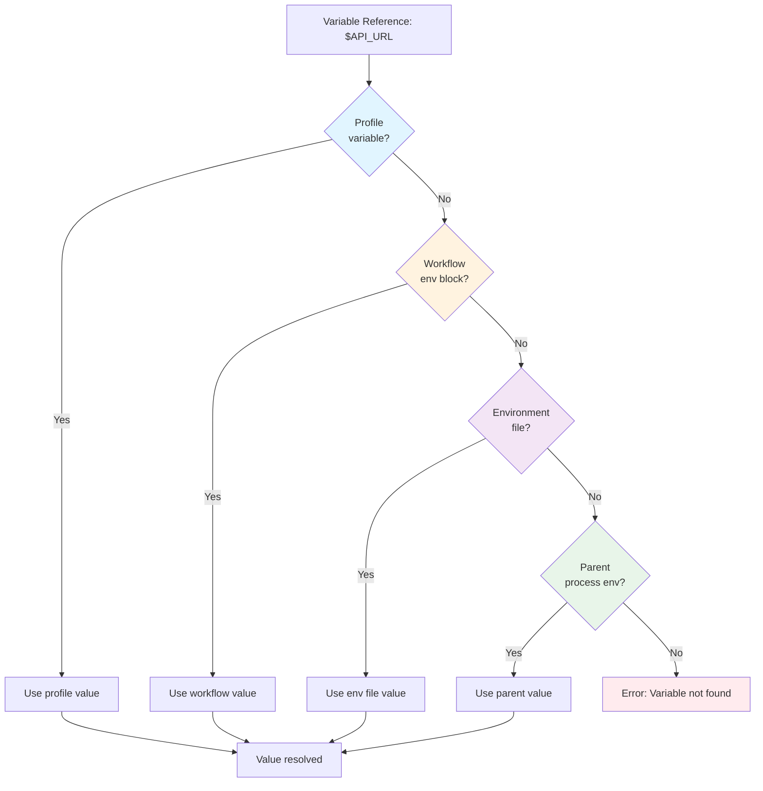

# Environment Variables Basics

This page covers the fundamentals of defining and using environment variables in Prodigy workflows.

## Overview

Environment variables in Prodigy allow you to:

- Define workflow-wide variables accessible in all commands
- Securely manage sensitive credentials with automatic masking
- Configure environment-specific settings using profiles
- Load variables from `.env` files
- Use dynamic and conditional variables
- Reference variables across all workflow phases

### Variable Precedence

Variables can be defined in multiple locations. When the same variable is defined in multiple places, Prodigy uses this precedence order (highest to lowest):

1. **Profile variables** - Activated with `--profile` flag
2. **Workflow `env` block** - Defined in workflow YAML
3. **Environment files** - Loaded from `.env` files (later files override earlier)
4. **Parent process environment** - Inherited from shell

This hierarchy allows you to set sensible defaults while providing runtime overrides when needed.



**Figure**: Variable resolution follows precedence from profile → workflow env → env files → parent environment.

## Defining Environment Variables

Environment variables are defined in the `env` block at the workflow root:

```yaml title="Basic environment variables"
# Source: workflows/environment-example.yml
env:
  # Static variables
  NODE_ENV: production
  API_URL: https://api.example.com
  PROJECT_NAME: "my-project"
  VERSION: "1.0.0"

commands:
  - shell: "echo Building $PROJECT_NAME version $VERSION"
  - shell: "curl $API_URL/health"
```

### Variable Types

#### Static Variables

Simple key-value pairs for constant values:

```yaml
# Source: workflows/mapreduce-env-example.yml:8-11
env:
  PROJECT_NAME: "example-project"
  PROJECT_CONFIG: "config.yml"
  FEATURES_PATH: "features"
```

#### Dynamic Variables

Computed from command output at workflow start:

```yaml
# Source: workflows/environment-example.yml:10-12
env:
  WORKERS:
    command: "nproc 2>/dev/null || echo 4"
    cache: true
```

Dynamic variables are evaluated once and cached for workflow duration when `cache: true`.

#### Conditional Variables

Values that depend on expressions:

```yaml
# Source: workflows/environment-example.yml:14-18
env:
  DEPLOY_ENV:
    condition: "${branch} == 'main'"
    when_true: "production"
    when_false: "staging"
```

## Variable Interpolation

Prodigy supports two interpolation syntaxes for flexibility:

```yaml
# Source: workflows/mapreduce-env-example.yml:43-46
commands:
  # Simple syntax
  - shell: "echo Starting $PROJECT_NAME workflow"

  # Bracketed syntax (more explicit)
  - shell: "echo Created output directory: ${OUTPUT_DIR}"

  # In Claude commands
  - claude: "/analyze --project $PROJECT_NAME --config ${PROJECT_CONFIG}"
```

**When to use bracketed syntax:**

- When variable name is followed by alphanumeric characters: `${VAR}_suffix`
- For clarity in complex expressions: `${map.results}`
- Inside quoted strings: `"Path: ${OUTPUT_DIR}/file"`

!!! tip "Prefer Bracketed Syntax"
    Using `${VAR}` instead of `$VAR` prevents ambiguity when variables are adjacent to other characters. For example, `$VARsuffix` may be interpreted as a variable named `VARsuffix`, while `${VAR}suffix` is unambiguous.
