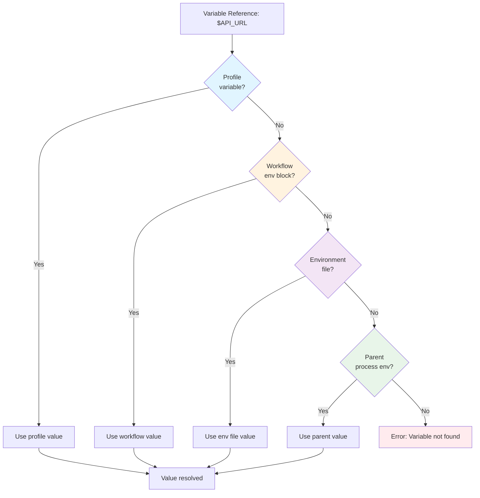

# Environment Variables

Prodigy provides comprehensive environment variable management for workflows, enabling parameterization, secrets management, and environment-specific configurations.

## Overview

Environment variables in Prodigy allow you to:

- Define workflow-wide variables accessible in all commands
- Securely manage sensitive credentials with automatic masking
- Configure environment-specific settings using profiles
- Load variables from `.env` files
- Use dynamic and conditional variables
- Reference variables across all workflow phases

## Documentation Sections

-   :material-code-tags:{ .lg .middle } **[Basics](basics.md)**

    ---

    Learn how to define and use environment variables in your workflows, including static, dynamic, and conditional variables.

-   :material-shield-lock:{ .lg .middle } **[Secrets & Profiles](secrets-profiles.md)**

    ---

    Manage sensitive credentials with automatic masking and configure environment-specific settings using profiles and environment files.

-   :material-cogs:{ .lg .middle } **[Workflow Usage](workflow-usage.md)**

    ---

    Use environment variables across all workflow phases including setup, map, reduce, and merge phases.

-   :material-lightbulb:{ .lg .middle } **[Patterns & Troubleshooting](patterns.md)**

    ---

    Best practices, common patterns, and solutions for common environment variable issues.

## Quick Reference

### Variable Precedence

Variables can be defined in multiple locations. When the same variable is defined in multiple places, Prodigy uses this precedence order (highest to lowest):

1. **Profile variables** - Activated with `--profile` flag
2. **Workflow `env` block** - Defined in workflow YAML
3. **Environment files** - Loaded from `.env` files (later files override earlier)
4. **Parent process environment** - Inherited from shell

This hierarchy allows you to set sensible defaults while providing runtime overrides when needed.

**Figure**: Variable resolution follows precedence from profile → workflow env → env files → parent environment.
