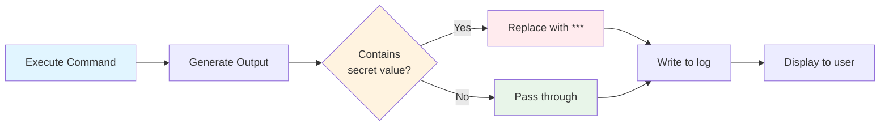

# Secrets Management & Profiles

This page covers secure credential management and environment-specific configurations in Prodigy workflows.

## Secrets Management

Secrets are automatically masked in all output, logs, and error messages to prevent credential leaks.

### Defining Secrets

```yaml
# Source: workflows/mapreduce-env-example.yml:22-25
env:
  API_TOKEN:
    secret: true
    value: "${GITHUB_TOKEN}"
```

Secrets can reference environment variables from the parent process using `${ENV_VAR}` syntax.

!!! warning "Common Mistake: Forgetting secret: true"
    The most common mistake is defining sensitive values without marking them as secrets:

    ```yaml
    # ❌ Wrong - will appear in logs
    env:
      API_KEY: "sk-abc123"

    # ✅ Correct - automatically masked
    env:
      API_KEY:
        secret: true
        value: "sk-abc123"
    ```

### Alternative Secrets Syntax

```yaml
# Source: workflows/environment-example.yml:21-23
secrets:
  API_KEY: "${env:SECRET_API_KEY}"
```

The `secrets` block is an alternative to inline `secret: true` definitions.

### Advanced: Secret Providers

Prodigy supports multiple secret providers for integration with external secret management systems:

```yaml
# Source: src/cook/environment/config.rs:99-112
env:
  # Environment variable provider (default)
  API_TOKEN:
    secret: true              # (1)!
    value: "${GITHUB_TOKEN}"  # (2)!

  # File-based secrets
  DATABASE_PASSWORD:
    secret: true
    provider: file            # (3)!
    key: "/run/secrets/db_password"  # (4)!

  # HashiCorp Vault integration
  VAULT_TOKEN:
    secret: true
    provider: vault           # (5)!
    key: "secret/data/myapp/token"  # (6)!
    version: "v2"             # (7)!

  # AWS Secrets Manager
  AWS_SECRET:
    secret: true
    provider: aws             # (8)!
    key: "myapp/prod/api-key"  # (9)!
```

1. Marks value as secret for automatic masking
2. References environment variable from parent process
3. File provider reads secret from filesystem
4. Path to file containing the secret value
5. HashiCorp Vault integration for centralized secrets
6. Vault path to the secret
7. KV secrets engine version (v1 or v2)
8. AWS Secrets Manager integration
9. Secret name/ARN in AWS Secrets Manager

!!! note "Provider Availability"
    Secret provider support depends on configuration. The `env` and `file` providers are always available. Vault and AWS providers require additional setup.

### Automatic Masking

Secrets are masked in:

- Command output (stdout/stderr)
- Error messages and stack traces
- Event logs and checkpoints
- Workflow summaries
- MapReduce agent logs

**Example output with masking:**

```bash
$ curl -H 'Authorization: Bearer ***' https://api.example.com
```



**Figure**: Secret masking automatically replaces sensitive values with `***` in all output streams.

!!! warning "Secret Security"
    Always mark sensitive values as secrets. Without the `secret: true` flag, values will appear in logs and may be exposed.

## Profiles

Profiles enable environment-specific configurations for development, staging, and production environments.

### Defining Profiles

```yaml
# Source: workflows/mapreduce-env-example.yml:28-39
env:
  DEBUG_MODE: "false"           # (1)!
  TIMEOUT_SECONDS: "300"        # (2)!
  OUTPUT_DIR: "output"          # (3)!

profiles:
  development:
    description: "Development environment with debug enabled"  # (4)!
    DEBUG_MODE: "true"          # (5)!
    TIMEOUT_SECONDS: "60"       # (6)!
    OUTPUT_DIR: "dev-output"

  production:
    description: "Production environment"
    DEBUG_MODE: "false"
    TIMEOUT_SECONDS: "300"
    OUTPUT_DIR: "prod-output"
```

1. Default values used when no profile is activated
2. Timeout for operations in seconds
3. Output directory for workflow results
4. Optional description shown in help text
5. Profile values override default env values
6. Development uses shorter timeout for faster feedback

### Activating Profiles

```bash
# Use default values (no profile)
prodigy run workflow.yml

# Activate development profile
prodigy run workflow.yml --profile development

# Activate production profile
prodigy run workflow.yml --profile production
```

Profile variables override default `env` values. Variables not defined in the profile inherit default values.

!!! tip "Profile Best Practice"
    Use profiles to separate environment-specific configuration (development, staging, production) rather than maintaining multiple workflow files. This ensures consistency while allowing environment-specific overrides.

## Environment Files

Load variables from `.env` format files for external configuration. Environment files support standard `.env` format and can be used for external secrets management and configuration.

### Defining Environment Files

```yaml
# Source: workflows/environment-example.yml:26-27
env_files:
  - .env.production
  - .env.local
```

Multiple files can be specified, with later files overriding earlier ones for the same variable names.

### .env File Format

```bash title=".env.production"
# Database configuration
DATABASE_URL=postgres://localhost/mydb
DATABASE_POOL_SIZE=10

# API settings
API_KEY=sk-abc123xyz
API_TIMEOUT=30

# Feature flags
ENABLE_CACHING=true
```

!!! note "Supported Formats"
    Environment files follow standard `.env` format with `KEY=VALUE` pairs. Lines starting with `#` are treated as comments. No spaces are allowed around the `=` sign.

### Variable Precedence with Environment Files

When variables are defined in multiple locations, Prodigy uses this precedence (highest to lowest):

1. **Profile variables** (`--profile` flag) - Highest priority
2. **Workflow `env` block** - Workflow-defined variables
3. **Environment files** - Later files override earlier files
4. **Parent process environment** - Lowest priority

This precedence order ensures that explicit workflow configuration takes precedence over external sources, while profiles provide runtime overrides.

!!! example "Precedence Example"
    Given these definitions:

    ```yaml
    env_files:
      - .env.base        # API_URL=http://localhost
      - .env.production  # API_URL=https://prod.api.com

    env:
      API_URL: https://staging.api.com

    profiles:
      prod:
        API_URL: https://api.example.com
    ```

    Resolution:
    - No profile: `https://staging.api.com` (workflow env)
    - With `--profile prod`: `https://api.example.com` (profile)
