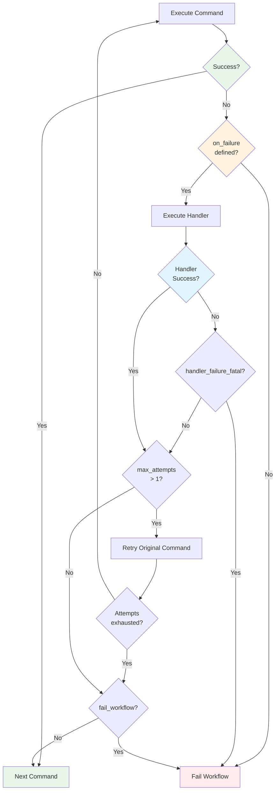
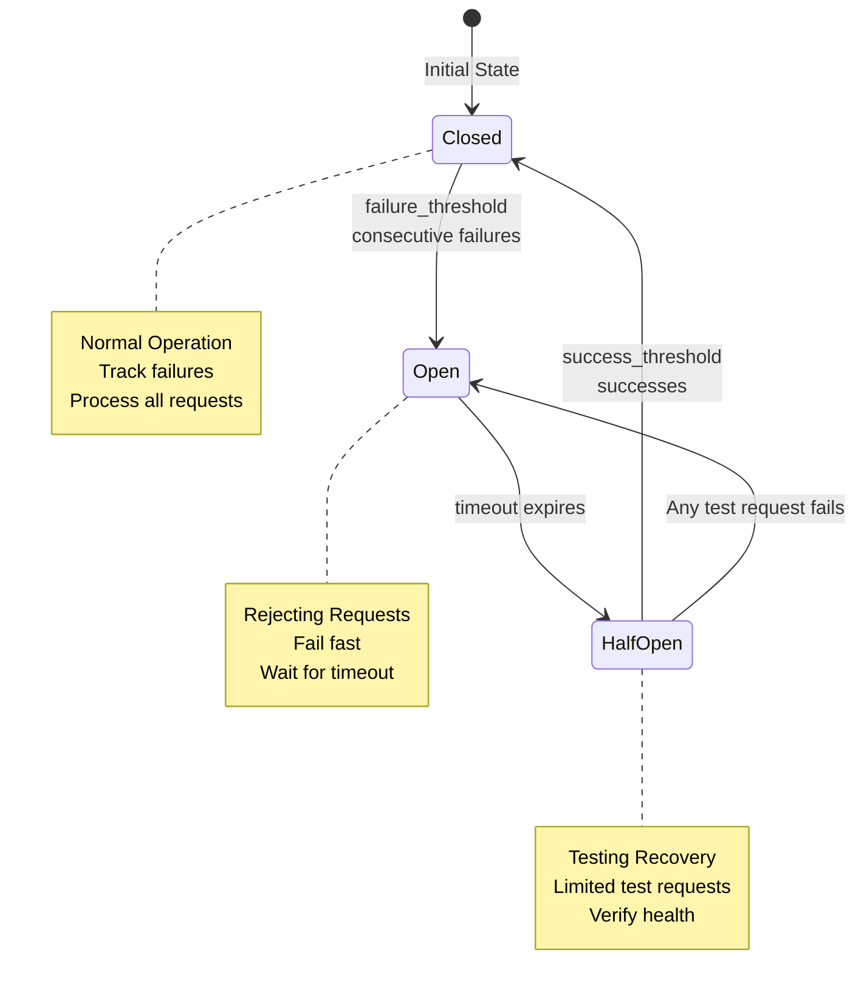

# Error Handling

Prodigy provides comprehensive error handling at both the workflow level (for MapReduce jobs) and the command level (for individual workflow steps). This chapter covers the practical features available for handling failures gracefully.

---

## Command-Level Error Handling

Command-level error handling allows you to specify what happens when a single workflow step fails. Use the `on_failure` configuration to define recovery, cleanup, or fallback strategies.



**Figure**: Command-level error handling flow showing handler execution, retry logic, and failure propagation.

### Simple Forms

For basic error handling, use the simplest form that meets your needs:

```yaml
# Ignore errors - don't fail the workflow
- shell: "optional-cleanup.sh"
  on_failure: true

# Single recovery command (shell or claude)
- shell: "npm install"
  on_failure: "npm cache clean --force"

- shell: "cargo clippy"
  on_failure: "/fix-warnings"

# Multiple recovery commands
- shell: "build-project"
  on_failure:
    - "cleanup-artifacts"
    - "/diagnose-build-errors"
    - "retry-build"
```

### Advanced Configuration

For more control over error handling behavior:

!!! tip "Automatic Retry Behavior"
    Setting `max_attempts > 1` automatically enables retry of the original command after the handler runs. You don't need a separate `retry_original` flag.

```yaml
- shell: "cargo clippy"
  on_failure:
    claude: "/fix-warnings ${shell.output}"  # (1)!
    fail_workflow: false     # (2)!
    max_attempts: 3          # (3)!

1. Handler receives command output for analysis
2. Continue workflow even if handler fails
3. Retry original command up to 3 times (auto-retry when > 1)
```

**Available Fields:**
- `shell` - Shell command to run on failure
- `claude` - Claude command to run on failure
- `fail_workflow` - Whether to fail the entire workflow (default: `false`)
- `max_attempts` - Maximum retry attempts for the original command (default: `1`)
- `max_retries` - Alternative name for `max_attempts` (both are supported for backward compatibility)

**Source**: FailureHandlerConfig struct in src/cook/workflow/on_failure.rs:26

**Notes:**
- When `max_attempts > 1`, Prodigy automatically retries the original command after running the failure handler (the deprecated `retry_original` flag is no longer needed)
- Retry behavior is now controlled by the `max_attempts`/`max_retries` value, not a separate flag
- You can specify both `shell` and `claude` commands - they will execute in sequence
- By default, having a handler means the workflow continues even if the step fails

> **Migration from `retry_original`:** Previously you used `retry_original: true` with `max_retries: 3`. Now just use `max_attempts: 3` (retry is implicit when > 1). Both `max_attempts` and `max_retries` are supported as aliases for backward compatibility.

### Detailed Handler Configuration

For complex error handling scenarios with multiple commands and fine-grained control:

```yaml
- shell: "deploy-production"
  on_failure:
    strategy: recovery        # Options: recovery, fallback, cleanup, custom
    timeout: 300             # Handler timeout in seconds
    handler_failure_fatal: true  # Fail workflow if handler fails
    fail_workflow: false     # Don't fail workflow if step fails
    capture:                 # Capture handler output to variables
      error_log: "handler_output"
      rollback_status: "rollback_result"
    commands:
      - shell: "rollback-deployment"
        continue_on_error: true
      - claude: "/analyze-deployment-failure"
      - shell: "notify-team"
```

**Handler Configuration Fields:**
- `strategy` - Handler strategy (recovery, fallback, cleanup, custom)
- `timeout` - Handler timeout in seconds
- `handler_failure_fatal` - Fail workflow if handler fails
- `fail_workflow` - Whether to fail the entire workflow
- `capture` - Map of variable names to capture from handler output (e.g., `error_log: "handler_output"`). Note: capture applies to the handler's combined output, not individual commands.
- `commands` - List of handler commands to execute

**Handler Strategies:**
- `recovery` - Try to fix the problem and retry (default)
- `fallback` - Use an alternative approach
- `cleanup` - Clean up resources
- `custom` - Custom handler logic

**Handler Command Fields:**
- `shell` or `claude` - The command to execute
- `continue_on_error` - Continue to next handler command even if this fails

> **Simpler Alternative:** For basic cases, you can use the Advanced format shown earlier instead of the detailed handler configuration. The Advanced format allows `shell` and `claude` fields directly without wrapping in a `commands` array: `on_failure: { shell: "command", fail_workflow: false, max_attempts: 3 }`.

### Success Handling

Execute commands when a step succeeds. The `on_success` field accepts a full WorkflowStep configuration with all available fields.

**Simple Form:**
```yaml
- shell: "deploy-staging"
  on_success:
    shell: "notify-success"
    claude: "/update-deployment-docs"
```

**Advanced Form with Full WorkflowStep Configuration:**
```yaml
- shell: "build-production"
  on_success:
    claude: "/update-build-metrics"
    timeout: 60              # Success handler timeout
    capture: "metrics"       # Capture output to variable
    working_dir: "dist"      # Run in specific directory
    when: "${build.target} == 'release'"  # Conditional execution
```

**Note:** The `on_success` handler supports all WorkflowStep fields including `timeout`, `capture`, `working_dir`, `when`, and nested `on_failure` handlers.

**Common Use Cases:**

Success handlers are useful for post-processing actions that should only occur when a step completes successfully:
- **Notifications:** Send success notifications to teams via Slack, email, or other channels
- **Metrics Updates:** Update deployment metrics, dashboard statistics, or monitoring systems
- **Downstream Workflows:** Trigger dependent workflows or pipelines
- **Artifact Archiving:** Archive build artifacts, logs, or generated files for later use
- **External System Updates:** Update issue trackers, deployment records, or configuration management systems

The handler receives access to step outputs via the `capture` field, allowing you to process results or pass data to subsequent steps. For example, using `capture: "metrics"` creates a `${metrics}` variable containing the handler output, which can be used in later workflow steps for processing or decision-making.

### Commit Requirements

Specify whether a workflow step must create a git commit:

```yaml
- claude: "/implement-feature"
  commit_required: true   # Fail if no commit is made
```

This is useful for ensuring that Claude commands that are expected to make code changes actually do so.

---

## Workflow-Level Error Policy (MapReduce)

For MapReduce workflows, you can configure workflow-level error policies that control how the entire job responds to failures. This is separate from command-level error handling and only applies to MapReduce mode.

### Basic Configuration

```yaml
# Source: src/cook/workflow/error_policy.rs:13-31
# Example: workflows/mkdocs-drift.yml:89-93
name: process-items
mode: mapreduce

error_policy:
  # What to do when a work item fails
  on_item_failure: dlq      # Options: dlq, retry, skip, stop, custom:<handler_name>

  # Continue processing after failures
  continue_on_failure: true

  # Stop after this many failures
  max_failures: 10

  # Stop if failure rate exceeds threshold (0.0 to 1.0)
  failure_threshold: 0.2    # Stop if 20% of items fail

  # How to report errors
  error_collection: aggregate  # Options: aggregate, immediate, batched
```

**Item Failure Actions:**
- `dlq` - Send failed items to Dead Letter Queue for later retry (default)
- `retry` - Retry the item immediately with backoff (if retry_config is set)
- `skip` - Skip the failed item and continue
- `stop` - Stop the entire workflow on first failure
- `custom:<name>` - Use a custom failure handler (not yet implemented)

**Error Collection Strategies:**
- `aggregate` - Collect all errors and report at the end (default)
- `immediate` - Report errors as they occur
- `batched` - Report errors in batches of N items (e.g., `batched: { size: 10 }`)

**Source**: ErrorCollectionStrategy enum in src/cook/workflow/error_policy.rs:33-44

### Circuit Breaker

Prevent cascading failures by opening a circuit after consecutive failures:

```yaml
# Source: src/cook/workflow/error_policy.rs:48-56 (CircuitBreakerConfig struct)
error_policy:
  circuit_breaker:
    failure_threshold: 5      # Open circuit after 5 consecutive failures
    success_threshold: 2      # Close circuit after 2 successes
    timeout: 30s             # Duration in humantime format (e.g., 30s, 1m, 500ms)
    half_open_requests: 3    # Test requests in half-open state
```

**Note:** The `timeout` field uses humantime format supporting `1s`, `100ms`, `2m`, `30s` for duration parsing.

#### Circuit Breaker States

The circuit breaker operates in three states to protect against cascading failures:



**Figure**: Circuit breaker state transitions showing how the breaker protects against cascading failures.

!!! warning "Circuit Breaker Opens After Consecutive Failures"
    The circuit opens after `failure_threshold` **consecutive** failures, not total failures. A single success resets the failure counter. This means the circuit breaker is designed to detect sustained problems, not intermittent errors.

**State Behaviors:**

1. **Closed (Normal Operation)**
   - All requests are processed normally
   - Failures are tracked; consecutive failures increment the failure counter
   - Transitions to **Open** after `failure_threshold` consecutive failures

2. **Open (Rejecting Requests)**
   - All requests are immediately rejected without attempting execution
   - Prevents further load on a failing dependency
   - Transitions to **HalfOpen** after `timeout` duration expires

3. **HalfOpen (Testing Recovery)**
   - Allows a limited number of test requests (`half_open_requests`) to verify recovery
   - If test requests succeed (reaching `success_threshold`), transitions back to **Closed**
   - If any test request fails, transitions back to **Open** and resets the timeout

**Monitoring Circuit Breaker State:**

To check the circuit breaker state during MapReduce execution, monitor the event logs:

```bash
# View circuit breaker events for a job
prodigy events ls --job-id <job_id> | grep -i circuit

# Follow circuit state changes in real-time
prodigy events follow --job-id <job_id>
```

Circuit breaker state transitions are logged as `CircuitOpen` and `CircuitClosed` events, allowing you to track when the circuit opens due to failures and when it recovers.

**Note**: The `events` CLI commands are defined but currently have stub implementations. Event data is stored in `~/.prodigy/events/{repo_name}/{job_id}/` and can be inspected directly as JSONL files.

#### Circuit Breaker Example

```yaml
error_policy:
  circuit_breaker:
    failure_threshold: 3
    success_threshold: 2
    timeout: "30s"
    half_open_requests: 1

- shell: "curl https://api.example.com/health"
  # After 3 failures, circuit opens
  # After 30s, allows 1 test request
  # After 2 successes, circuit closes
```

### Retry Configuration with Backoff

Configure automatic retry behavior for failed items:

!!! tip "Choosing a Backoff Strategy"
    - **Exponential**: Best for external APIs and network calls (prevents overwhelming services)
    - **Linear**: Good for predictable resource constraints
    - **Fixed**: Use for operations with consistent retry cost
    - **Fibonacci**: Balanced approach between linear and exponential

```yaml
# Source: src/cook/workflow/error_policy.rs:92-99, 108-120
error_policy:
  on_item_failure: retry    # (1)!
  retry_config:
    max_attempts: 3         # (2)!
    backoff:
      exponential:
        initial: 1s         # (3)!
        multiplier: 2       # (4)!

1. Use retry strategy instead of sending to DLQ
2. Total attempts including the original (3 means 1 original + 2 retries)
3. Starting delay before first retry
4. Multiply delay by this factor for each retry (1s, 2s, 4s...)
```

**Backoff Strategy Options:**

The backoff strategy is configured using enum variant syntax. Each variant has specific fields defined by the `BackoffStrategy` enum in `src/cook/workflow/error_policy.rs:108-120`.

```yaml
# Source: src/cook/workflow/error_policy.rs:110
# Fixed delay between retries
# Always waits the same duration
backoff:
  fixed:
    delay: 1s

# Source: src/cook/workflow/error_policy.rs:112-115
# Linear increase in delay
# Calculates: delay = initial + (retry_count * increment)
# Example with initial=1s, increment=500ms:
#   Retry 1: 1s + (1 * 500ms) = 1.5s
#   Retry 2: 1s + (2 * 500ms) = 2s
#   Retry 3: 1s + (3 * 500ms) = 2.5s
backoff:
  linear:
    initial: 1s
    increment: 500ms

# Source: src/cook/workflow/error_policy.rs:117
# Exponential backoff (recommended)
# Calculates: delay = initial * (multiplier ^ retry_count)
# Example: 1s, 2s, 4s, 8s...
backoff:
  exponential:
    initial: 1s
    multiplier: 2

# Source: src/cook/workflow/error_policy.rs:119
# Fibonacci sequence delays
# Calculates: delay = initial * fibonacci(retry_count)
# Example: 1s, 1s, 2s, 3s, 5s...
backoff:
  fibonacci:
    initial: 1s
```

**Important:** All duration values use humantime format (e.g., `1s`, `100ms`, `2m`, `30s`), not milliseconds.

> **Note:** All duration values use humantime format (e.g., `1s`, `100ms`, `2m`, `30s`) for consistency. This applies to both BackoffStrategy delays and CircuitBreakerConfig timeout.

#### Advanced Retry Configuration

Prodigy has two retry configuration systems with different capabilities:

**1. Workflow-Level RetryConfig** (`src/cook/workflow/error_policy.rs:92-99`)
   - Used in MapReduce `error_policy.retry_config`
   - Fields: `max_attempts`, `backoff` (BackoffStrategy enum)
   - Simpler configuration for workflow-level retries

**2. Command-Level RetryConfig** (`src/cook/retry_v2.rs:16-52`)
   - Used for individual command retry logic
   - Additional fields: `jitter`, `max_delay`, `retry_budget`, `retry_on`
   - More advanced features for fine-grained control

**Jitter (Command-Level Only):**

Add randomization to retry delays to prevent thundering herd problems. This feature is available in `retry_v2.rs` RetryConfig but not yet in workflow-level error_policy RetryConfig.

```yaml
# Source: src/cook/retry_v2.rs:33-39
# Note: This syntax is for command-level retry configuration
retry_config:
  attempts: 5              # Max retry attempts
  initial_delay: 1s        # Starting delay
  max_delay: 60s          # Cap on delay (prevents unbounded growth)
  jitter: true            # Enable jitter
  jitter_factor: 0.1      # Jitter randomization (0.0 to 1.0)
  backoff: exponential    # Backoff strategy type
```

!!! note "Workflow-Level vs Command-Level Retry"
    The workflow-level `error_policy.retry_config` (used in MapReduce) does not currently support `jitter`, `max_delay`, or `retry_budget` fields. These advanced features are only available in the command-level retry configuration (`retry_v2.rs`).

### Error Metrics

Prodigy automatically tracks error metrics for MapReduce jobs using the `ErrorMetrics` structure:

**Available Fields:**
- `total_items` - Total number of work items processed
- `successful` - Number of items that completed successfully
- `failed` - Number of items that failed
- `skipped` - Number of items that were skipped
- `failure_rate` - Percentage of failures (0.0 to 1.0)
- `error_types` - Map of error types to their frequency counts
- `failure_patterns` - Detected recurring error patterns with suggested remediation

**Source**: ErrorMetrics struct in src/cook/workflow/error_policy.rs:196

**Accessing Metrics:**

Access metrics during execution or after completion to understand job health:

```yaml
# In your reduce phase
reduce:
  - shell: "echo 'Processed ${map.successful}/${map.total} items'"
  - shell: "echo 'Failure rate: ${map.failure_rate}'"
```

You can also access metrics programmatically via the Prodigy API or through CLI commands like `prodigy events` to view detailed error statistics.

**Pattern Detection:**

Prodigy automatically detects recurring error patterns when an error type occurs 3 or more times. The following error types receive specific remediation suggestions in the `failure_patterns` field:

- **Timeout errors** → "Consider increasing agent_timeout_secs in timeout_config"
- **Network errors** → "Check network connectivity and retry settings"
- **Permission errors** → "Verify file permissions and access rights"

All other error types receive a generic suggestion: "Review error logs for more details."

These suggestions help diagnose and resolve systemic issues in MapReduce jobs.

**Note:** Only the three error types listed above receive specific remediation suggestions. All other error types (such as compilation errors, runtime panics, or custom application errors) receive the generic "Review error logs" suggestion.

**Source**: Pattern detection logic in src/cook/workflow/error_policy.rs:478-489

---

## Dead Letter Queue (DLQ)

The Dead Letter Queue stores failed work items from MapReduce jobs for later retry or analysis. This is only available for MapReduce workflows, not regular workflows.

### Sending Items to DLQ

Configure your MapReduce workflow to use DLQ:

```yaml
mode: mapreduce
error_policy:
  on_item_failure: dlq
```

Failed items are automatically sent to the DLQ with:
- Original work item data
- Failure reason and error message
- Timestamp of failure
- Attempt history
- JSON log location for debugging

### Retrying Failed Items

Use the CLI to retry failed items:

```bash
# Retry all failed items for a job
prodigy dlq retry <job_id>

# Retry with custom parallelism (default: 5)
prodigy dlq retry <job_id> --max-parallel 10

# Dry run to see what would be retried
prodigy dlq retry <job_id> --dry-run
```

**DLQ Retry Features:**
- Streams items to avoid memory issues with large queues
- Respects original workflow's max_parallel setting (unless overridden)
- Preserves correlation IDs for tracking
- Updates DLQ state (removes successful, keeps failed)
- Supports interruption and resumption
- Shared across worktrees for centralized failure tracking

### View DLQ Contents

```bash
# Show failed items
prodigy dlq show <job_id>

# Get JSON format
prodigy dlq show <job_id> --format json
```

### DLQ Storage

DLQ data is stored in:
```
~/.prodigy/dlq/{repo_name}/{job_id}/
```

This centralized storage allows multiple worktrees to share the same DLQ.

---

## Best Practices

### Choosing the Right Error Handling Level

Understanding when to use command-level versus workflow-level error handling is crucial for building robust workflows.

!!! note "Two Levels of Error Handling"
    Prodigy provides error handling at two distinct levels, and you can use both in the same workflow for defense in depth. Command-level handlers respond to specific step failures, while workflow-level policies apply consistent rules across all MapReduce items.

| **Aspect** | **Command-Level (`on_failure`)** | **Workflow-Level (`error_policy`)** |
|------------|-----------------------------------|--------------------------------------|
| **Scope** | Single workflow step | Entire MapReduce job |
| **Availability** | All workflow modes | MapReduce mode only |
| **Use Case** | Step-specific recovery logic | Consistent handling across all items |
| **Retry Control** | Per-command retry with `max_attempts` | Per-item retry with backoff strategies |
| **Failure Action** | Custom handler commands | DLQ, retry, skip, or stop |
| **Circuit Breaker** | Not available | Available with configurable thresholds |
| **Best For** | Targeted recovery, cleanup, notifications | Batch processing, rate limiting, cascading failure prevention |

### When to Use Command-Level Error Handling

- **Recovery:** Use `on_failure` to fix issues and retry (e.g., clearing cache before reinstalling)
- **Cleanup:** Use `strategy: cleanup` to clean up resources after failures
- **Fallback:** Use `strategy: fallback` for alternative approaches
- **Notifications:** Use handler commands to notify teams of failures
- **Step-Specific Logic:** When different steps need different error handling strategies

### When to Use Workflow-Level Error Policy

- **MapReduce jobs:** Use error_policy for consistent failure handling across all work items
- **Failure thresholds:** Use max_failures or failure_threshold to prevent runaway jobs
- **Circuit breakers:** Use when external dependencies might fail cascading
- **DLQ:** Use for large batch jobs where you want to retry failures separately
- **Rate Limiting:** Use backoff strategies to avoid overwhelming external services
- **Batch Processing:** When processing hundreds or thousands of items with similar error patterns

### Error Information Available

When a command fails, you can access error information in handler commands:

```yaml
- shell: "risky-command"
  on_failure:
    claude: "/analyze-error ${shell.output}"
```

The `${shell.output}` variable contains the command's stdout/stderr output.

### Common Patterns

!!! example "Cleanup and Retry"
    This pattern is useful when failures are caused by corrupted caches or stale state:

```yaml
- shell: "npm install"
  on_failure:
    - "npm cache clean --force"    # (1)!
    - "rm -rf node_modules"         # (2)!
    - "npm install"                 # (3)!

1. Clean npm cache to remove corrupted entries
2. Remove node_modules to ensure clean state
3. Retry installation from scratch
```

**Conditional Recovery:**
```yaml
- shell: "cargo test"
  on_failure:
    claude: "/fix-failing-tests"
  max_attempts: 3
  fail_workflow: false
```

**Critical Step with Notification:**
```yaml
- shell: "deploy-production"
  on_failure:
    commands:
      - shell: "rollback-deployment"
      - shell: "notify-team 'Deployment failed'"
    fail_workflow: true   # Still fail workflow after cleanup
```

**Resilient API Integration:**
```yaml
error_policy:
  retry_config:
    max_attempts: 5
    backoff:
      exponential:
        initial: "2s"
        multiplier: 2.0
        max_delay: "60s"
    jitter: true

  circuit_breaker:
    failure_threshold: 3
    success_threshold: 2
    timeout: "30s"

- shell: "curl -f https://api.example.com/data"
  on_failure:
    shell: "echo 'API unavailable, will retry with backoff'"
```

**MapReduce with DLQ:**
```yaml
mode: mapreduce

error_policy:
  on_item_failure: dlq
  max_failures: 10
  failure_threshold: 0.1  # Stop at 10% failure rate

map:
  input: "items.json"
  json_path: "$[*]"
  agent_template:
    - claude: "/process ${item}"
      timeout: 300
      on_failure:
        shell: "echo 'Item ${item.id} failed, sent to DLQ'"
```

**Progressive Error Handling:**
```yaml
- shell: "cargo test"
  on_failure:
    - claude: "/analyze-test-failure ${shell.stderr}"
    - shell: "cargo clean"
    - shell: "cargo test"  # Retry after clean
      on_failure:
        - claude: "/deep-analysis ${shell.stderr}"
        - shell: "notify-team.sh 'Tests still failing after retry'"
```

**Combined Error Handling Strategies (MapReduce):**

For complex MapReduce workflows, combine multiple error handling features:

!!! example "Defense in Depth: Multi-Layer Error Handling"
    This example demonstrates how to combine command-level and workflow-level error handling for maximum resilience:

```yaml
# Process API endpoints with comprehensive error handling
mode: mapreduce
error_policy:
  on_item_failure: retry          # (1)!
  continue_on_failure: true       # (2)!
  max_failures: 50                # (3)!
  failure_threshold: 0.15         # (4)!

  # Retry with exponential backoff
  retry_config:
    max_attempts: 3               # (5)!
    backoff:
      type: exponential
      initial: 2s
      multiplier: 2               # (6)!

  # Protect against cascading failures
  circuit_breaker:
    failure_threshold: 10         # (7)!
    success_threshold: 3
    timeout: 60s
    half_open_requests: 5

  # Report errors in batches of 10
  error_collection:
    batched:
      size: 10                    # (8)!

map:
  agent_template:
    - claude: "/process-endpoint ${item.path}"
      on_failure:
        # Item-level recovery before workflow-level retry
        claude: "/diagnose-api-error ${shell.output}"
        max_attempts: 2           # (9)!

1. Try immediate retry first (workflow-level)
2. Don't stop entire job on failures
3. Stop if 50 total failures occur
4. Stop if 15% of items fail (runaway protection)
5. Retry each failed item up to 3 times
6. Delays: 2s, 4s, 8s between retries
7. Open circuit after 10 consecutive failures
8. Report errors in batches to reduce noise
9. Item-level handler can retry twice before workflow-level retry
```

This configuration provides multiple layers of protection:
1. Item-level error handlers for immediate recovery attempts
2. Automatic retry with exponential backoff for transient failures
3. Circuit breaker to prevent overwhelming failing dependencies
4. Failure thresholds to stop runaway jobs early
5. Batched error reporting to reduce noise

---
