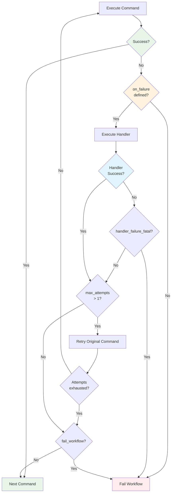

# Command-Level Error Handling

Command-level error handling allows you to specify what happens when a single workflow step fails. Use the `on_failure` configuration to define recovery, cleanup, or fallback strategies.



**Figure**: Command-level error handling flow showing handler execution, retry logic, and failure propagation.

## Simple Forms

For basic error handling, use the simplest form that meets your needs:

```yaml
# Ignore errors - don't fail the workflow
- shell: "optional-cleanup.sh"
  on_failure: true

# Single recovery command (shell or claude)
- shell: "npm install"
  on_failure: "npm cache clean --force"

- shell: "cargo clippy"
  on_failure: "/fix-warnings"

# Multiple recovery commands
- shell: "build-project"
  on_failure:
    - "cleanup-artifacts"
    - "/diagnose-build-errors"
    - "retry-build"
```

## Advanced Configuration

For more control over error handling behavior:

!!! tip "Automatic Retry Behavior"
    Setting `max_attempts > 1` automatically enables retry of the original command after the handler runs. You don't need a separate `retry_original` flag.

```yaml
- shell: "cargo clippy"
  on_failure:
    claude: "/fix-warnings ${shell.output}"  # (1)!
    fail_workflow: false     # (2)!
    max_attempts: 3          # (3)!

1. Handler receives command output for analysis
2. Continue workflow even if handler fails
3. Retry original command up to 3 times (auto-retry when > 1)
```

**Available Fields:**
- `shell` - Shell command to run on failure
- `claude` - Claude command to run on failure
- `fail_workflow` - Whether to fail the entire workflow (default: `false`)
- `max_attempts` - Maximum retry attempts for the original command (default: `1`)
- `max_retries` - Alternative name for `max_attempts` (both are supported for backward compatibility)

**Source**: FailureHandlerConfig struct in src/cook/workflow/on_failure.rs:26

**Notes:**
- When `max_attempts > 1`, Prodigy automatically retries the original command after running the failure handler (the deprecated `retry_original` flag is no longer needed)
- Retry behavior is now controlled by the `max_attempts`/`max_retries` value, not a separate flag
- You can specify both `shell` and `claude` commands - they will execute in sequence
- By default, having a handler means the workflow continues even if the step fails

> **Migration from `retry_original`:** Previously you used `retry_original: true` with `max_retries: 3`. Now just use `max_attempts: 3` (retry is implicit when > 1). Both `max_attempts` and `max_retries` are supported as aliases for backward compatibility.

## Detailed Handler Configuration

For complex error handling scenarios with multiple commands and fine-grained control:

```yaml
- shell: "deploy-production"
  on_failure:
    strategy: recovery        # Options: recovery, fallback, cleanup, custom
    timeout: 300             # Handler timeout in seconds
    handler_failure_fatal: true  # Fail workflow if handler fails
    fail_workflow: false     # Don't fail workflow if step fails
    capture:                 # Capture handler output to variables
      error_log: "handler_output"
      rollback_status: "rollback_result"
    commands:
      - shell: "rollback-deployment"
        continue_on_error: true
      - claude: "/analyze-deployment-failure"
      - shell: "notify-team"
```

**Handler Configuration Fields:**
- `strategy` - Handler strategy (recovery, fallback, cleanup, custom)
- `timeout` - Handler timeout in seconds
- `handler_failure_fatal` - Fail workflow if handler fails
- `fail_workflow` - Whether to fail the entire workflow
- `capture` - Map of variable names to capture from handler output (e.g., `error_log: "handler_output"`). Note: capture applies to the handler's combined output, not individual commands.
- `commands` - List of handler commands to execute

**Handler Strategies:**
- `recovery` - Try to fix the problem and retry (default)
- `fallback` - Use an alternative approach
- `cleanup` - Clean up resources
- `custom` - Custom handler logic

**Handler Command Fields:**
- `shell` or `claude` - The command to execute
- `continue_on_error` - Continue to next handler command even if this fails

> **Simpler Alternative:** For basic cases, you can use the Advanced format shown earlier instead of the detailed handler configuration. The Advanced format allows `shell` and `claude` fields directly without wrapping in a `commands` array: `on_failure: { shell: "command", fail_workflow: false, max_attempts: 3 }`.

## Success Handling

Execute commands when a step succeeds. The `on_success` field accepts a full WorkflowStep configuration with all available fields.

**Simple Form:**
```yaml
- shell: "deploy-staging"
  on_success:
    shell: "notify-success"
    claude: "/update-deployment-docs"
```

**Advanced Form with Full WorkflowStep Configuration:**
```yaml
- shell: "build-production"
  on_success:
    claude: "/update-build-metrics"
    timeout: 60              # Success handler timeout
    capture: "metrics"       # Capture output to variable
    working_dir: "dist"      # Run in specific directory
    when: "${build.target} == 'release'"  # Conditional execution
```

**Note:** The `on_success` handler supports all WorkflowStep fields including `timeout`, `capture`, `working_dir`, `when`, and nested `on_failure` handlers.

**Common Use Cases:**

Success handlers are useful for post-processing actions that should only occur when a step completes successfully:
- **Notifications:** Send success notifications to teams via Slack, email, or other channels
- **Metrics Updates:** Update deployment metrics, dashboard statistics, or monitoring systems
- **Downstream Workflows:** Trigger dependent workflows or pipelines
- **Artifact Archiving:** Archive build artifacts, logs, or generated files for later use
- **External System Updates:** Update issue trackers, deployment records, or configuration management systems

The handler receives access to step outputs via the `capture` field, allowing you to process results or pass data to subsequent steps. For example, using `capture: "metrics"` creates a `${metrics}` variable containing the handler output, which can be used in later workflow steps for processing or decision-making.

## Commit Requirements

Specify whether a workflow step must create a git commit:

```yaml
- claude: "/implement-feature"
  commit_required: true   # Fail if no commit is made
```

This is useful for ensuring that Claude commands that are expected to make code changes actually do so.
