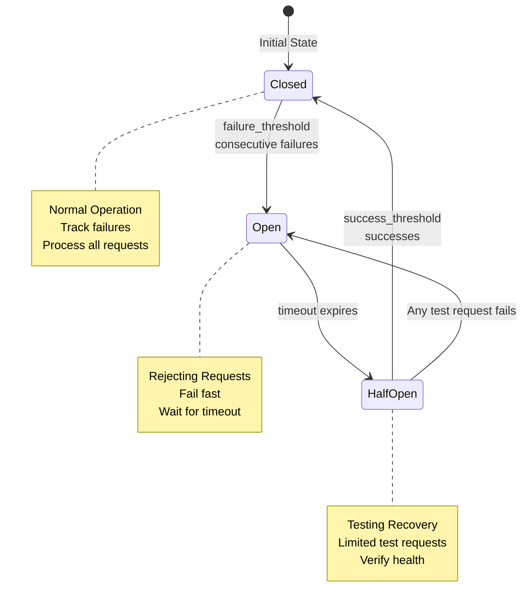

# Workflow-Level Error Policy (MapReduce)

For MapReduce workflows, you can configure workflow-level error policies that control how the entire job responds to failures. This is separate from command-level error handling and only applies to MapReduce mode.

## Basic Configuration

```yaml
# Source: src/cook/workflow/error_policy.rs:13-31
# Example: workflows/mkdocs-drift.yml:89-93
name: process-items
mode: mapreduce

error_policy:
  # What to do when a work item fails
  on_item_failure: dlq      # Options: dlq, retry, skip, stop, custom:<handler_name>

  # Continue processing after failures
  continue_on_failure: true

  # Stop after this many failures
  max_failures: 10

  # Stop if failure rate exceeds threshold (0.0 to 1.0)
  failure_threshold: 0.2    # Stop if 20% of items fail

  # How to report errors
  error_collection: aggregate  # Options: aggregate, immediate, batched
```

**Item Failure Actions:**
- `dlq` - Send failed items to Dead Letter Queue for later retry (default)
- `retry` - Retry the item immediately with backoff (if retry_config is set)
- `skip` - Skip the failed item and continue
- `stop` - Stop the entire workflow on first failure
- `custom:<name>` - Use a custom failure handler (not yet implemented)

**Error Collection Strategies:**
- `aggregate` - Collect all errors and report at the end (default)
- `immediate` - Report errors as they occur
- `batched` - Report errors in batches of N items (e.g., `batched: { size: 10 }`)

**Source**: ErrorCollectionStrategy enum in src/cook/workflow/error_policy.rs:33-44

## Circuit Breaker

Prevent cascading failures by opening a circuit after consecutive failures:

```yaml
# Source: src/cook/workflow/error_policy.rs:48-56 (CircuitBreakerConfig struct)
error_policy:
  circuit_breaker:
    failure_threshold: 5      # Open circuit after 5 consecutive failures
    success_threshold: 2      # Close circuit after 2 successes
    timeout: 30s             # Duration in humantime format (e.g., 30s, 1m, 500ms)
    half_open_requests: 3    # Test requests in half-open state
```

**Note:** The `timeout` field uses humantime format supporting `1s`, `100ms`, `2m`, `30s` for duration parsing.

### Circuit Breaker States

The circuit breaker operates in three states to protect against cascading failures:



**Figure**: Circuit breaker state transitions showing how the breaker protects against cascading failures.

!!! warning "Circuit Breaker Opens After Consecutive Failures"
    The circuit opens after `failure_threshold` **consecutive** failures, not total failures. A single success resets the failure counter. This means the circuit breaker is designed to detect sustained problems, not intermittent errors.

**State Behaviors:**

1. **Closed (Normal Operation)**
   - All requests are processed normally
   - Failures are tracked; consecutive failures increment the failure counter
   - Transitions to **Open** after `failure_threshold` consecutive failures

2. **Open (Rejecting Requests)**
   - All requests are immediately rejected without attempting execution
   - Prevents further load on a failing dependency
   - Transitions to **HalfOpen** after `timeout` duration expires

3. **HalfOpen (Testing Recovery)**
   - Allows a limited number of test requests (`half_open_requests`) to verify recovery
   - If test requests succeed (reaching `success_threshold`), transitions back to **Closed**
   - If any test request fails, transitions back to **Open** and resets the timeout

**Monitoring Circuit Breaker State:**

To check the circuit breaker state during MapReduce execution, monitor the event logs:

```bash
# View circuit breaker events for a job
prodigy events ls --job-id <job_id> | grep -i circuit

# Follow circuit state changes in real-time
prodigy events follow --job-id <job_id>
```

Circuit breaker state transitions are logged as `CircuitOpen` and `CircuitClosed` events, allowing you to track when the circuit opens due to failures and when it recovers.

**Note**: The `events` CLI commands are defined but currently have stub implementations. Event data is stored in `~/.prodigy/events/{repo_name}/{job_id}/` and can be inspected directly as JSONL files.

### Circuit Breaker Example

```yaml
error_policy:
  circuit_breaker:
    failure_threshold: 3
    success_threshold: 2
    timeout: "30s"
    half_open_requests: 1

- shell: "curl https://api.example.com/health"
  # After 3 failures, circuit opens
  # After 30s, allows 1 test request
  # After 2 successes, circuit closes
```

## Retry Configuration with Backoff

Configure automatic retry behavior for failed items:

!!! tip "Choosing a Backoff Strategy"
    - **Exponential**: Best for external APIs and network calls (prevents overwhelming services)
    - **Linear**: Good for predictable resource constraints
    - **Fixed**: Use for operations with consistent retry cost
    - **Fibonacci**: Balanced approach between linear and exponential

```yaml
# Source: src/cook/workflow/error_policy.rs:92-99, 108-120
error_policy:
  on_item_failure: retry    # (1)!
  retry_config:
    max_attempts: 3         # (2)!
    backoff:
      exponential:
        initial: 1s         # (3)!
        multiplier: 2       # (4)!

1. Use retry strategy instead of sending to DLQ
2. Total attempts including the original (3 means 1 original + 2 retries)
3. Starting delay before first retry
4. Multiply delay by this factor for each retry (1s, 2s, 4s...)
```

**Backoff Strategy Options:**

The backoff strategy is configured using enum variant syntax. Each variant has specific fields defined by the `BackoffStrategy` enum in `src/cook/workflow/error_policy.rs:108-120`.

```yaml
# Source: src/cook/workflow/error_policy.rs:110
# Fixed delay between retries
# Always waits the same duration
backoff:
  fixed:
    delay: 1s

# Source: src/cook/workflow/error_policy.rs:112-115
# Linear increase in delay
# Calculates: delay = initial + (retry_count * increment)
# Example with initial=1s, increment=500ms:
#   Retry 1: 1s + (1 * 500ms) = 1.5s
#   Retry 2: 1s + (2 * 500ms) = 2s
#   Retry 3: 1s + (3 * 500ms) = 2.5s
backoff:
  linear:
    initial: 1s
    increment: 500ms

# Source: src/cook/workflow/error_policy.rs:117
# Exponential backoff (recommended)
# Calculates: delay = initial * (multiplier ^ retry_count)
# Example: 1s, 2s, 4s, 8s...
backoff:
  exponential:
    initial: 1s
    multiplier: 2

# Source: src/cook/workflow/error_policy.rs:119
# Fibonacci sequence delays
# Calculates: delay = initial * fibonacci(retry_count)
# Example: 1s, 1s, 2s, 3s, 5s...
backoff:
  fibonacci:
    initial: 1s
```

**Important:** All duration values use humantime format (e.g., `1s`, `100ms`, `2m`, `30s`), not milliseconds.

> **Note:** All duration values use humantime format (e.g., `1s`, `100ms`, `2m`, `30s`) for consistency. This applies to both BackoffStrategy delays and CircuitBreakerConfig timeout.

### Advanced Retry Configuration

Prodigy has two retry configuration systems with different capabilities:

**1. Workflow-Level RetryConfig** (`src/cook/workflow/error_policy.rs:92-99`)
   - Used in MapReduce `error_policy.retry_config`
   - Fields: `max_attempts`, `backoff` (BackoffStrategy enum)
   - Simpler configuration for workflow-level retries

**2. Command-Level RetryConfig** (`src/cook/retry_v2.rs:16-52`)
   - Used for individual command retry logic
   - Additional fields: `jitter`, `max_delay`, `retry_budget`, `retry_on`
   - More advanced features for fine-grained control

**Jitter (Command-Level Only):**

Add randomization to retry delays to prevent thundering herd problems. This feature is available in `retry_v2.rs` RetryConfig but not yet in workflow-level error_policy RetryConfig.

```yaml
# Source: src/cook/retry_v2.rs:33-39
# Note: This syntax is for command-level retry configuration
retry_config:
  attempts: 5              # Max retry attempts
  initial_delay: 1s        # Starting delay
  max_delay: 60s          # Cap on delay (prevents unbounded growth)
  jitter: true            # Enable jitter
  jitter_factor: 0.1      # Jitter randomization (0.0 to 1.0)
  backoff: exponential    # Backoff strategy type
```

!!! note "Workflow-Level vs Command-Level Retry"
    The workflow-level `error_policy.retry_config` (used in MapReduce) does not currently support `jitter`, `max_delay`, or `retry_budget` fields. These advanced features are only available in the command-level retry configuration (`retry_v2.rs`).

## Error Metrics

Prodigy automatically tracks error metrics for MapReduce jobs using the `ErrorMetrics` structure:

**Available Fields:**
- `total_items` - Total number of work items processed
- `successful` - Number of items that completed successfully
- `failed` - Number of items that failed
- `skipped` - Number of items that were skipped
- `failure_rate` - Percentage of failures (0.0 to 1.0)
- `error_types` - Map of error types to their frequency counts
- `failure_patterns` - Detected recurring error patterns with suggested remediation

**Source**: ErrorMetrics struct in src/cook/workflow/error_policy.rs:196

**Accessing Metrics:**

Access metrics during execution or after completion to understand job health:

```yaml
# In your reduce phase
reduce:
  - shell: "echo 'Processed ${map.successful}/${map.total} items'"
  - shell: "echo 'Failure rate: ${map.failure_rate}'"
```

You can also access metrics programmatically via the Prodigy API or through CLI commands like `prodigy events` to view detailed error statistics.

**Pattern Detection:**

Prodigy automatically detects recurring error patterns when an error type occurs 3 or more times. The following error types receive specific remediation suggestions in the `failure_patterns` field:

- **Timeout errors** -> "Consider increasing agent_timeout_secs in timeout_config"
- **Network errors** -> "Check network connectivity and retry settings"
- **Permission errors** -> "Verify file permissions and access rights"

All other error types receive a generic suggestion: "Review error logs for more details."

These suggestions help diagnose and resolve systemic issues in MapReduce jobs.

**Note:** Only the three error types listed above receive specific remediation suggestions. All other error types (such as compilation errors, runtime panics, or custom application errors) receive the generic "Review error logs" suggestion.

**Source**: Pattern detection logic in src/cook/workflow/error_policy.rs:478-489
