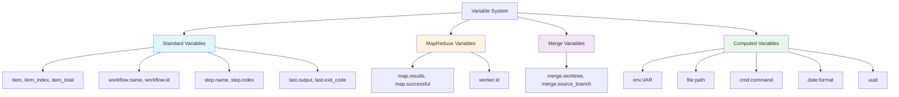
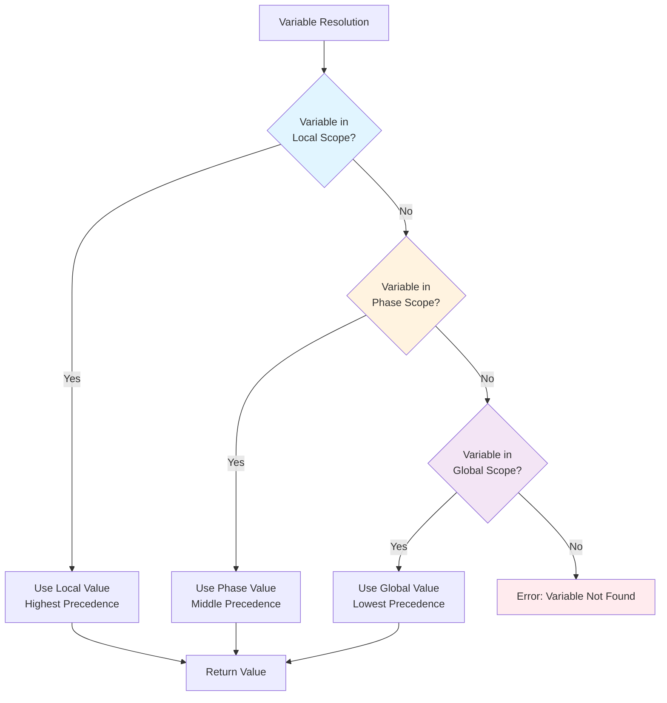

# Variables and Interpolation

Prodigy provides a powerful variable system that enables dynamic workflows with captured outputs, nested field access, and flexible interpolation.

## Overview

Variables in Prodigy allow you to:
- Capture command outputs in multiple formats (JSON, text, lines, numbers)
- Reference work items in MapReduce workflows
- Access nested fields with dot notation
- Provide default values for missing variables
- Use both `${var}` and `$var` syntax

## Variable Categories



**Figure**: Variable system overview showing four main categories and their available variables.

### Standard Variables

Available in all execution modes:

**Work Item Variables:**

- `${item}` - Current work item in foreach/MapReduce
- `${item_index}` - Zero-based index of current item
- `${item_total}` - Total number of items being processed

**Workflow Variables:**

- `${workflow.name}` - Workflow identifier
- `${workflow.id}` - Unique workflow execution ID
- `${workflow.iteration}` - Current iteration number

**Step Variables:**

Source: `src/cook/workflow/variables.rs:10-42`

- `${step.name}` - Name of the currently executing step
- `${step.index}` - Zero-based index of the current step in the workflow

**Previous Command Results:**

- `${last.output}` - Output from the previous command
- `${last.exit_code}` - Exit code from the previous command

### MapReduce Variables

Available in MapReduce workflows:

- `${map.results}` - Aggregated results from all map agents
- `${map.successful}` - Count of successfully processed items
- `${map.failed}` - Count of failed items
- `${map.total}` - Total item count
- `${map.key}` - Optional key for grouping or identifying map outputs (rarely used)
- `${worker.id}` - Identifier for parallel worker processing the current item

!!! note "String Representation"
    MapReduce aggregate variables (`${map.successful}`, `${map.failed}`, `${map.total}`) contain string representations of counts, not numeric values. If you need to perform arithmetic operations, convert them to numbers first.

    Source: `src/cook/execution/mapreduce/utils.rs:114-116`

### Merge Variables

Available in merge workflows:

- `${merge.worktree}` - Name of worktree being merged
- `${merge.source_branch}` - Source branch for merge
- `${merge.target_branch}` - Target branch for merge
- `${merge.session_id}` - Session ID for correlation

## Output Capture

Capture command outputs for use in subsequent steps:

!!! tip "When to Use Capture"
    Use output capture when you need to:

    - Pass data between commands (commit SHA, file paths, configuration)
    - Make decisions based on command results (`when:` conditions)
    - Access structured data (JSON) with nested field access
    - Track metadata (exit codes, duration, success status)

```yaml
# Source: examples/capture-json-processing.yml
# Capture as string (default)
- shell: "git rev-parse HEAD"
  capture_output: commit_sha                # (1)!

# Capture as JSON
- shell: "cat items.json"
  capture_output: items
  capture_format: json                      # (2)!

# Capture as lines array
- shell: "find src -name '*.rs'"
  capture_output: rust_files
  capture_format: lines                     # (3)!

# Capture as number
- shell: "wc -l < file.txt"
  capture_output: line_count
  capture_format: number                    # (4)!

# Capture as boolean
- shell: "git diff --quiet && echo true || echo false"
  capture_output: repo_clean
  capture_format: boolean                   # (5)!

1. Default format - captures raw text output
2. Parses JSON to enable nested field access with dot notation
3. Splits output into array (one element per line)
4. Parses numeric value for arithmetic operations
5. Parses boolean for conditional logic
```

### Capture Formats

The following capture formats are supported (defined in `src/cook/workflow/variables.rs:253-265`):

- **string** - Raw text output (default)
- **json** - Parse JSON and access nested fields with dot notation
- **lines** - Split output into array of lines (one per line break)
- **number** - Parse numeric value (integer or float)
- **boolean** - Parse true/false value from output

### Capture Metadata

Additional metadata available for captured outputs:

- `${var.exit_code}` - Command exit status
- `${var.success}` - Boolean success flag
- `${var.duration}` - Execution time
- `${var.stderr}` - Error output

## Interpolation Syntax

### Basic Interpolation

```yaml
# Both syntaxes work for simple variables
- shell: "echo $VARIABLE"
- shell: "echo ${VARIABLE}"
```

!!! warning "Unbraced $VAR Syntax Limitation"
    The unbraced `$VAR` syntax only works for simple identifiers (A-Z, a-z, 0-9, _). For nested field access like `map.total`, you **MUST** use braced syntax `${map.total}`. The syntax `$map.total` will fail because the unbraced parser cannot handle dots.

    ```yaml
    # ❌ WRONG - unbraced syntax with dots fails
    - shell: "echo $map.total"

    # ✅ CORRECT - braced syntax required for nested access
    - shell: "echo ${map.total}"
    ```

    Source: `src/cook/execution/interpolation.rs:33-36`

### Nested Field Access

```yaml
# Source: src/cook/execution/interpolation.rs:420-522
# Access nested JSON fields - always use braced syntax
- shell: "echo ${item.metadata.priority}"       # (1)!
- claude: "/process ${user.config.api_url}"     # (2)!

1. Dot notation for nested object fields
2. Works with any captured JSON output
```

!!! example "Nested Field Example"
    Given this captured JSON:
    ```json
    {
      "user": {
        "name": "Alice",
        "config": {
          "api_url": "https://api.example.com"
        }
      }
    }
    ```

    Access nested fields:
    ```yaml
    - shell: "echo Name: ${user.name}"              # Output: Name: Alice
    - shell: "echo URL: ${user.config.api_url}"     # Output: URL: https://api.example.com
    ```

### Default Values

```yaml
# Source: src/cook/execution/interpolation.rs:274-288
# Provide default if variable missing (using :- syntax)
- shell: "echo ${PORT:-8080}"                   # (1)!
- claude: "/deploy ${environment:-dev}"         # (2)!

1. If PORT not set, use 8080
2. If environment not set, use "dev"
```

!!! warning "Default Value Syntax"
    Use the `:-` syntax (with colon and dash) for default values:

    - **Correct**: `${VAR:-default}` - Uses "default" if VAR is unset or empty
    - **Incorrect**: `${VAR-default}` - Only works if VAR is unset (not if empty)
    - **Incorrect**: `${VAR:default}` - Not supported, will cause parsing error

    The `:-` operator is the recommended and most robust option.

### Array Access

```yaml
# Source: src/cook/execution/interpolation.rs:420-522
# Access array elements - two syntaxes supported
- shell: "echo ${items[0]}"      # Bracket notation (preferred)
- shell: "echo ${items.0}"       # Dot notation with number (also supported)
- shell: "echo ${items[1]}"      # Second element
- shell: "echo ${items.1}"       # Same as items[1]
```

!!! note "Array Indexing Syntax"
    Prodigy supports two notations for array access:

    - **Bracket syntax** `${items[0]}` - Preferred for clarity and consistency
    - **Dot notation** `${items.0}` - Also supported, resolves to the same element

    **Important:** Negative indices like `${items[-1]}` are **NOT** supported. Use explicit positive indices or compute the index in a shell command.

## Advanced Features

### Computed Variables

Source: `src/cook/execution/variables.rs:1-1378`

Prodigy supports computed variables that dynamically generate values at runtime:

!!! tip "Computed Variable Use Cases"
    Computed variables are ideal for:

    - **Dynamic configuration**: Read config files at runtime (`file:config.json`)
    - **Environment-specific values**: Access environment variables (`env.DATABASE_URL`)
    - **Command integration**: Embed command output (`cmd:git rev-parse HEAD`)
    - **Timestamps**: Generate dated filenames (`${date:%Y%m%d}`)
    - **Unique IDs**: Create correlation IDs (`${uuid}`)

=== "Environment Variables"
    ```yaml
    # Access environment variables
    - shell: "echo Database: ${env.DATABASE_URL}"
    - shell: "echo User: ${env.USER}"
    - shell: "echo Path: ${env.PATH}"
    ```

    Access system environment variables using the `env:` prefix.

=== "File Content"
    ```yaml
    # Read file content into variable
    - shell: "echo Version: ${file:/path/to/VERSION}"
    - claude: "/analyze ${file:config.json}"
    ```

    Read file contents at runtime. Useful for configuration files and version strings.

=== "Command Output"
    ```yaml
    # Execute command and capture output
    - shell: "echo Commit: ${cmd:git rev-parse HEAD}"
    - shell: "echo Branch: ${cmd:git branch --show-current}"
    ```

    Execute commands inline and use their output. Cached for performance.

=== "JSON Extraction"
    ```yaml
    # Extract value from JSON file using path
    - shell: "echo Name: ${json:name:package.json}"
    - shell: "echo Version: ${json:version:package.json}"
    ```

    Extract specific fields from JSON files without loading the entire file.

=== "Date Formatting"
    ```yaml
    # Generate formatted date strings
    - shell: "echo Today: ${date:%Y-%m-%d}"
    - shell: "echo Timestamp: ${date:%Y%m%d_%H%M%S}"
    ```

    Generate timestamps using [strftime format codes](https://docs.rs/chrono/latest/chrono/format/strftime/).

=== "UUID Generation"
    ```yaml
    # Generate unique identifiers
    - shell: "echo Request ID: ${uuid}"
    - shell: "echo Session: ${uuid}"
    ```

    Generate unique UUIDs (v4). Each use generates a new UUID.

!!! tip "Performance: Computed Variable Caching"
    Expensive operations (`file:`, `cmd:`) are cached with an LRU cache (100 entry limit) to improve performance. However, `${uuid}` always generates a new value for each use.

    Source: `src/cook/execution/variables.rs:415-421, 662-669`

### Aggregate Functions (Enhanced Variable System)

Source: `src/cook/execution/variables.rs:44-97`

For advanced workflows, Prodigy provides aggregate functions for data processing:

**Statistical Functions:**

- `Count(filter?)` - Count items (with optional filter)
- `Sum` - Sum numeric values
- `Average` - Calculate mean
- `Min` - Find minimum value
- `Max` - Find maximum value
- `Median` - Calculate median
- `StdDev` - Standard deviation
- `Variance` - Calculate variance

**Collection Functions:**

- `Collect` - Gather values into array
- `Unique` - Get unique values
- `Concat` - Concatenate strings
- `Merge` - Merge objects
- `Flatten` - Flatten nested arrays
- `Sort(ascending|descending)` - Sort values
- `GroupBy` - Group by key

!!! note "Enhanced Variable System"
    Aggregate functions are part of the enhanced variable system designed for advanced workflows. Consult the source code or examples for detailed usage patterns.

### Variable Scoping

Source: `src/cook/execution/variables.rs:382-407`

Prodigy uses a three-tier variable scoping system with precedence rules:



**Figure**: Variable resolution flow showing scope precedence from local (highest) to global (lowest).

**Scope Hierarchy (highest to lowest precedence):**

1. **Local Scope** - Step-level variables (highest precedence)
   - Set within a specific command or step
   - Only visible within that step
   - Overrides phase and global variables

2. **Phase Scope** - Phase-level variables (middle precedence)
   - Available within a workflow phase (setup, map, reduce)
   - Shared across steps in the same phase
   - Overrides global variables

3. **Global Scope** - Workflow-level variables (lowest precedence)
   - Available throughout the entire workflow
   - Set at workflow start or in environment
   - Can be overridden by phase or local variables

**Example:**

```yaml
# Global scope
env:
  ENVIRONMENT: "production"

setup:
  # Phase scope - overrides global
  - shell: "export ENVIRONMENT=staging"
    capture_output: phase_env

map:
  agent_template:
    # Local scope - overrides phase and global
    - shell: "ENVIRONMENT=dev npm test"
```

## Variable Aliases

Prodigy supports aliases for backward compatibility:

**Syntax Aliases:**

- `$item` → `${item}` (both syntaxes work for simple identifiers)
- `$workflow_name` → `${workflow.name}` (legacy snake_case maps to dot notation)

**Backward Compatibility Aliases:**

Source: `src/cook/workflow/variables.rs:10-42`

- `$ARG` or `$ARGUMENT` → `${item.value}` (legacy item value access)
- `$FILE` or `$FILE_PATH` → `${item.path}` (legacy item path access)

These aliases exist for backward compatibility with older workflow formats.

!!! tip "Use Modern Syntax"
    New workflows should prefer:
    - Dot notation (`${workflow.name}`) over legacy underscore variables (`$workflow_name`)
    - Braced syntax (`${var}`) over unbraced (`$var`) for consistency
    - Direct item access (`${item.value}`) over aliases (`$ARG`)

## Examples

### Capturing and Using JSON Output

```yaml
# Source: examples/capture-json-processing.yml:8-14
- shell: "jq -c '{name, version}' package.json"
  capture_output: pkg
  capture_format: json

- shell: "echo Building ${pkg.name} version ${pkg.version}"
```

### Conditional Variable Usage

```yaml
- shell: "npm run build"
  when: "${environment} == 'production'"
  capture_output: build_output

- claude: "/analyze-build ${build_output}"
  when: "${build_output.success} == true"
```

### MapReduce Variable Flow

```yaml
# Source: src/cook/workflow/variables.rs:738-750
mode: mapreduce

map:
  agent_template:
    - claude: "/process ${item.path}"
      capture_output: result

reduce:
  - shell: "echo Processing ${map.total} files"
  - shell: "echo Successful: ${map.successful}"
  - claude: "/summarize ${map.results}"
```

## Common Patterns

### Using Capture Metadata

Access metadata from captured outputs:

```yaml
- shell: "npm test"
  capture_output: test_results

- shell: "echo Tests completed in ${test_results.duration}ms"
  when: "${test_results.success} == true"

- shell: "echo Test failures: ${test_results.stderr}"
  when: "${test_results.exit_code} != 0"
```

### Default Values for Optional Configuration

Provide fallbacks when variables may not be set:

```yaml
# Source: src/cook/execution/interpolation.rs:274-288
- shell: "echo API URL: ${API_URL:-http://localhost:3000}"
- shell: "echo Environment: ${ENVIRONMENT:-development}"
- shell: "echo Timeout: ${TIMEOUT:-300} seconds"
```
