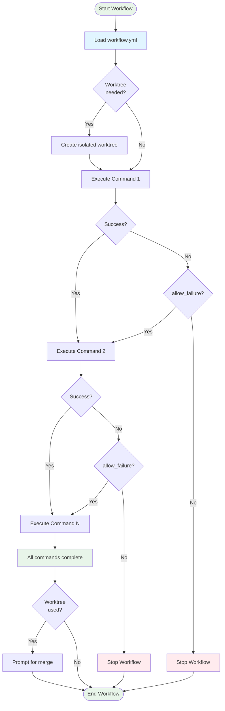

# Workflow Structure

Prodigy workflows are YAML files that define commands to execute. This page explains the basic structure and how workflows are executed.

## Two Formats

Prodigy supports two workflow formats, allowing you to start simple and add complexity as needed.

!!! tip "Choosing a Format"
    Start with the **simple array format** for basic automation. Switch to the **full object format** when you need environment variables, secrets, or custom merge workflows. You can convert between formats at any time.

### Simple Array Format

The simplest workflow is just an array of commands:

```yaml
# Source: examples/standard-workflow.yml:3-13
- shell: echo "Starting code analysis..."
- shell: find . -name "*.rs" -type f | wc -l | xargs -I {} echo "Found {} Rust files"
- shell: echo "Running cargo check..."
- shell: cargo check --quiet 2>&1 || echo "Check completed"
- shell: echo "Workflow complete"
```

This format is ideal for:
- Quick automation scripts
- Simple sequential tasks
- Learning Prodigy basics

**Execution**: Commands run sequentially, one after another. Each command must complete before the next starts.

### Full Object Format

For more control, use the full format with explicit configuration:

```yaml
# Source: src/config/workflow.rs:12-39
commands:                    # (1)!
  - shell: "cargo build"
  - claude: "/prodigy-test"
  - shell: "cargo test"

# Optional: Global environment variables
env:                         # (2)!
  NODE_ENV: production
  API_URL: https://api.example.com

# Optional: Custom merge workflow
merge:                       # (3)!
  - shell: "git fetch origin"
  - claude: "/prodigy-merge-worktree ${merge.source_branch} ${merge.target_branch}"
```

1. Array of commands to execute sequentially
2. Environment variables available to all commands
3. Custom commands to run when merging worktree changes

This format enables:
- Environment variable configuration
- Secret management
- Custom merge workflows
- Profile switching (dev/staging/prod)

**When to use**: When you need environment variables, secrets, or custom merge behavior.

## Sequential Execution Model

**Standard workflows execute commands sequentially** - each command completes before the next starts.

```yaml
- shell: "cargo build"          # Runs first, completes
- shell: "cargo test"           # Runs second, completes
- claude: "/prodigy-analyze"    # Runs third, completes
```

**Key behaviors**:
- Commands execute in the order listed
- If a command fails, the workflow stops (unless `allow_failure: true`)
- Variables from earlier commands are available to later commands
- Each command's output can be captured and used downstream

!!! warning "Failure Handling"
    By default, a failing command stops the entire workflow. Use `allow_failure: true` on individual commands if you want to continue execution after failures. See [Command-Level Options](command-level-options.md) for details.

**Source**: Sequential execution logic in `src/cook/workflow/executor/orchestration.rs`

!!! note "MapReduce Workflows"
    MapReduce workflows (`mode: mapreduce`) use a different execution model with parallel processing. Instead of sequential command execution, they process work items in parallel across multiple agents. See the [MapReduce Guide](../mapreduce/overview.md) for details.

## Top-Level Fields

The full workflow format supports these top-level fields:

| Field | Required | Description |
|-------|----------|-------------|
| `commands` | Yes | Array of commands to execute |
| `mode` | No | Workflow execution mode (`standard` or `mapreduce`) - defaults to `standard` |
| `env` | No | Global environment variables for all commands |
| `secrets` | No | Secret environment variables (masked in logs) |
| `env_files` | No | Environment files to load (`.env` format) |
| `profiles` | No | Environment profiles for different contexts (dev/staging/prod) |
| `merge` | No | Custom merge workflow for worktree integration |
| `name` | No | Workflow name (defaults to "default") |

**Source**: Field definitions from `src/config/workflow.rs:12-39`

See [Available Fields](available-fields.md) for detailed documentation of each field.

## Basic Examples

!!! example "Example 1: Simple Test Workflow"
    ```yaml
    # Source: examples/standard-workflow.yml:3-5
    - shell: echo "Starting code analysis..."
    - shell: cargo check --quiet 2>&1 || echo "Check completed"
    - shell: echo "Workflow complete"
    ```

!!! example "Example 2: Workflow with Environment Variables"
    ```yaml
    # Source: examples/capture-conditional-flow.yml:4-5
    name: conditional-deployment
    mode: standard

    commands:
      - shell: "cargo test"
      - shell: "cargo build --release"

    env:
      RUST_BACKTRACE: "1"
      BUILD_ENV: production
    ```

!!! example "Example 3: Workflow with Variable Capture"
    Commands can capture output for use in later commands:

    ```yaml
    # Source: examples/capture-conditional-flow.yml:26-28
    commands:
      - shell: "grep '^version' Cargo.toml | cut -d'\"' -f2 || echo '0.0.0'"
        capture: "current_version"    # (1)!

      - shell: "echo 'Building version ${current_version}'"  # (2)!
    ```

    1. Capture command output into a variable
    2. Use the captured variable in subsequent commands

    See [Command Types](command-types.md) for details on variable capture and other command features.

## Execution Flow Diagram



**Figure**: Sequential workflow execution showing command-by-command processing with failure handling.

## Format Detection

Prodigy automatically detects which format you're using:

```rust
// Source: src/config/workflow.rs:41-74
// Deserializer tries formats in order:
// 1. Commands (simple array)
// 2. Full (object with env/merge/etc)
// 3. WithCommandsField (legacy object format)
```

You don't need to specify the format - just write YAML and Prodigy handles it.

## See Also

- [Command Types](command-types.md) - Learn about `shell`, `claude`, `goal_seek`, and `foreach` commands
- [Command-Level Options](command-level-options.md) - Options like `capture`, `when`, `allow_failure`
- [Environment Configuration](environment-configuration.md) - Using environment variables and secrets
- [Full Workflow Structure](full-workflow-structure.md) - Complete details on the full format with merge workflows
- [Complete Example](complete-example.md) - A comprehensive workflow showcasing all features
